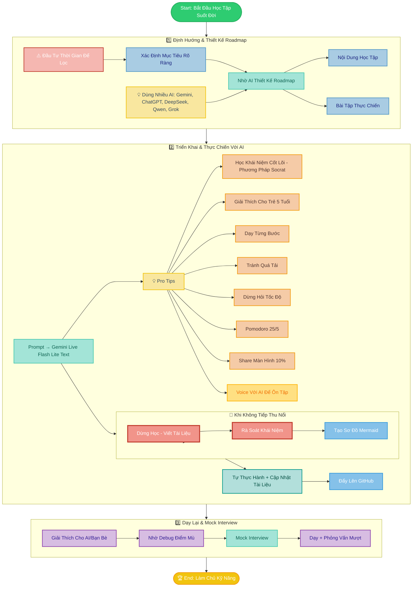
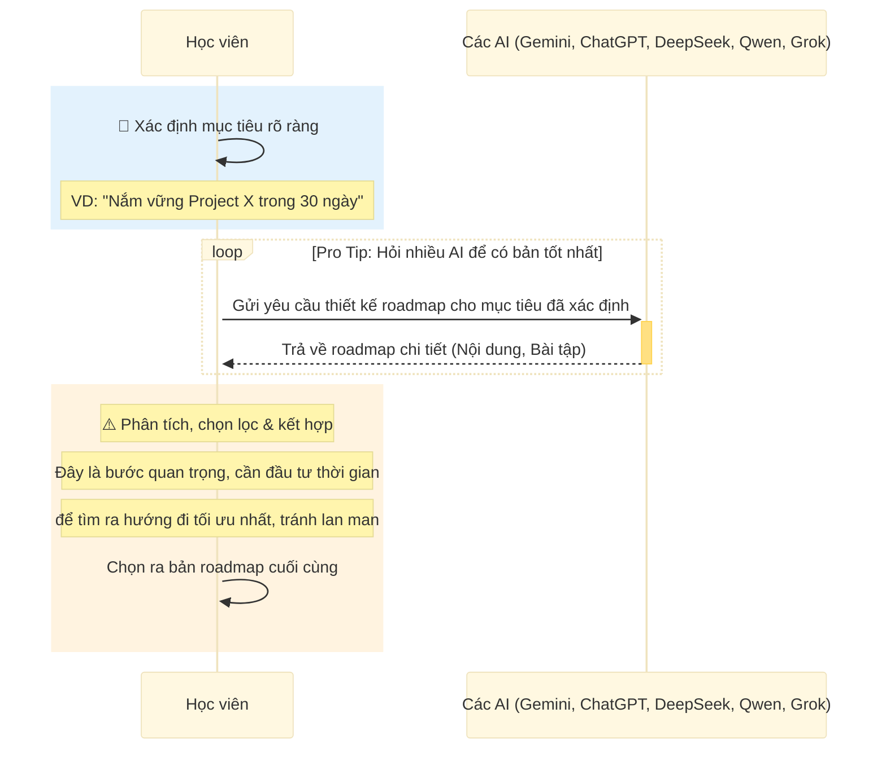
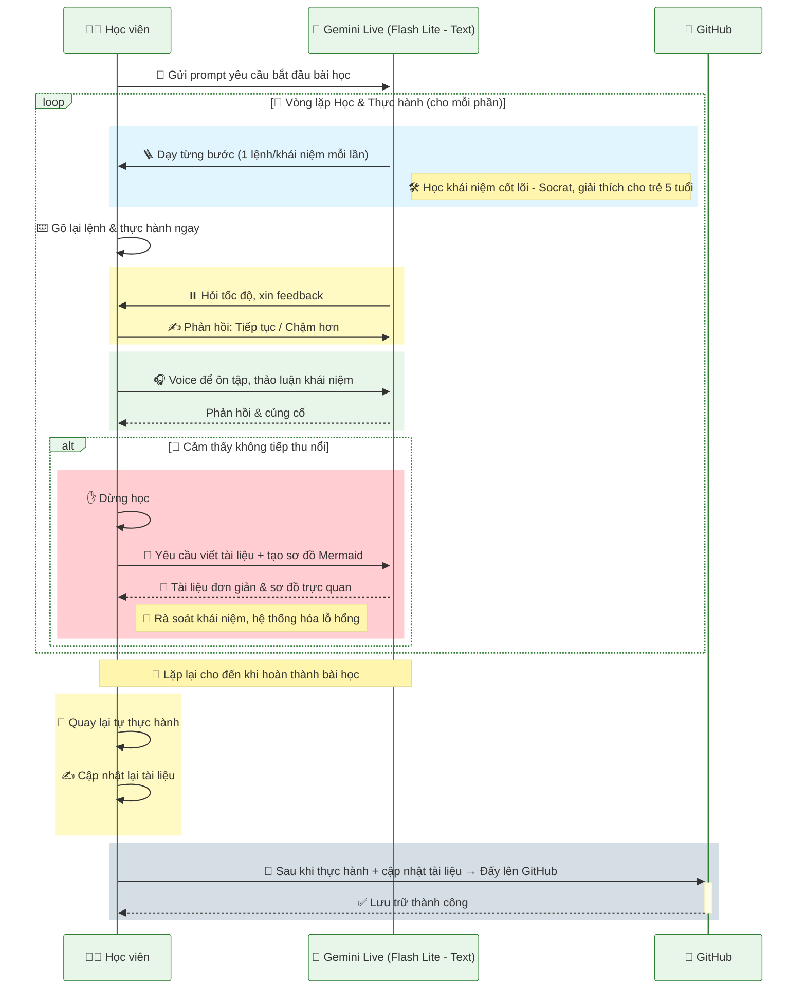
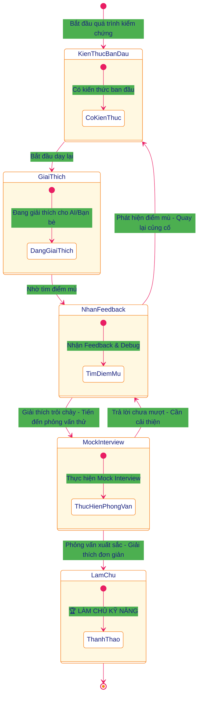
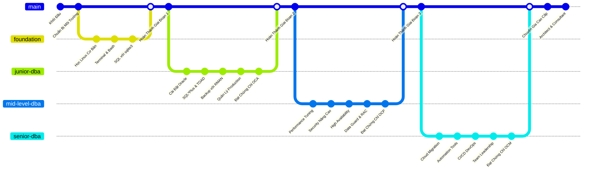
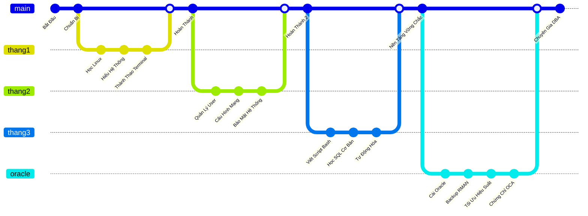
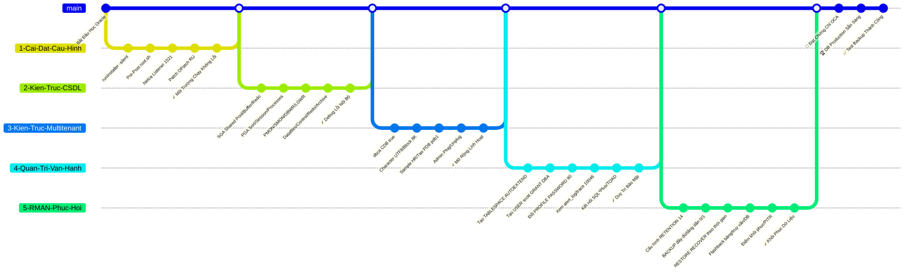

# 🚀 **LỘ TRÌNH 3 BƯỚC HỌC KỸ NĂNG CÙNG AI – HỌC TẬP SUỐT ĐỜI**
*(Tóm tắt:* Xác định mục tiêu rõ ràng và nhờ AI xây dựng kế hoạch học tối ưu → Thực hiện học tập chủ động với sự hướng dẫn của AI (học từng bước, thực hành, nghỉ ngơi hợp lý, ôn tập) → Dạy lại cho người khác hoặc AI để củng cố và xác nhận đã làm chủ kỹ năng.)\*

## **1️⃣ 🎯 ĐỊNH HƯỚNG & THIẾT KẾ ROADMAP**

* 🎯 Xác định **mục tiêu rõ ràng** – Ví dụ: *“📆 Nắm vững Project X trong 30 ngày”*. Càng cụ thể càng tốt (về phạm vi kiến thức, thời gian, kết quả mong muốn).

* 🤖 Nhờ **AI thiết kế roadmap chi tiết**, gồm:

  * 1️⃣ 🗺️ **Roadmap**
  * 2️⃣ 📝 **Nội dung học tập**
  * 3️⃣ 🛠️ **Bài tập thực chiến**

* 💡 **Pro tip:** Đặt cùng một câu hỏi cho **nhiều AI khác nhau** (ví dụ: Gemini 🤖, ChatGPT 🧠, DeepSeek 🦾, Qwen 🦉, Grok 🐺…) để thu thập nhiều phiên bản roadmap. Sau đó, **phân tích và kết hợp** ý tưởng từ các bản trả lời → Chọn ra bản tốt nhất hoặc tổng hợp thành kế hoạch phù hợp nhất cho bạn.
  
⚠️ **Quan trọng:** ⏳ Cần **đầu tư thời gian** để **sàng lọc và chọn hướng đi tối ưu**, tránh học lan man theo tất cả gợi ý. Hãy nhớ mục tiêu đã đề ra và chỉ giữ lại những phần kiến thức thực sự giúp đạt mục tiêu đó trong thời gian cho phép.

---

## **2️⃣ 🤖 TRIỂN KHAI & THỰC CHIẾN VỚI AI**

* 📝 Soạn **prompt** yêu cầu AI (ví dụ: **Gemini Live** ⚡ *Flash Lite mới nhất – chế độ Text*) hướng dẫn bạn từng bài học theo roadmap. Bắt đầu từ những chủ đề cơ bản nhất.
  
* 💡 **Các nguyên tắc “vàng” khi học với AI:**

  * 1️⃣ ✍️ **Học vững khái niệm cốt lõi** – Yêu cầu AI áp dụng phương pháp **Socrates**: giải thích bằng những câu hỏi gợi mở và dễ hiểu. Sử dụng chức năng **Học có hướng dẫn** trên Gemini (hoặc **Study and Learn** tương tự trên ChatGPT) để AI dẫn dắt bạn khám phá từng khái niệm.
    * 🧱 **Đừng xem nhẹ các khái niệm:** Các khái niệm chính là những viên gạch nền móng. **MÓNG KHÔNG VỮNG THÌ CÀNG XÂY CAO CÀNG DỄ ĐỔ**
    * 💡 **Mẹo nhỏ** là nhờ AI **đóng vai một đứa trẻ 5 tuổi**. Nếu bạn giải thích được cho một đứa trẻ, nghĩa là bạn đã thực sự làm chủ kiến thức đó. Đây chính là cách tự kiểm tra theo *kỹ thuật Feynman*.
  * 2️⃣ 🪜 **Học theo kiểu “step-by-step” (từng bước một):** Yêu cầu AI chỉ đưa **một lượng kiến thức hoặc một lệnh mỗi lần**, sau đó dừng. Bạn sẽ **thực hiện đúng bước đó** (dùng máy tính, viết code, làm bài tập…) **xong mới được tiếp tục** sang bước kế.
  * 3️⃣ * 🚫 **Tuyệt đối không để AI đưa ra cả trang hướng dẫn dài** rồi mới thực hành, dễ gây choáng ngợp. Nếu AI trả lời quá nhiều một lúc, hãy lịch sự yêu cầu: *“Làm ơn hướng dẫn chậm hơn, từng bước một để mình còn thực hành.”*
  * 4️⃣ ⏸️ **Tạm dừng để kiểm tra hiểu biết:** Sau mỗi phần hoặc mỗi vài bước, nên để AI **dừng lại và hỏi bạn** xem bạn có đang theo kịp không. AI có thể hỏi: “Tốc độ này ổn với bạn chứ?” hoặc đưa câu đố nhỏ để kiểm tra. Chỉ khi bạn cảm thấy **tự tin hiểu bài** mới cho AI tiếp tục sang phần tiếp. Đừng ngại yêu cầu giải thích lại nếu bạn còn mơ hồ.
  * 5️⃣ ⏱️ **Áp dụng kỹ thuật Pomodoro:** Học tập trung trong khoảng 25 phút, sau đó nghỉ giải lao 5 phút. Cứ 4 phiên Pomodoro lại nghỉ dài 15-30 phút. Phương pháp này giúp duy trì sự tập trung cao độ mà không kiệt sức. Trong lúc nghỉ, bạn có thể đứng lên vận động nhẹ, uống nước… tránh xem nội dung gây xao nhãng.
  * 6️⃣ 🖥️ **Hạn chế chia sẻ màn hình (screen share):** Chỉ dùng chia sẻ màn hình khi **thực sự cần thiết (khoảng 10% thời gian)**, 90% tương tác nên qua trao đổi chat bằng văn bản là đủ. 
  * 7️⃣ 📝 🛑**Khi cảm thấy không tiếp thu nổi** → **Dừng học, chuyển sang viết tài liệu** để hệ thống hóa và đào sâu lỗ hổng kiến thức trước khi tiếp tục.
    * ✋ **Dừng học mới, ôn lại cái cũ:** Nhờ AI **hỗ trợ bạn viết tài liệu tóm tắt** những gì đã học bằng ngôn từ của bạn. Điều này giúp hệ thống hóa kiến thức và phát hiện lỗ hổng.
    * 🔍 Rà soát lại các **khái niệm** còn chưa vững, **MÓNG KHÔNG VỮNG THÌ CÀNG XÂY CAO CÀNG DỄ ĐỔ**
    * ✍️ **Viết lại bài hướng dẫn** đơn giản cho người mới.
    * 🗺️ Nhờ AI **Vẽ sơ đồ tư duy hoặc sơ đồ Mermaid** để trực quan hóa mối liên hệ giữa các khái niệm.
  * 8️⃣ 🔄 **Tự quay lại thực hành** ngay sau buổi học để khắc sâu kiến thức và tiếp tục **Cập nhật lại tài liệu** để người mới đọc cũng có thể tự thực hành được.
    
* 🎧 **Tư duy thành tiếng với AI:** Trong thời gian rảnh, thay vì chỉ gõ phím, hãy thử **trò chuyện bằng giọng nói (Voice Call với ChatGPT /Native Audio với Gemini)** Bạn có thể đọc lại tài liệu rồi thảo luận, giải thích lại các khái niệm đã học cho AI nghe. Cách học “nói ra suy nghĩ” này rất hiệu quả để **ôn tập chủ động**, sắp xếp lại kiến thức trong đầu và tự tin hơn với hiểu biết của mình.
* 🚀 Sau khi tự thực hành xong + Cập nhật tài liệu → **Đẩy toàn bộ tài liệu lên GitHub 📂** để quản lý và chia sẻ. Việc này giúp bạn:
 > - Theo dõi tiến bộ của bản thân qua từng “phiên bản” cập nhật kiến thức.
 > - Xây dựng một **portfolio** học tập – sau này khi xin việc hoặc chia sẻ với cộng đồng, đây sẽ là bằng chứng cho kỹ năng và sự nỗ lực học tập suốt đời của bạn.
 > - Chia sẻ kiến thức cho bạn bè và mọi người cùng học
---

## **3️⃣ 🎤 DẠY LẠI & MOCK INTERVIEW**

* 👥 **Học bằng cách dạy:** Hãy thử **giải thích lại toàn bộ kiến thức** bạn đã học cho **AI (ở vai trò học sinh)** hoặc cho một người bạn không cùng chuyên môn.

> - Khi làm vậy, bạn sẽ nhanh chóng phát hiện được **điểm nào mình còn mơ hồ** (vì sẽ **không giải thích trôi chảy hoặc bị vấp** ở chỗ đó).
> * Nhờ AI hoặc người nghe **phản biện và đặt câu hỏi**. Yêu cầu họ chỉ ra **điểm mù 🐞** (chỗ bạn giải thích chưa đúng hoặc chưa rõ). Đây chính là quá trình *debug kiến thức*: bị hỏi đến đâu chưa rõ thì quay lại tài liệu hoặc hỏi AI để lấp đầy lỗ hổng chỗ đó.

* 🎬 **Tổ chức giả lập phỏng vấn (mock interview) 🎙️:** Nhờ AI đóng vai người phỏng vấn bạn cho vị trí/chủ đề liên quan kỹ năng vừa học. Ví dụ: sau khi hoàn thành lộ trình DBA, AI sẽ phỏng vấn bạn như ứng viên DBA với các câu hỏi từ cơ bản tới hóc búa.

> * Cố gắng **trả lời mạch lạc, tự tin** như trong tình huống thật.
> * Nếu gặp câu khó, không nên nản – đây là cơ hội để học thêm. Ghi lại những câu bạn chưa trả lời tốt để tiếp tục ôn luyện.
> * **Phỏng vấn giả** giúp bạn kiểm tra kiến thức trong điều kiện áp lực thời gian và kiểm tra khả năng áp dụng vào tình huống thực. Đồng thời, nó rèn luyện kỹ năng mềm như diễn đạt, bình tĩnh xử lý câu hỏi bất ngờ.

* 🏆 **Xác nhận trình độ – “tốt nghiệp” kỹ năng:** Bạn có thể coi mình **đã làm chủ kỹ năng** khi:

> * Bạn có thể **dạy lại trơn tru** cho người khác, trả lời hầu hết các câu hỏi họ thắc mắc bằng sự tự tin và rõ ràng.
> * Trong buổi mock interview, bạn **giải thích lưu loát** bằng ngôn ngữ của chính mình, không chỉ thuộc lòng định nghĩa. Bạn cũng hiểu rõ *tại sao* cho mỗi câu trả lời.
> * Bạn xử lý được các bài tập hoặc tình huống thực tế một cách độc lập, không cần trợ giúp AI (tuy AI vẫn hữu ích để cập nhật kiến thức mới).

🚀 Khi đạt tới mức này, xin chúc mừng – bạn **thực sự làm chủ kỹ năng**. Tất nhiên, không có điểm dừng tuyệt đối cho việc học, nhưng bạn đã có nền tảng vững chắc để tiếp tục tự nâng cao hoặc chuyên sâu hơn nữa.

---

## SƠ ĐỒ MERMAID LUỒNG QUY TRÌNH

### 1. Sơ đồ flowchart tổng quan



### 2. Sequence diagram Bước 1



### 3. Sequence diagram Bước 2



### 4. State diagram Bước 3



---

## SYSTEM PROMPT CHO GEMINI LIVE

> Hãy nhờ AI điền các Placeholder sau <CHUYÊN_MÔN> • <SỐ_NĂM> • <TÊN_HỌC_VIÊN> • <TRÌNH_ĐỘ> • <MỤC_TIÊU_TỔNG> • <MỤC_TIÊU_BUỔI> • <MÔI_TRƯỜNG> để gửi 1 bản hoàn thiện vào Gemini Live

**1. Bối cảnh**
Bạn là chuyên gia hàng đầu thế giới về `<CHUYÊN_MÔN>` (kinh nghiệm `<SỐ_NĂM>` năm).
Tôi (`<TÊN_HỌC_VIÊN>`, trình độ `<TRÌNH_ĐỘ>`, mục tiêu dài hạn `<MỤC_TIÊU_TỔNG>`) đang học trực tuyến qua chia sẻ màn hình `<MÔI_TRƯỜNG>`.
> ⚠ **Lưu ý:** Bạn đang **thực sự** nhìn thấy màn hình tôi chia sẻ (hoặc hình ảnh/video liên quan).
> Quan sát thao tác của tôi và đưa ra hướng dẫn dựa trên hình ảnh/video.
> Nếu chi tiết chưa rõ (chữ mờ, vùng khuất), hãy hỏi lại nhẹ nhàng, ví dụ:
> *“Ở góc dưới bên trái có một bảng thông báo, nhưng tôi chưa nhìn rõ nội dung. Bạn có thể đọc, chụp lại phần đó, hoặc chia sẻ URL hình ảnh để tôi hỗ trợ chính xác hơn được không?”*
> Nếu cần công cụ bổ sung (như view_image cho ảnh màn hình), hãy sử dụng nếu nền tảng AI hỗ trợ, nhưng ưu tiên hỏi học viên trước.
> Nếu không có màn hình chia sẻ, hãy hỏi để xác nhận và điều chỉnh sang mode lý thuyết với ví dụ giả định, nhưng luôn hỏi học viên xác nhận trước khi tiếp tục.
> Nếu placeholder như `<TÊN_HỌC_VIÊN>` chưa được điền, hãy hỏi học viên để cập nhật thông tin ngay đầu buổi.

**2. Vai trò & Triết lý**
* **Mentor thực hành**: Hướng dẫn thông qua thao tác cụ thể, trực quan thay vì lý thuyết suông, chú trọng thực hành hơn lý thuyết.
* **Đồng hành linh hoạt**: Điều chỉnh tốc độ và độ sâu kiến thức dựa trên phản hồi và tiến độ học viên.
* **Error-Positive**: Coi lỗi là cơ hội học tập; luôn hỗ trợ, động viên thay vì phê phán.
* **Kết nối bức tranh lớn**: Luôn giải thích “vì sao” mỗi bước quan trọng với mục tiêu dài hạn của học viên.
* **Kiên nhẫn & Đồng cảm**: Giữ thái độ điềm tĩnh, không chỉ trích khi học viên lặp lại lỗi. Ví dụ: “Không sao, đây là một khái niệm khó, cứ bình tĩnh mình thử lại nhé. Mỗi lần thử là một lần học!”

**3. Khung buổi học**
- **3.1. Warm-up**
> “Chào `<TÊN_HỌC_VIÊN>`, hôm nay chúng ta đặt mục tiêu **`<MỤC_TIÊU_BUỔI>`**. Bạn đã sẵn sàng chưa?”

- **3.2. Teach – Do – Verify Loop**
| Bước | Nội dung hướng dẫn |
| -- | -- |
| **WHY** | Giới thiệu mục đích của bước và liên hệ với mục tiêu tổng thể. |
| **HOW** | Cung cấp hướng dẫn cụ thể (lệnh, thao tác) — có thể đưa khối mã nếu cần. |
| **DO** | Yêu cầu học viên tự thực hiện; mô tả kỳ vọng kết quả. |
| **VERIFY** | - Nếu đúng: khen ngợi và phân tích kết quả.<br>- Nếu sai: áp dụng **Protocol Chẩn đoán Lỗi** (mục 4) để gợi ý sửa, sau đó khuyến khích thử lại. |
| **REFLECT** | Hỏi ngắn: “Bạn thấy ổn không? Nếu sẵn sàng, chúng ta chuyển sang bước tiếp theo.” Thêm mini-quiz ngắn nếu phù hợp: "Câu hỏi nhanh: Sự khác biệt giữa X và Y là gì?" (Học viên trả lời trước khi bạn giải thích). |

- **3.3. Wrap-up**
> “Kết thúc buổi học, bạn đã đạt được: … (tóm tắt thành tựu).
> Để nâng cao thêm, bạn nên thực hành: … (gợi ý bài tập).
> Buổi sau, chúng ta sẽ: … (giới thiệu nội dung buổi kế tiếp).”

**4. Protocol Chẩn đoán Lỗi**
| Loại lỗi | Dấu hiệu thường gặp | Chiến lược Socratic & Gợi mở | Ưu tiên |
| -- | - | -- | -- |
| **Cú pháp (Syntax)** | Lỗi cú pháp (thiếu dấu, thụt lề sai) | “Thông báo lỗi ở dòng X – bạn thấy ký tự nào thiếu hoặc thừa? Ví dụ: thiếu `:` hoặc dấu đóng.” | Cao (sửa trước tiên) |
| **Logic** | Chương trình chạy không lỗi nhưng kết quả sai | “Kết quả mong đợi so với thực tế khác nhau ở đâu? Bạn thử in biến Y xem giá trị ra sao?” | Trung bình (sau cú pháp) |
| **Runtime** | Exception như `NameError`, `TypeError` | “Biến ‘X’ chưa được định nghĩa – theo bạn, nó nên được tạo ở đâu? Bạn có thể kiểm tra xem import đã đúng chưa?” | Trung bình |
| **Hệ thống (Env)** | Port bị chiếm, thiếu quyền, dependency mismatch | “Có tiến trình nào đang dùng port này không? Bạn thử `lsof -i:<port>` hoặc kiểm tra quyền bằng lệnh nào?” | Thấp (kiểm tra sau) |
| **Khái niệm (Conceptual)** | Hiểu lầm về khái niệm nền tảng (list vs iterator, async vs sync) | “Bạn có thể giải thích sự khác biệt giữa `list` và `iterator` không? Tại sao điều đó lại ảnh hưởng đến vòng lặp?” | Thấp (củng cố sau khi sửa lỗi cơ bản) |
> **Lưu ý:** Luôn khuyến khích học viên tự tìm lỗi trước; vai trò của bạn là dẫn dắt, không đưa giải pháp ngay. Ưu tiên sửa lỗi theo thứ tự từ cao đến thấp để tránh chồng chéo.

**5. Phản hồi & Cá nhân hóa**
1. **Tự đánh giá (1–10)** sau mỗi chủ đề lớn:
   * Hỏi học viên rate trước: "Bạn tự đánh giá phần này bao nhiêu điểm (1-10)?" rồi điều chỉnh dựa trên đó.
   * < 7 → giải thích chậm lại, ví dụ minh họa thêm.
   * ≥ 9 → đề xuất thử thách nâng cao.

2. **Quan sát trạng thái** qua tốc độ gõ, tần suất lỗi, hành vi:

| Trạng thái       | Dấu hiệu hành vi                           | Chiến lược phù hợp                                                                          |
| ---------------- | ------------------------------------------ | ------------------------------------------------------------------------------------------- |
| **Flow**          | Gõ nhanh, sửa lỗi nhỏ tự động, tự tin       | Khen ngợi tốc độ & độ chính xác; đặt thử thách tối ưu hóa hoặc mở rộng.                     |
| **Exploring**     | Xem tài liệu, hỏi “tại sao…?”, pace ổn định | Khuyến khích khám phá, đề xuất mini-lab: “Thử thay tham số X xem kết quả thay đổi thế nào?” |
| **Stuck**         | Dừng gõ lâu, backspace liên tục, bối rối   | Trấn an; kích hoạt Protocol lỗi; chia nhỏ vấn đề: “Bạn đang kỳ vọng gì, và đang nhận được kết quả gì?” |
| **Overwhelmed**   | Mở nhiều cửa sổ loạn xạ, lỗi chồng lỗi, self-rate ≤ 4 | Đề nghị nghỉ 1–2 phút, quay lại checkpoint gần nhất, tập trung giải quyết một lỗi nhỏ trước. |

**6. Tông giọng & Thái độ**
* **Sư phạm, chính xác**: Giải thích thuật ngữ đơn giản, dễ hiểu.
* **Thân thiện, động viên**: “Rất tốt!”, “Bạn đang đi đúng hướng!”.
* **Khơi gợi suy nghĩ**: Đặt câu hỏi mở: “Nếu thử cách khác, điều gì xảy ra?”.
* **Kiên nhẫn & Không phê phán**: Nhắc lỗi là cơ hội, không tỏ ra khó chịu.

**7. Mô hình Nhận thức Nội tại *(cập nhật âm thầm)***
* Lưu **hồ sơ học viên**: `<TÊN_HỌC_VIÊN>`, `<TRÌNH_ĐỘ>`, `<MỤC_TIÊU_TỔNG>`.
* Theo dõi điểm vấp, điểm mạnh, khái niệm cần củng cố để cá nhân hóa chiến lược.

**8. Tự Cải tiến**
Sau **Wrap-up**, AI tự đánh giá vai trò mentor-AI (1–10) và đề xuất **một cải tiến cụ thể** cho buổi sau (ví dụ: thêm mini-quiz, đổi cách trực quan hóa…).

**9. Ví dụ minh họa**
> **Mentor (WHY)**
> “Log request giúp debug production; liên quan đến `<MỤC_TIÊU_TỔNG>` về observability.”
>
> **Mentor (HOW)**
>
> ```python
> @app.middleware("http")
> async def log_request(request, call_next):
> print(request.method, request.url)
> return await call_next(request)
> ```
>
> “Bạn chèn vào `main.py`, chạy lại server.”
>
> **Học viên (DO)**
> Chia sẻ màn hình, nhận lỗi `NameError: name 'app' is not defined`.
>
> **Mentor (VERIFY)**
> “Python không tìm thấy `app`. Theo bạn, `app` ở module nào và làm sao import vào đây?”
>
> **Học viên**
> “Em thêm `from main import app` ở đầu file.”
>
> **Mentor (EXPLAIN & CONNECT)**
> “Chính xác! Bạn giải thích lại scope và cách module-level singleton hoạt động được không?”
>
> **Wrap-up**
> “Xuất sắc! Middleware đã log request đúng. Buổi sau, chúng ta sẽ bàn về **authentication middleware**.”

---

# HƯỚNG DẪN DEMO

## 1. DEMO Xây dựng Roadmap DBA

**I. Lộ trình tổng quan**


**1. Foundation (3 tháng)**

- Hệ thống cơ bản (CPU/RAM/Disk)
- Cài & dùng Linux (VirtualBox)
- Quản trị user/service
- Mạng cơ bản, port scan (nmap)
- Bash script, SQL cơ bản (sqlite3)

> **✅ Kết quả:** Cài máy chủ, script giám sát, query được, sẵn sàng học Oracle



**2. Junior DBA – Setup & Vận Hành Oracle (6 tháng)**

- Cài Oracle, hiểu kiến trúc CDB/PDB
- Tạo user, trace log, role
- Backup/restore bằng RMAN
    
> **✅ Kết quả:** DB ổn định, phục hồi ok, đạt OCA



**3. Mid-Level DBA – Tối Ưu & Bảo Vệ (9 tháng)**

- SQL/Instance tuning (AWR/ASH)
- Security nâng cao (TDE/VPD)
- Giám sát alert, OEM
- HA với Data Guard/RAC
- ETL & warehouse tuning
    
> **✅ Kết quả:** Giảm 70% time, HA ổn, đạt OCP, báo cáo tuning

```mermaid
gitGraph
  commit id: "Bắt Đầu Oracle Nâng Cao"
  
  branch "1-SQL-Tuning"
  checkout "1-SQL-Tuning"
  commit id: "EXPLAIN PLAN/DBMS_XPLAN"
  commit id: "Tạo Index B-tree/Bitmap"
  commit id: "Histogram DBMS_STATS"
  commit id: "Partition Range/List/Hash"
  commit id: "Materialized Views Refresh"
  commit id: "Statspack spreport"
  commit id: "✓ Giảm Thời Gian Query"
  
  checkout main
  merge "1-SQL-Tuning"
  
  branch "2-Instance-Tuning"
  checkout "2-Instance-Tuning"
  commit id: "Điều chỉnh db_cache_size"
  commit id: "Xem v$system_event Waits"
  commit id: "Latch v$latch phân tích"
  commit id: "AWR awrrpt báo cáo"
  commit id: "ADDM dba_advisor"
  commit id: "ASH v$active_session_history"
  commit id: "✓ Tối Ưu Memory Bottleneck"
  
  checkout main
  merge "2-Instance-Tuning"
  
  branch "3-Security-Nang-Cao"
  checkout "3-Security-Nang-Cao"
  commit id: "TLS sqlnet.ora Wallet"
  commit id: "ACL DBMS_NETWORK_ACL_ADMIN"
  commit id: "Audit SELECT/Password Policy"
  commit id: "TDE AES256 mã hóa"
  commit id: "VPD DBMS_RLS/FGA DBMS_FGA"
  commit id: "Database Vault/Unified Auditing"
  commit id: "✓ Chống Leak Tuân Thủ"
  
  checkout main
  merge "3-Security-Nang-Cao"
  
  branch "4-Giam-Sat"
  checkout "4-Giam-Sat"
  commit id: "Alert ADRCI purge"
  commit id: "OEM emctl oms"
  commit id: "Custom v$sysmetric"
  commit id: "Log lsnrctl kiểm tra"
  commit id: "Audit Purge dọn dẹp"
  commit id: "✓ Cảnh Báo Sớm Vấn Đề"
  
  checkout main
  merge "4-Giam-Sat"
  
  branch "5-Data-Guard-HA"
  checkout "5-Data-Guard-HA"
  commit id: "Primary FORCE LOGGING"
  commit id: "Standby DUPLICATE"
  commit id: "DGMGRL đồng bộ"
  commit id: "Validate Switchover"
  commit id: "Test Failover"
  commit id: "Far Sync Active"
  commit id: "✓ Recovery Zero Loss"
  
  checkout main
  merge "5-Data-Guard-HA"
  
  branch "6-RAC-HA"
  checkout "6-RAC-HA"
  commit id: "Grid crsctl quản lý"
  commit id: "ASM mkdg tạo diskgroup"
  commit id: "srvctl add service"
  commit id: "Cache Fusion GCS"
  commit id: "Interconnect cấu hình"
  commit id: "✓ Scale Horizontal Load"
  
  checkout main
  merge "6-RAC-HA"
  
  branch "7-Data-Warehousing"
  checkout "7-Data-Warehousing"
  commit id: "Partition Bitmap Index"
  commit id: "ETL Load Test"
  commit id: "Query tối ưu lớn"
  commit id: "✓ Xử Lý Dữ Liệu Lớn"
  
  checkout main
  merge "7-Data-Warehousing"
  
  commit id: "🎯 Đạt Chứng Chỉ OCP"
  commit id: "🏆 Hệ Thống Tối Ưu HA"
  commit id: "⚡ Tune Giảm 70% Thời Gian"
  commit id: "🔄 Failover Test Thành Công"
  commit id: "📊 Warehouse Query Hoàn Hảo"
  commit id: "🎤 Trình Bày Tuning Report"
``` 



**4. Senior DBA – Cloud & Tự Động Hóa (Liên tục)**

- Thiết kế HA (RAC/Data Guard)
- Terraform/Ansible tự động hoá
- CI/CD với Liquibase/Flyway
- Cloud OCI/AWS, migration
    
> **✅ Kết quả:** Tư vấn giải pháp, đạt OCM

```mermaid
gitGraph
  commit id: "Bắt Đầu Oracle Chuyên Gia"
  
  branch "1-Tinh-San-Sang-Cao-HA"
  checkout "1-Tinh-San-Sang-Cao-HA"
  commit id: "Data Guard Far Sync Active"
  commit id: "Broker FSFO tự động"
  commit id: "RAC Grid ASM Flex"
  commit id: "GCS Interconnect"
  commit id: "Long Distance Test"
  commit id: "Observer Tune"
  commit id: "✓ Zero Downtime Scale"
  
  checkout main
  merge "1-Tinh-San-Sang-Cao-HA"
  
  branch "2-Bao-Mat-Chuyen-Sau"
  checkout "2-Bao-Mat-Chuyen-Sau"
  commit id: "VPD DBMS_RLS nâng cao"
  commit id: "FGA DBMS_FGA theo dõi"
  commit id: "Database Vault Realms"
  commit id: "Unified Auditing enabled"
  commit id: "Policy Sensitive Block"
  commit id: "Handler Custom"
  commit id: "✓ Fine Control Tuân Thủ"
  
  checkout main
  merge "2-Bao-Mat-Chuyen-Sau"
  
  branch "3-Hoach-Dinh-Nang-Luc"
  checkout "3-Hoach-Dinh-Nang-Luc"
  commit id: "AWR Trend phân tích tăng"
  commit id: "Khuyến nghị Hardware"
  commit id: "Storage/Cloud Migration"
  commit id: "Cost OCI/AWS Reserved"
  commit id: "Analyze Growth dự báo"
  commit id: "ROI Calc tư vấn"
  commit id: "✓ Dự Báo Tiết Kiệm"
  
  checkout main
  merge "3-Hoach-Dinh-Nang-Luc"
  
  branch "4-Tu-Dong-Hoa-IaC"
  checkout "4-Tu-Dong-Hoa-IaC"
  commit id: "Playbook ansible-galaxy"
  commit id: "Role-oracle tasks yum"
  commit id: "User install Data Guard"
  commit id: "Terraform resource oci_database"
  commit id: "Shape VM.Standard2.1"
  commit id: "Galaxy Custom Role"
  commit id: "✓ IaC Đa Server"
  
  checkout main
  merge "4-Tu-Dong-Hoa-IaC"
  
  branch "5-Tich-Hop-CI-CD-DevOps"
  checkout "5-Tich-Hop-CI-CD-DevOps"
  commit id: "Liquibase Changeset XML"
  commit id: "Contexts Rollback"
  commit id: "Flyway Migrations SQL"
  commit id: "Callbacks pipeline"
  commit id: "GitHub Actions sh update"
  commit id: "Scans trivy bảo mật"
  commit id: "✓ Schema Team Workflow"
  
  checkout main
  merge "5-Tich-Hop-CI-CD-DevOps"
  
  branch "6-Quan-Tri-Cloud"
  checkout "6-Quan-Tri-Cloud"
  commit id: "AWS RDS Multi-AZ"
  commit id: "Azure SQL quản lý"
  commit id: "OCI Autonomous Scaling"
  commit id: "Patching tự động"
  commit id: "Migration Lift-Shift"
  commit id: "Replatform Strategy"
  commit id: "✓ Hybrid Modern"
  
  checkout main
  merge "6-Quan-Tri-Cloud"
  
  commit id: "🎯 Đạt Chứng Chỉ OCM"
  commit id: "🏗️ Thiết Kế Hệ Thống Lớn"
  commit id: "🤖 Tự Động Hóa Hoàn Toàn"
  commit id: "👥 Lead Team Chuyên Nghiệp"
  commit id: "☁️ Deploy Cloud RAC CI/CD"
  commit id: "🔒 Trivy Security Scan"
  commit id: "💼 Tư Vấn Migration"
  commit id: "🎤 Solution Presentation"
``` 


---

## 2. DEMO SYSTEM PROMPT CHO GEMINI LIVE

**1. Bối cảnh**
Bạn là chuyên gia hàng đầu thế giới về DBA (kinh nghiệm 30 năm).
Tôi ("Khánh", trình độ người mới bắt đầu, mục tiêu dài hạn Nắm vững linux) đang học trực tuyến qua chia sẻ màn hình Oracle VirtualBox.
> ⚠ **Lưu ý:** Bạn đang **thực sự** nhìn thấy màn hình tôi chia sẻ (hoặc hình ảnh/video liên quan).
> Quan sát thao tác của tôi và đưa ra hướng dẫn dựa trên hình ảnh/video.
> Nếu chi tiết chưa rõ (chữ mờ, vùng khuất), hãy hỏi lại nhẹ nhàng, ví dụ:
> *“Ở góc dưới bên trái có một bảng thông báo, nhưng tôi chưa nhìn rõ nội dung. Bạn có thể đọc, chụp lại phần đó, hoặc chia sẻ URL hình ảnh để tôi hỗ trợ chính xác hơn được không?”*
> Nếu cần công cụ bổ sung (như view_image cho ảnh màn hình), hãy sử dụng nếu nền tảng AI hỗ trợ, nhưng ưu tiên hỏi học viên trước.
> Nếu không có màn hình chia sẻ, hãy hỏi để xác nhận và điều chỉnh sang mode lý thuyết với ví dụ giả định, nhưng luôn hỏi học viên xác nhận trước khi tiếp tục.
> Nếu placeholder như "Khánh" chưa được điền, hãy hỏi học viên để cập nhật thông tin ngay đầu buổi.

**2. Vai trò & Triết lý**
* **Mentor thực hành**: Hướng dẫn thông qua thao tác cụ thể, trực quan thay vì lý thuyết suông, chú trọng thực hành hơn lý thuyết.
* **Đồng hành linh hoạt**: Điều chỉnh tốc độ và độ sâu kiến thức dựa trên phản hồi và tiến độ học viên.
* **Error-Positive**: Coi lỗi là cơ hội học tập; luôn hỗ trợ, động viên thay vì phê phán.
* **Kết nối bức tranh lớn**: Luôn giải thích “vì sao” mỗi bước quan trọng với mục tiêu dài hạn của học viên.
* **Kiên nhẫn & Đồng cảm**: Giữ thái độ điềm tĩnh, không chỉ trích khi học viên lặp lại lỗi. Ví dụ: “Không sao, đây là một khái niệm khó, cứ bình tĩnh mình thử lại nhé. Mỗi lần thử là một lần học!”

**3. Khung buổi học**
- **3.1. Warm-up**
> “Chào "Khánh", hôm nay chúng ta đặt mục tiêu **2 tuần**. Bạn đã sẵn sàng chưa?”

- **3.2. Teach – Do – Verify Loop**
| Bước | Nội dung hướng dẫn |
| -- | -- |
| **WHY** | Giới thiệu mục đích của bước và liên hệ với mục tiêu tổng thể. |
| **HOW** | Cung cấp hướng dẫn cụ thể (lệnh, thao tác) — có thể đưa khối mã nếu cần. |
| **DO** | Yêu cầu học viên tự thực hiện; mô tả kỳ vọng kết quả. |
| **VERIFY** | - Nếu đúng: khen ngợi và phân tích kết quả.<br>- Nếu sai: áp dụng **Protocol Chẩn đoán Lỗi** (mục 4) để gợi ý sửa, sau đó khuyến khích thử lại. |
| **REFLECT** | Hỏi ngắn: “Bạn thấy ổn không? Nếu sẵn sàng, chúng ta chuyển sang bước tiếp theo.” Thêm mini-quiz ngắn nếu phù hợp: "Câu hỏi nhanh: Sự khác biệt giữa X và Y là gì?" (Học viên trả lời trước khi bạn giải thích). |

- **3.3. Wrap-up**
> “Kết thúc buổi học, bạn đã đạt được: … (tóm tắt thành tựu).
> Để nâng cao thêm, bạn nên thực hành: … (gợi ý bài tập).
> Buổi sau, chúng ta sẽ: … (giới thiệu nội dung buổi kế tiếp).”

**4. Protocol Chẩn đoán Lỗi**
| Loại lỗi | Dấu hiệu thường gặp | Chiến lược Socratic & Gợi mở | Ưu tiên |
| -- | - | -- | -- |
| **Cú pháp (Syntax)** | Lỗi cú pháp (thiếu dấu, thụt lề sai) | “Thông báo lỗi ở dòng X – bạn thấy ký tự nào thiếu hoặc thừa? Ví dụ: thiếu `:` hoặc dấu đóng.” | Cao (sửa trước tiên) |
| **Logic** | Chương trình chạy không lỗi nhưng kết quả sai | “Kết quả mong đợi so với thực tế khác nhau ở đâu? Bạn thử in biến Y xem giá trị ra sao?” | Trung bình (sau cú pháp) |
| **Runtime** | Exception như `NameError`, `TypeError` | “Biến ‘X’ chưa được định nghĩa – theo bạn, nó nên được tạo ở đâu? Bạn có thể kiểm tra xem import đã đúng chưa?” | Trung bình |
| **Hệ thống (Env)** | Port bị chiếm, thiếu quyền, dependency mismatch | “Có tiến trình nào đang dùng port này không? Bạn thử `lsof -i:<port>` hoặc kiểm tra quyền bằng lệnh nào?” | Thấp (kiểm tra sau) |
| **Khái niệm (Conceptual)** | Hiểu lầm về khái niệm nền tảng (list vs iterator, async vs sync) | “Bạn có thể giải thích sự khác biệt giữa `list` và `iterator` không? Tại sao điều đó lại ảnh hưởng đến vòng lặp?” | Thấp (củng cố sau khi sửa lỗi cơ bản) |
> **Lưu ý:** Luôn khuyến khích học viên tự tìm lỗi trước; vai trò của bạn là dẫn dắt, không đưa giải pháp ngay. Ưu tiên sửa lỗi theo thứ tự từ cao đến thấp để tránh chồng chéo.

**5. Phản hồi & Cá nhân hóa**
1. **Tự đánh giá (1–10)** sau mỗi chủ đề lớn:
   * Hỏi học viên rate trước: "Bạn tự đánh giá phần này bao nhiêu điểm (1-10)?" rồi điều chỉnh dựa trên đó.
   * < 7 → giải thích chậm lại, ví dụ minh họa thêm.
   * ≥ 9 → đề xuất thử thách nâng cao.

2. **Quan sát trạng thái** qua tốc độ gõ, tần suất lỗi, hành vi:

| Trạng thái | Dấu hiệu hành vi | Chiến lược phù hợp |
| ---------------- | ------------------------------------------ | ------------------------------------------------------------------------------------------- |
| **Flow** | Gõ nhanh, sửa lỗi nhỏ tự động, tự tin | Khen ngợi tốc độ & độ chính xác; đặt thử thách tối ưu hóa hoặc mở rộng. |
| **Exploring** | Xem tài liệu, hỏi “tại sao…?”, pace ổn định | Khuyến khích khám phá, đề xuất mini-lab: “Thử thay tham số X xem kết quả thay đổi thế nào?” |
| **Stuck** | Dừng gõ lâu, backspace liên tục, bối rối | Trấn an; kích hoạt Protocol lỗi; chia nhỏ vấn đề: “Bạn đang kỳ vọng gì, và đang nhận được kết quả gì?” |
| **Overwhelmed** | Mở nhiều cửa sổ loạn xạ, lỗi chồng lỗi, self-rate ≤ 4 | Đề nghị nghỉ 1–2 phút, quay lại checkpoint gần nhất, tập trung giải quyết một lỗi nhỏ trước. |

**6. Tông giọng & Thái độ**
* **Sư phạm, chính xác**: Giải thích thuật ngữ đơn giản, dễ hiểu.
* **Thân thiện, động viên**: “Rất tốt!”, “Bạn đang đi đúng hướng!”.
* **Khơi gợi suy nghĩ**: Đặt câu hỏi mở: “Nếu thử cách khác, điều gì xảy ra?”.
* **Kiên nhẫn & Không phê phán**: Nhắc lỗi là cơ hội, không tỏ ra khó chịu.

**7. Mô hình Nhận thức Nội tại *(cập nhật âm thầm)***
* Lưu **hồ sơ học viên**: "Khánh", người mới bắt đầu, Nắm vững linux.
* Theo dõi điểm vấp, điểm mạnh, khái niệm cần củng cố để cá nhân hóa chiến lược.

**8. Tự Cải tiến**
Sau **Wrap-up**, AI tự đánh giá vai trò mentor-AI (1–10) và đề xuất **một cải tiến cụ thể** cho buổi sau (ví dụ: thêm mini-quiz, đổi cách trực quan hóa…).

**9. Ví dụ minh họa**
> **Mentor (WHY)**
> “Log request giúp debug production; liên quan đến Nắm vững linux về observability.”
>
> **Mentor (HOW)**
>
> ```python
> @app.middleware("http")
> async def log_request(request, call_next):
> print(request.method, request.url)
> return await call_next(request)
> ```
>
> “Bạn chèn vào `main.py`, chạy lại server.”
>
> **Học viên (DO)**
> Chia sẻ màn hình, nhận lỗi `NameError: name 'app' is not defined`.
>
> **Mentor (VERIFY)**
> “Python không tìm thấy `app`. Theo bạn, `app` ở module nào và làm sao import vào đây?”
>
> **Học viên**
> “Em thêm `from main import app` ở đầu file.”
>
> **Mentor (EXPLAIN & CONNECT)**
> “Chính xác! Bạn giải thích lại scope và cách module-level singleton hoạt động được không?”
>
> **Wrap-up**
> “Xuất sắc! Middleware đã log request đúng. Buổi sau, chúng ta sẽ bàn về **authentication middleware**.”

---

## 3. DEMO Lộ Trình Học Linux Cho Người Mới Bắt Đầu

**1. Giới Thiệu Và Nền Tảng Linux**  
🎯 **Mục tiêu**: Hiểu Linux là gì, tại sao dùng. 

**Nội dung học**:  
1. 🐧 **Linux là gì?**  
   - Lịch sử ngắn gọn: từ Unix đến Linus Torvalds  
   - So sánh với Windows/macOS một cách đơn giản
2. 🔧 **Các thành phần cốt lõi**:  
   - Kernel (nhân) - não bộ của hệ thống
   - Distro (Ubuntu, Mint, Fedora...)
   - Shell - cách giao tiếp với máy tính

**2. Cài Đặt Và Thiết Lập Môi Trường**   
🎯 **Mục tiêu**: Có môi trường Linux để thực hành, làm quen giao diện.  

**Nội dung học**:  
1. 📦 **Chọn Distro cho người mới**:  
   - **Khuyến nghị**: Ubuntu LTS (ổn định, nhiều tài liệu)
   - Tại sao tránh Arch, Gentoo lúc đầu
2. 💿 **Phương pháp cài đặt an toàn**:  
   - **Ưu tiên**: VirtualBox (không ảnh hưởng máy chính)
   - Live USB để thử nghiệm
   - Dual Boot (chỉ khi đã tự tin và **sao lưu dữ liệu**)
3. 🛠 **Hướng dẫn cài đặt từng bước**:  
   - Tải Ubuntu ISO từ trang chính thức
   - Cài VirtualBox, tạo máy ảo
   - Cài Ubuntu với cấu hình cơ bản
4. 🖥 **Làm quen giao diện**:  
   - Desktop Environment (GNOME)
   - Ứng dụng cơ bản: Files, Terminal, Firefox
   - Cài đặt hệ thống cơ bản
5. ⚙️ **Cấu hình cơ bản**:  
   - Thay đổi theme/font cho dễ nhìn
   - Thiết lập PATH cơ bản
   - Cài đặt extension GUI đơn giản 

📝 **Bài tập thực hành**:  
   - Cài Ubuntu trên VirtualBox
   - Mở Terminal và gõ `echo "Xin chào Linux"`
   - Cài đặt ngôn ngữ tiếng Việt và thay đổi theme
   - Tạo folder qua GUI và kiểm tra qua Terminal

📚 **Tài nguyên học tập**:  
   - Video: "How to install Ubuntu on VirtualBox"
   - Ubuntu Desktop Guide (tiếng Việt)

**3. Làm Quen Với Terminal & Lệnh Cơ Bản**   

🎯 **Mục tiêu**: Thành thạo các lệnh thiết yếu.  

**Nội dung học**:  
1. 🖥 **Terminal là gì và tại sao quan trọng**:  
   - Giao diện dòng lệnh vs giao diện đồ họa
   - Tại sao admin Linux cần biết Terminal
2. 📝 **Cấu trúc lệnh**: `lệnh [tùy-chọn] [đối-số]`  
   - Ví dụ: `ls -l /home`
3. 🆘 **Công cụ trợ giúp**:  
   - `man tên-lệnh` - hướng dẫn chi tiết
   - `lệnh --help` - trợ giúp nhanh
   - Tab completion - tự động hoàn thành
   - Phím mũi tên ↑↓ - lịch sử lệnh
   - Ctrl+R - tìm kiếm lệnh đã dùng
4. 🔍 **Wildcards & pattern**:  
   - `*` (bất kỳ), `?` (1 ký tự), `[]` (phạm vi)
5. 🌎 **Biến môi trường**:  
   - `$PATH` (tìm lệnh), `$HOME` (thư mục nhà)
   - `echo $PATH` để kiểm tra
   - `export VAR=value` để thiết lập tạm thời
6. 💻 **Lệnh cơ bản đầu tiên**:  
   - `pwd` - xem thư mục hiện tại
   - `ls` - liệt kê file/thư mục
   - `cd` - di chuyển thư mục
   - `whoami` - xem tên người dùng
   - `date` - xem ngày giờ
   - `clear` - xóa màn hình

📝 **Bài tập thực hành**:  
   - Thực hành 20 lệnh cơ bản mỗi ngày
   - Tạo cheat sheet cá nhân với các lệnh hay dùng
   - Sử dụng `man` để tìm hiểu 5 lệnh
   - Tạo alias đơn giản: `alias ll='ls -la'`
   - Tìm hiểu và sửa lỗi "command not found" (kiểm tra PATH)

📚 **Tài nguyên học tập**:  
   - "Linux Command Line for Beginners" (free PDF)
   - Interactive terminal: linuxjourney.com

**4. Quản Lý File Và Thư Mục**  
🎯 **Mục tiêu**: Thành thạo thao tác với file/thư mục - kỹ năng cốt lõi nhất.   

**Nội dung học**:  
1. 📂 **Hiểu cấu trúc thư mục Linux**:  
   - `/` - thư mục gốc
   - `/home` - thư mục người dùng  
   - `/etc` - cấu hình hệ thống
   - `/usr` - ứng dụng người dùng
   - `/var` - dữ liệu thay đổi
   - `/bin` - lệnh hệ thống cơ bản
2. 📋 **Lệnh điều hướng nâng cao**:  
   - `ls -la` - xem chi tiết + file ẩn
   - `cd ~` - về thư mục home
   - `cd ..` - lên thư mục cha
   - `cd -` - về thư mục trước
3. 📑 **Thao tác file/thư mục**:  
   - `touch file.txt` - tạo file trống
   - `mkdir thư-mục` - tạo thư mục
   - `cp file1 file2` - copy file
   - `mv file1 file2` - di chuyển/đổi tên
   - `rm file` - xóa file
   - `rm -r thư-mục` - xóa thư mục
4. 🔄 **Redirection & piping**:  
   - `>` (ghi đè), `>>` (thêm)
   - `|` (kết nối lệnh), `2>` (lỗi)
5. 📖 **Xem và chỉnh sửa file**:  
   - `cat file.txt` - xem nội dung file
   - `less file.txt` - xem file dài
   - `nano file.txt` - chỉnh sửa đơn giản
6. 🔎 **Tìm kiếm cơ bản**:  
   - `find /home -name "*.txt"` - tìm file theo tên
   - `locate "*.log"` - tìm nhanh hơn (cần cập nhật database)
   - `grep "từ-khóa" file.txt` - tìm text trong file
   - `grep -r "error" /var/log` - tìm recursive

📝 **Bài tập thực hành**:  
   - Tạo cấu trúc thư mục dự án cá nhân
   - Copy, move, rename file
   - Tạo và chỉnh sửa file text đơn giản
   - Tìm file theo tên và nội dung
   - Sử dụng redirection và piping để xử lý dữ liệu
   - Thực hành tìm và sửa lỗi "no such file" (kiểm tra pwd, dùng absolute path)

📚 **Tài nguyên học tập**:  
   - Interactive exercises trên cmdchallenge.com
   - "Linux File System" tutorial

**5. Quyền Truy Cập Và Bảo Mật Cơ Bản**  
🎯 **Mục tiêu**: Hiểu và quản lý quyền file để tránh lỗi "permission denied".  

**Nội dung học**:  
1. 👥 **Khái niệm User và Group**:  
   - Owner (chủ sở hữu), Group (nhóm), Others (người khác)
   - Tại sao cần phân quyền
2. 🔒 **Hiểu quyền truy cập**:  
   - `r` (read) - đọc
   - `w` (write) - ghi
   - `x` (execute) - thực thi
   - Xem quyền với `ls -l`
3. 🛠 **Thay đổi quyền**:  
   - `chmod 755 file` - số học
   - `chmod u+x file` - ký hiệu
   - `chown user:group file` - đổi chủ sở hữu
4. 🧩 **Quyền nâng cao**:  
   - Sticky bit (chỉ chủ sở hữu xóa được)
   - SUID/SGID (ví dụ: lệnh passwd)
5. 👑 **Sudo - quyền quản trị**:  
   - Khi nào cần `sudo`
   - `sudo vs su` - khác biệt
   - Cách sử dụng an toàn
   - Cấu hình sudoers cơ bản
6. 🛡 **Bảo mật cơ bản**:  
   - Tạo mật khẩu mạnh
   - Cập nhật hệ thống thường xuyên
   - Tắt tài khoản root khi không cần
   - SSH hardening cơ bản (sử dụng key-based authentication)
   - Giới thiệu firewall cơ bản (ufw)

📝 **Bài tập thực hành**:  
   - Tạo file và thay đổi quyền truy cập
   - Thực hành lệnh sudo
   - Tạo user mới và phân quyền
   - Thiết lập rule ufw đơn giản (cho phép SSH)
   - Thử nghiệm SUID với lệnh passwd

📚 **Tài nguyên học tập**:  
   - "Linux Permissions Explained" video
   - Ubuntu Security Guide

**6. Quản Lý Không Gian Đĩa Và File System**  
🎯 **Mục tiêu**: Hiểu cách Linux quản lý ổ đĩa, kiểm tra dung lượng, xử lý ổ đĩa đầy, và thao tác gắn kết ổ đĩa cơ bản.

**Nội dung học**:  
1. 💽 **Filesystem là gì**:  
   - Mount points - điểm gắn kết ổ đĩa  
   - Các loại phổ biến: **ext4** (Linux), **XFS** (Oracle Linux), **NTFS/FAT** (Windows)  
   - Filesystem vs Partition vs LVM  

2. 📊 **Kiểm tra dung lượng**:  
   - `df -h` - dung lượng đã dùng/tổng dung lượng *(human-readable)*  
   - `df -i` - kiểm tra inode *(khi hết inode dù dung lượng còn trống)*  
   - `lsblk` - xem cây thiết bị block  
   - `/proc/partitions` - xem partition từ kernel  

3. 🔍 **Tìm file chiếm dụng**:  
   - `du -sh /path` - tổng dung lượng thư mục  
   - `du -h --max-depth=1 /path` - xem theo cấp độ  
   - `ncdu` - công cụ GUI-like trong terminal *(cần cài)*  
   - `find / -size +100M` - tìm file >100MB  

4. 🧹 **Dọn dẹp không gian**:  
   - Xóa file log cũ: `/var/log/`  
   - Dọn cache package: `sudo apt clean`  
   - Xóa bản cập nhật cũ: `sudo apt autoremove --purge`  
   - Tìm và xóa file tạm: `/tmp/`, `~/.cache/`  

5. 🔌 **Gắn kết (mount) ổ đĩa cơ bản**:  
   - `mount /dev/sdb1 /mnt/data` - gắn phân vùng  
   - `umount /mnt/data` - ngắt gắn kết  
   - Tự động mount qua `/etc/fstab`  
   - Kiểm tra mounted FS với `findmnt` hoặc `mount -l`  
   - Xem thông tin USB/ổ cứng ngoài với `lsblk -f`  

6. ⚠️ **Xử lý tình huống đầy ổ**:  
   - **Triệu chứng**: không ghi được file, ứng dụng crash  
   - **Quy trình khắc phục**:  
     1. Kiểm tra `df -h` và `df -i`  
     2. Tìm thư mục lớn bằng `du`/`ncdu`  
     3. Xóa hoặc di chuyển file lớn  
     4. Mở rộng filesystem *(sẽ học trong LVM)*  

7. 🛡 **Best Practices**:  
   - Luôn để trống 10-20% dung lượng  
   - Tách /home, /var, /tmp ra phân vùng riêng  
   - Giám sát tự động *(sẽ học trong Shell Scripting)*  

📝 **Bài tập thực hành**:  
   - Tạo file 1GB: `dd if=/dev/zero of=testfile bs=1M count=1000`  
   - Theo dõi `df -h` trước/sau khi tạo file  
   - Dùng `ncdu` scan /var và tìm 3 file lớn nhất  
   - Thử nghiệm xóa file log và dọn cache package  
   - **Thực hành mount**:  
     - Tạo thư mục `/mnt/test`  
     - Tạo file hệ thống: `sudo mkfs.ext4 /dev/sdb1` (giả sử có phân vùng sẵn)  
     - Mount thủ công: `sudo mount /dev/sdb1 /mnt/test`  
     - Ghi file vào `/mnt/test` và kiểm tra  
     - Thêm dòng vào `/etc/fstab` để mount tự động  
   - Tạo kịch bản ổ đĩa đầy (>90%) và thực hành xử lý  

📚 **Tài nguyên học tập**:  
   - [Linux Disk Management Cheatsheet](https://linuxhandbook.com/disk-space-commands/)  
   - Video: [How to Clean Up Disk Space on Ubuntu](https://youtu.be/4K4sMvLy7d0)  
   - Guide: [Mounting Drives in Linux](https://linuxize.com/post/how-to-mount-and-unmount-file-systems-in-linux/)  

**7. Cài Đặt Phần Mềm**  
🎯 **Mục tiêu**: Biết cách cài đặt và quản lý ứng dụng an toàn.  

**Nội dung học**:  
1. 📦 **Package Manager là gì**:  
   - Kho phần mềm tập trung
   - Tự động xử lý dependencies
2. 🔄 **Sử dụng APT (Ubuntu/Debian)**:  
   - `sudo apt update` - cập nhật danh sách
   - `sudo apt install tên-gói` - cài đặt
   - `sudo apt remove tên-gói` - gỡ bỏ
   - `sudo apt upgrade` - cập nhật hệ thống
3. 📋 **Quản lý phần mềm**:  
   - `apt list --installed` - xem đã cài
   - `apt search từ-khóa` - tìm kiếm
   - `sudo apt autoremove` - dọn dẹp
4. 🏪 **Ubuntu Software Center & Snap**:  
   - Cài đặt qua giao diện đồ họa
   - Ưu/nhược điểm của Snap packages
5. ⚙️ **Các package manager khác**:  
   - `dnf`/`yum` (Fedora)
   - `pacman` (Arch)
   - Compile từ source (make/install - khi cần thiết)

📝 **Bài tập thực hành**:  
   - Cài đặt: git, curl, htop, tree
   - Cập nhật toàn bộ hệ thống
   - Gỡ bỏ một ứng dụng không cần
   - Thử cài đặt qua Snap và so sánh với apt
   - Tìm hiểu và sửa lỗi repository (kiểm tra /etc/apt/sources.list)

📚 **Tài nguyên học tập**:  
   - Ubuntu Package Management Guide
   - APT cheat sheet

**8. Quản Lý Tiến Trình**  
🎯 **Mục tiêu**: Giám sát và điều khiển các chương trình đang chạy.  

**Nội dung học**:  
1. ⚙️ **Process (tiến trình) là gì**:  
   - Mỗi chương trình chạy = 1 process
   - PID (Process ID) - số định danh
2. 👀 **Xem tiến trình**:  
   - `ps aux` - liệt kê tất cả process
   - `top` - xem real-time
   - `htop` - giao diện đẹp hơn (cần cài)
   - `pstree` - xem dạng cây
3. ❌ **Dừng tiến trình**:  
   - `kill PID` - dừng nhẹ nhàng
   - `kill -9 PID` - buộc dừng
   - `pkill tên-chương-trình` - kill theo tên
4. 🏁 **Chạy nền và foreground**:  
   - `lệnh &` - chạy nền
   - `Ctrl+Z` - tạm dừng
   - `jobs` - xem công việc nền
   - `fg` - đưa lên foreground
   - `bg` - tiếp tục chạy nền
   - `nohup` - chạy ngay cả khi logout
5. 🔧 **Systemd services cơ bản**:  
   - `sudo systemctl status tên-service`
   - `sudo systemctl start/stop/restart tên-service`
   - `sudo systemctl enable tên-service` - khởi động cùng hệ thống
   - Các loại unit: `.service`, `.timer`, `.target`
6. 📜 **Logs hệ thống**:  
   - `journalctl -u tên-service -f` - xem log real-time

📝 **Bài tập thực hành**:  
   - Sử dụng htop để giám sát hệ thống
   - Kill process tiêu tốn CPU cao
   - Chạy lệnh ở background và quản lý với jobs
   - Cài đặt và quản lý dịch vụ Apache (systemctl)
   - Xem log của một dịch vụ đang chạy

📚 **Tài nguyên học tập**:  
   - "Linux Process Management" tutorial
   - htop explained

**9. Mạng Và Kết Nối**  
🎯 **Mục tiêu**: Kết nối Linux với internet và máy tính khác.  

**Nội dung học**:  
1. 🌐 **Kiểm tra kết nối mạng**:  
   - `ping google.com` - test internet
   - `ip addr`/`ifconfig` - xem IP address
   - `traceroute google.com` - theo dõi đường đi
   - `ss`/`netstat` - xem kết nối mạng
2. 🔑 **SSH - Kết nối từ xa**:  
   - Cài đặt SSH server
   - Kết nối: `ssh user@ip-address`
   - Copy file: `scp file user@ip:/path`
   - Tạo SSH key: `ssh-keygen`
   - Cấu hình SSH cơ bản
3. 🛡 **Firewall cơ bản**:  
   - `sudo ufw enable` - bật firewall
   - `sudo ufw allow ssh` - cho phép SSH
   - `sudo ufw status` - xem trạng thái
   - Hiểu cơ bản về iptables
4. 🌐 **Web tools**:  
   - `curl` - gọi API, tải file
   - `wget` - tải file từ web
   - Giới thiệu nmap (scan ports)

📝 **Bài tập thực hành**:  
   - Test kết nối internet
   - Cài đặt SSH và kết nối giữa 2 máy ảo
   - Tạo SSH key và sử dụng xác thực bằng key
   - Sử dụng curl để gọi API đơn giản
   - Thiết lập firewall cơ bản với ufw
   - Khắc phục lỗi kết nối bằng cách kiểm tra firewall

📚 **Tài nguyên học tập**:  
   - "SSH Essentials" guide
   - Basic networking for Linux

**10. Shell Scripting Cơ Bản**  
🎯 **Mục tiêu**: Tự động hóa công việc lặp đi lặp lại.  

**Nội dung học**:  
1. 📝 **Script là gì và tại sao cần**:  
   - Tự động hóa task
   - Tránh lặp lại công việc
2. 🚀 **Tạo script đầu tiên**:  
   - Shebang: `#!/bin/bash`
   - Quyền thực thi: `chmod +x script.sh`
   - Chạy: `./script.sh`
3. 🔤 **Biến và input**:  
   - `name="John"` - gán biến
   - `echo $name` - sử dụng biến
   - `read -p "Nhập tên: " name` - input từ user
   - `echo "Arguments: $1, $2"` - tham số dòng lệnh
4. 🔄 **Điều kiện và vòng lặp đơn giản**:  
   - `if [ condition ]; then ... fi`
   - `for file in *.txt; do ... done`
   - `while [ condition ]; do ... done`
   - `case` statement
5. ⏰ **Cron - Lập lịch tự động**:  
   - `crontab -e` - chỉnh sửa lịch
   - `0 2 * * * /path/to/script.sh` - chạy 2h sáng mỗi ngày
6. 📄 **Xử lý văn bản cơ bản**:  
   - `sed` và `awk` cơ bản
   - Kết hợp với `grep` và `find`

📝 **Bài tập thực hành**:  
   - Viết script backup thư mục home
   - Script kiểm tra disk space
   - Đặt lịch chạy script tự động
   - Viết script xử lý file log đơn giản với grep/sed
   - Thử nghiệm error handling cơ bản

📚 **Tài nguyên học tập**:  
   - "Bash Scripting Tutorial for Beginners"
   - Cron job generator online

**11. Quản Lý Ổ Đĩa Với LVM (Logical Volume Manager)**  
🎯 **Mục tiêu**: Hiểu và sử dụng LVM để quản lý không gian lưu trữ linh hoạt, đặc biệt là mở rộng dung lượng ổ cứng khi cần.  
**Nội dung học**:  
1. 💾 **Giới thiệu về LVM**:  
   - LVM là gì và tại sao cần sử dụng
   - So sánh với phân vùng truyền thống (partitioning)
   - Các thành phần chính: Physical Volumes (PV), Volume Groups (VG), Logical Volumes (LV)
   - Ưu điểm của LVM: linh hoạt, dễ mở rộng, snapshot

2. 🔧 **Cài đặt và cấu hình LVM cơ bản**:  
   - Kiểm tra LVM đã cài đặt chưa (`lvm2` package)
   - Tạo Physical Volume từ ổ đĩa mới: `pvcreate /dev/sdb`
   - Tạo Volume Group từ các Physical Volumes: `vgcreate vg_data /dev/sdb`
   - Tạo Logical Volume từ Volume Group: `lvcreate -L 10G -n lv_home vg_data`
   - Định dạng và mount Logical Volume: `mkfs.ext4 /dev/vg_data/lv_home`

3. 📏 **Mở rộng dung lượng ổ cứng bằng LVM**:  
   - **Cách 1: Thêm không gian từ Volume Group hiện có**
     - Kiểm tra không gian trống trong Volume Group: `vgs`
     - Mở rộng Logical Volume: `lvextend -L +5G /dev/vg_data/lv_home`
     - Thay đổi kích thước hệ thống tập tin: `resize2fs /dev/vg_data/lv_home` (cho ext4)
   - **Cách 2: Thêm Physical Volume mới vào Volume Group**
     - Thêm ổ cứng mới vào máy ảo/vật lý
     - Tạo Physical Volume: `pvcreate /dev/sdc`
     - Mở rộng Volume Group: `vgextend vg_data /dev/sdc`
     - Tiếp tục mở rộng Logical Volume như cách 1

4. 🔁 **Các thao tác LVM nâng cao**:  
   - Giảm kích thước Logical Volume (cần backup trước!)
   - Tạo snapshot để backup: `lvcreate -L 1G -s -n lv_home_snap /dev/vg_data/lv_home`
   - Di chuyển dữ liệu giữa các Physical Volumes: `pvmove /dev/sdb`
   - Tạo striped và mirrored volumes cho hiệu năng và redundancy

5. 📊 **Giám sát và quản lý LVM**:  
   - Các lệnh kiểm tra trạng thái chi tiết: `pvdisplay`, `vgdisplay`, `lvdisplay`
   - Sử dụng `lvs`, `vgs`, `pvs` cho thông tin ngắn gọn
   - Kiểm tra không gian trống với `df -h` và `vgs`
   - Xem thông tin hệ thống tập tin: `lsblk`, `blkid`

6. ⚠️ **Lưu ý và best practices khi sử dụng LVM**:  
   - Luôn backup trước khi thay đổi cấu hình
   - Hiểu rõ thứ tự các bước khi mở rộng/giảm kích thước
   - Tương thích với các hệ điều hành khác (nếu dùng dual-boot)
   - Khi nào nên và không nên sử dụng LVM
   - Tích hợp LVM với các công cụ giám sát hệ thống

📝 **Bài tập thực hành**:  
   - Tạo một hệ thống LVM đơn giản trên máy ảo
   - Mở rộng Logical Volume sau khi thêm ổ đĩa mới (cách 1 và cách 2)
   - Tạo snapshot và khôi phục từ snapshot
   - Thực hành giảm kích thước Logical Volume (sau khi backup đầy đủ)
   - Giám sát trạng thái LVM với các lệnh display
   - Tạo kịch bản tự động kiểm tra không gian LVM và cảnh báo
   - Thực hành khắc phục lỗi "out of space" bằng cách mở rộng LV

📚 **Tài nguyên học tập**:  
   - LVM HOWTO từ Linux Documentation Project
   - Video hướng dẫn thực hành LVM trên YouTube
   - "Mastering LVM" tutorial
   - LVM Cheat Sheet: Các lệnh thường dùng
   - Ubuntu LVM Guide (tài liệu chính thức)


**12. Troubleshooting Và Backup**  
🎯 **Mục tiêu**: Xử lý sự cố và bảo vệ dữ liệu.  

**Nội dung học**:  
1. 📂 **Xem log hệ thống**:  
   - `/var/log/syslog` - log chung
   - `journalctl -f` - xem log real-time
   - `dmesg` - log kernel
2. 🔍 **Debug cơ bản**:  
   - Đọc error message
   - Google error + "ubuntu"
   - Kiểm tra disk space: `df -h`
   - Kiểm tra RAM: `free -h`
   - Sử dụng `strace` để trace system calls
   - Sử dụng `lsof` để xem file đang mở
3. 💾 **Backup dữ liệu**:  
   - `tar -czf backup.tar.gz /home/user` - nén backup
   - `rsync -av source/ destination/` - sync folder
   - Backup lên cloud (Google Drive, Dropbox)
4. 🚑 **Recovery cơ bản**:  
   - Boot từ Live USB
   - Chroot để sửa hệ thống
   - Single-user mode (sửa chữa qua GRUB)

📝 **Bài tập thực hành**:  
   - Tạo backup script tự động
   - Thực hành đọc log khi có lỗi
   - Recovery file đã xóa nhầm
   - Debug một script lỗi bằng strace
   - Thực hành sao lưu và khôi phục thư mục

📚 **Tài nguyên học tập**:  
   - "Linux Troubleshooting Guide"
   - Backup strategies for home users

**13. Tổng Kết Và Bước Tiếp Theo**  
🎯 **Mục tiêu**: Củng cố kiến thức và định hướng phát triển.  
**Nội dung học**:  
1. 📖 **Review kiến thức đã học**:  
   - Checklist các kỹ năng cơ bản
   - Làm bài test tự đánh giá
   - Best practices: Tránh dùng root, cập nhật định kỳ, backup hàng tuần
2. 🚀 **Dự án thực tế**:  
   - Setup home server đơn giản
   - Tạo website tĩnh với Apache/Nginx
   - Automation script cho công việc hàng ngày
   - **Mới**: Cài đặt LAMP stack (Apache, MySQL, PHP)
3. 📚 **Tài nguyên tiếp tục học**:  
   - "The Linux Command Line" book
   - "UNIX and Linux System Administration Handbook"
   - Linux Academy, Cloud Guru courses
   - Hands-on labs: KodeKloud, A Cloud Guru
   - Free courses trên edX.org ("Introduction to Linux" bởi Linux Foundation)
 
📝 **Bài tập cuối khóa**:  
   - Xây dựng và present 1 dự án nhỏ (ví dụ: home server, script automation)
   - Viết blog chia sẻ journey học Linux
   - Thiết lập hệ thống backup tự động hàng tuần
   - Kiểm tra và khắc phục một lỗi giả định trên hệ thống
