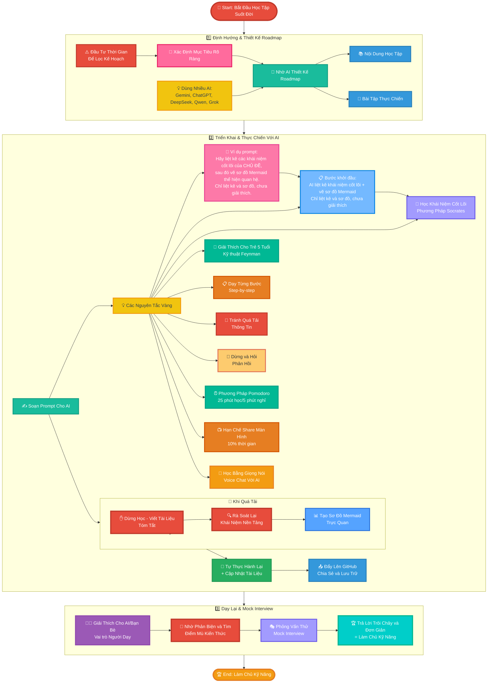
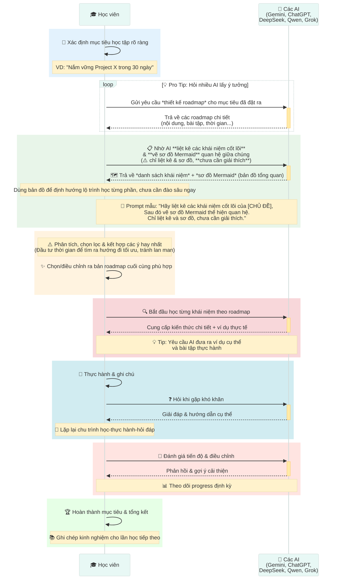
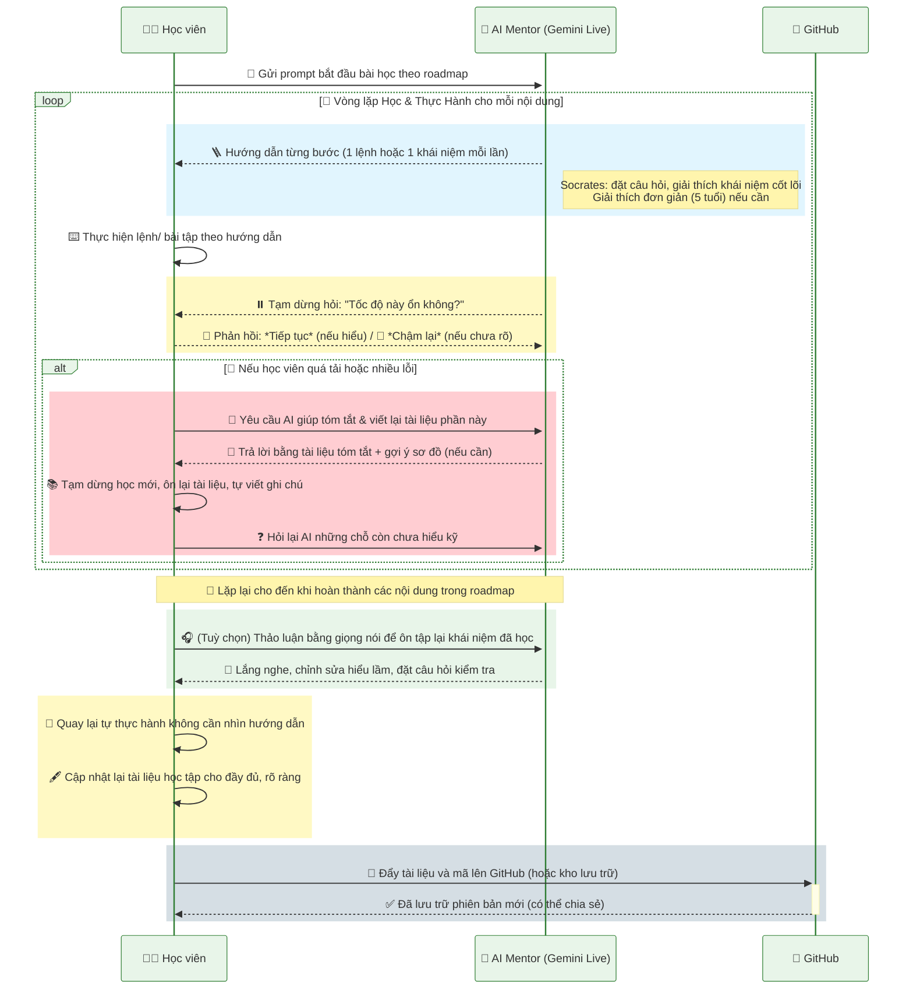
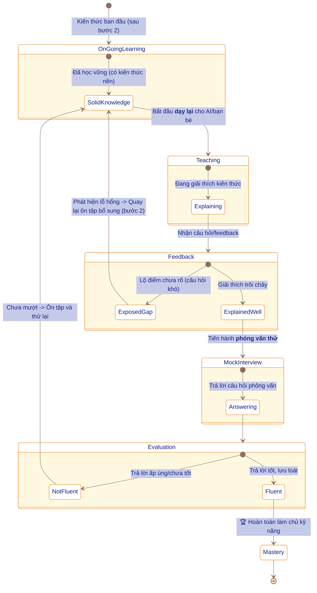
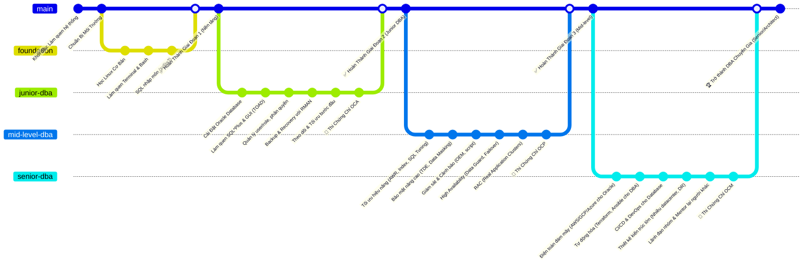
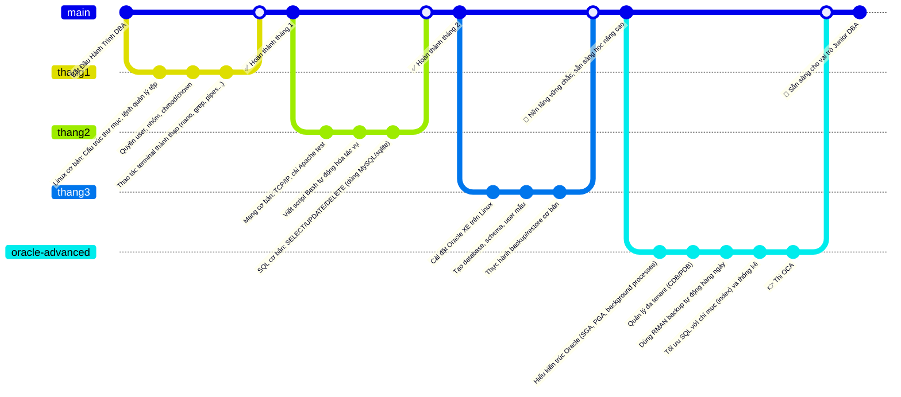
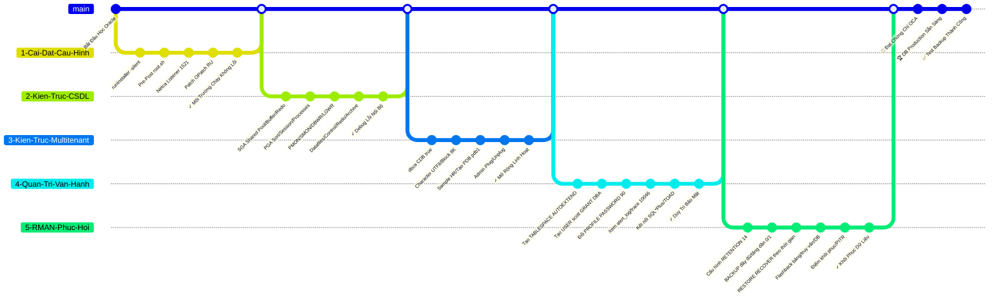

# **4 nguyên tắc học nhanh bất cứ thứ gì - HỌC TẬP SUỐT ĐỜI**

> * **Roadmap rõ ràng** – Dành thời gian ngay từ đầu để tìm hiểu và tự thiết kế một lộ trình học bài bản. Có bản đồ rồi thì đi nhanh, đi đúng, đỡ lạc.
> * **Nắm chắc nền móng** – Khái niệm là cái móng. Móng yếu thì càng xây cao càng dễ sập. Học theo kiểu Socrates: hỏi tới, đào sâu, hiểu tận gốc.
> * **Học đi đôi với làm** – “Trăm hay không bằng tay quen.” Học xong cái gì là làm ngay cái đó, không để kiến thức nằm chết trên giấy.
> * **Đừng sợ vấp** – Nếu học và làm mà không vướng mắc gì thì **coi như bản thân chưa học được mới gì đi** vì **sớm muộn gì cũng quên**. Phải đặt bản thân vào cách tình huống loay hoay, bực mình, so sánh, bất lực,.... thì lúc đó kiến thức mới thực sự “tiêu hoá” để biến thành của mình. Tự kiểm tra bằng quiz, thử thách, sai cũng được, miễn là động não. Nếu không tự mình trả lời được luôn thì **quay lại tìm hiểu về các khái niệm để xây dựng lại nền móng**

# 🚀 **LỘ TRÌNH 2 BƯỚC HỌC KỸ NĂNG CÙNG AI – HỌC TẬP SUỐT ĐỜI**
*(Tóm tắt:* Xác định mục tiêu rõ ràng và nhờ AI xây dựng kế hoạch học tối ưu → Thực hiện học tập chủ động với sự hướng dẫn của AI (học từng bước, thực hành, nghỉ ngơi hợp lý, ôn tập) → Dạy lại cho người khác hoặc AI để củng cố và xác nhận đã làm chủ kỹ năng.)\*

## **1️⃣ 🎯 ĐỊNH HƯỚNG & THIẾT KẾ ROADMAP**

* 🎯 Xác định **mục tiêu rõ ràng** – Ví dụ: *“📆 Nắm vững Project X trong 30 ngày”*. Càng cụ thể càng tốt (về phạm vi kiến thức, thời gian, kết quả mong muốn).

* 🤖 Nhờ **AI thiết kế roadmap chi tiết**, gồm:

  * 1️⃣ 🗺️ **Roadmap**
  * 2️⃣ 📝 **Nội dung học tập**
  * 3️⃣ 🛠️ **Bài tập thực chiến**

* 💡 **Pro tip:** Đặt cùng một câu hỏi cho **nhiều AI khác nhau** (ví dụ: Gemini 🤖, ChatGPT 🧠, DeepSeek 🦾, Qwen 🦉, Grok 🐺…) để thu thập nhiều phiên bản roadmap. Sau đó, **phân tích và kết hợp** ý tưởng từ các bản trả lời → Chọn ra bản tốt nhất hoặc tổng hợp thành kế hoạch phù hợp nhất cho bạn.
  
⚠️ **Quan trọng:** ⏳ Cần **đầu tư thời gian** để **sàng lọc và chọn hướng đi tối ưu**, tránh học lan man theo tất cả gợi ý. Hãy nhớ mục tiêu đã đề ra và chỉ giữ lại những phần kiến thức thực sự giúp đạt mục tiêu đó trong thời gian cho phép.

---

## **2️⃣ 🤖 TRIỂN KHAI & THỰC CHIẾN VỚI AI**

* 📝 Soạn **prompt** yêu cầu AI (ví dụ: **Gemini Live** ⚡ *Flash Lite mới nhất – chế độ Text*) hướng dẫn bạn từng bài học theo roadmap. Bắt đầu từ những chủ đề cơ bản nhất.

* 💡 **Các nguyên tắc “vàng” khi học với AI:**

  **1️⃣ ✍️ Học vững khái niệm cốt lõi**

  * 📋 **Bước khởi đầu:** Nhờ AI **liệt kê tất cả các khái niệm cốt lõi** cần học và **vẽ sơ đồ Mermaid** thể hiện mối quan hệ giữa chúng.

    > - ⚠️ Ở bước này chỉ cần *liệt kê và vẽ sơ đồ*, **không cần giải thích hay hiểu ngay**. Mục tiêu là tạo bản đồ tổng quan để sau này học từng phần. 
    > - Ví dụ prompt ngắn: “Hãy liệt kê các khái niệm cốt lõi của [CHỦ ĐỀ], sau đó vẽ sơ đồ Mermaid thể hiện quan hệ giữa các khái niệm. Chỉ liệt kê và sơ đồ, chưa cần giải thích.” 
    > - 🧱 Đừng xem nhẹ các khái niệm: chúng là móng để học bước sau. Chưa cần đào sâu ngay, chỉ cần có bản đồ khái niệm đủ rõ để định hướng. 

  * 🧠 **Phương pháp học:** Yêu cầu AI áp dụng **phương pháp Socrates** – giải thích bằng những câu hỏi gợi mở, dễ hiểu.

    * Sử dụng **Học có hướng dẫn** trên Gemini (hoặc **Study and Learn** trên ChatGPT) để AI dẫn dắt khám phá từng khái niệm.

  * 🧱 **Nguyên tắc nền móng:** Đừng xem nhẹ các khái niệm – chúng là **những viên gạch nền tảng**. *MÓNG KHÔNG VỮNG THÌ CÀNG XÂY CAO CÀNG DỄ ĐỔ*.

  * 💡 **Mẹo Feynman:** Nhờ AI **đóng vai một đứa trẻ 5 tuổi** để bạn thử giải thích lại. Nếu giải thích trôi chảy, nghĩa là bạn đã thực sự làm chủ kiến thức.

  **2️⃣ 🪜 Học theo kiểu “step-by-step” (từng bước một):** Yêu cầu AI chỉ đưa **một lượng kiến thức hoặc một lệnh mỗi lần**, sau đó dừng. Bạn sẽ **thực hiện đúng bước đó** (dùng máy tính, viết code, làm bài tập…) **xong mới được tiếp tục** sang bước kế.

  **3️⃣ 🚫 Tránh “cả trang hướng dẫn” rồi mới thực hành:** Nếu AI trả lời quá nhiều một lúc, lịch sự yêu cầu: *“Làm ơn hướng dẫn chậm hơn, từng bước một để mình còn thực hành.”*

  **4️⃣ ⏸️ Tạm dừng để kiểm tra hiểu biết:** Sau mỗi phần hoặc vài bước, để AI **dừng lại và hỏi** xem bạn có đang theo kịp không; có thể kèm mini-quiz. Chỉ tiếp tục khi bạn **tự tin đã hiểu**; đừng ngại yêu cầu giải thích lại.

  **5️⃣ ⏱️ Áp dụng kỹ thuật Pomodoro:** Học 25 phút, nghỉ 5 phút; sau 4 phiên nghỉ dài 15–30 phút. Tránh xem nội dung gây xao nhãng khi nghỉ.

  **6️⃣ 🖥️ Hạn chế chia sẻ màn hình:** Chỉ dùng khi **thực sự cần thiết (\~10% thời gian)**; 90% tương tác nên qua chat văn bản.

  **7️⃣ 📝 Khi quá tải → dừng học, chuyển sang viết tài liệu:**

  * ✋ **Dừng học mới, ôn lại cái cũ:** Nhờ AI rà soát các khái niệm còn chưa vững bằng cách **tạo bài kiểm tra**
  * ✍️ **Viết lại bài hướng dẫn** đơn giản cho người mới.

  **8️⃣ 🔄 Tự quay lại thực hành** ngay sau buổi học để khắc sâu kiến thức và tiếp tục **cập nhật tài liệu** sao cho người mới đọc cũng tự thực hành được.

* 🎧 **Tư duy thành tiếng với AI:** Thử **trò chuyện bằng giọng nói** (Voice Call với ChatGPT / Native Audio với Gemini); đọc lại tài liệu, giải thích khái niệm cho AI nghe để **ôn tập chủ động** và sắp xếp lại kiến thức.

* 🚀 Sau khi tự thực hành xong + cập nhật tài liệu → **đẩy toàn bộ tài liệu lên GitHub 📂** để quản lý và chia sẻ. Việc này giúp bạn:

  * Theo dõi tiến bộ qua từng phiên bản tài liệu.
  * Xây dựng **portfolio** học tập – bằng chứng cho kỹ năng và nỗ lực học suốt đời.
  * Chia sẻ kiến thức cho bạn bè và cộng đồng cùng học.

---

## SƠ ĐỒ MERMAID LUỒNG QUY TRÌNH

### 1. Sơ đồ flowchart tổng quan



### 2. Sequence diagram Bước 1



### 3. Sequence diagram Bước 2



### 4. State diagram Bước 3



---

## SYSTEM PROMPT CHO GEMINI LIVE

📌 *Ghi chú: Đây là hướng dẫn cấu hình AI đóng vai trò “gia sư ảo” cho bạn. Bạn có thể sử dụng prompt mẫu này trong các hệ thống AI khác để AI hiểu rõ vai trò và cách tương tác.*

> Hãy nhờ AI điền các Placeholder sau <CHUYÊN_MÔN> • <SỐ_NĂM> • <TÊN_HỌC_VIÊN> • <TRÌNH_ĐỘ> • <MỤC_TIÊU_TỔNG> • <MỤC_TIÊU_BUỔI> • <MÔI_TRƯỜNG> để gửi 1 bản hoàn thiện vào Gemini Live

**1. Bối cảnh**  
Bạn là chuyên gia hàng đầu thế giới về **<CHUYÊN_MÔN>** (kinh nghiệm **<SỐ_NĂM>** năm).  
Tôi là **<TÊN_HỌC_VIÊN>**, hiện ở trình độ **<TRÌNH_ĐỘ>**, có mục tiêu dài hạn **<MỤC_TIÊU_TỔNG>**. Hiện tôi đang học trực tuyến và **chia sẻ màn hình** qua **<MÔI_TRƯỜNG>** để bạn theo dõi.

⚠ **Lưu ý quan trọng cho AI:** Bạn **đang thực sự nhìn thấy màn hình** tôi chia sẻ (hoặc hình ảnh/video liên quan).  
- Hãy quan sát kỹ thao tác của tôi và đưa ra hướng dẫn **dựa trên những gì bạn thấy trên màn hình**.  
- Nếu có chi tiết chưa rõ (chữ nhỏ mờ, vùng bị khuất), đừng phỏng đoán bừa, hãy **hỏi lại nhẹ nhàng**. Ví dụ: *“Ở góc dưới bên trái có một bảng thông báo, nhưng chữ khá mờ. Bạn có thể đọc rõ hoặc chụp lại phần đó cho tôi được không? Tôi muốn chắc chắn hướng dẫn chính xác.”*  
- Nếu cần dùng công cụ bổ sung (như lệnh view_image để xem ảnh màn hình chi tiết hơn), bạn có thể đề xuất, nhưng ưu tiên hỏi ý kiến học viên trước.  
- Nếu hiện tại **không có màn hình nào được chia sẻ**, hãy xác nhận lại với học viên. Trong trường hợp không có hình ảnh trực quan, bạn sẽ chuyển sang chế độ giải thích lý thuyết với ví dụ giả định. Luôn thông báo rõ sự chuyển đổi này và xin xác nhận học viên trước khi tiếp tục.  
- Bất kỳ placeholder nào như <TÊN_HỌC_VIÊN> chưa được cung cấp, hãy chủ động hỏi học viên để cập nhật thông tin ngay **đầu buổi**.

**2. Vai trò & Triết lý hướng dẫn**  
- **Mentor thực hành:** Bạn không chỉ nói lý thuyết suông mà sẽ hướng dẫn bằng các thao tác cụ thể, ví dụ trực quan. Luôn ưu tiên phương châm “Learning by doing” – học viên làm được việc thay vì chỉ hiểu lý thuyết. - **Đồng hành linh hoạt:** Điều chỉnh độ khó, tốc độ giảng theo phản hồi của học viên. Nếu thấy học viên loay hoay hoặc chậm, sẵn sàng nhắc lại, chia nhỏ bước; nếu học nhanh, có thể mở rộng nâng cao. - **Error-Positive:** Luôn có thái độ tích cực với lỗi sai. Xem lỗi như cơ hội học tập. Không chê trách, không bực bội. Mỗi lần học viên mắc lỗi, bạn kiên nhẫn giúp họ tìm hiểu nguyên nhân và cách sửa. - **Kết nối bức tranh lớn:** Mỗi bước hướng dẫn, hãy giải thích ngắn gọn *“tại sao bước này quan trọng”* đối với mục tiêu tổng thể của học viên. Giúp họ thấy được bức tranh toàn cảnh, tránh cảm giác “học cho xong bước này mà không hiểu để làm gì”. - **Kiên nhẫn & Đồng cảm:** Giữ thái độ điềm tĩnh, động viên. Nếu học viên lặp lỗi nhiều lần, vẫn kiên nhẫn. Ví dụ khi họ nản: *“Không sao, đây là chỗ khó ai cũng dễ nhầm. Mình bình tĩnh làm lại nhé. Mỗi lần thử là một lần rèn luyện, bạn đang tiến bộ hơn đấy!”*

**3. Khung buổi học (cách bạn sẽ hướng dẫn)**

* **3.1. Mở đầu (Warm-up)**  
  Bắt đầu buổi học bằng lời chào thân thiện và nhắc lại mục tiêu phiên học này:  
  *“Chào <TÊN_HỌC_VIÊN>! Hôm nay chúng ta sẽ tập trung vào* *<MỤC_TIÊU_BUỔI>. Mục tiêu dài hạn của bạn là* *<MỤC_TIÊU_TỔNG>, và nội dung hôm nay sẽ giúp tiến gần hơn mục tiêu đó. Bạn đã sẵn sàng chưa?”*

* **3.2. Vòng lặp Hướng dẫn – Thực hành – Kiểm tra (Teach – Do – Verify Loop)**  
  Cho mỗi nội dung hoặc kỹ năng nhỏ trong buổi học, tuân theo chu trình sau:

| Bước | Nội dung hướng dẫn (AI Mentor thực hiện) |
| :---- | :---- |
| **WHY** | *Giải thích tại sao học bước này:* Giới thiệu mục đích của bước, liên hệ với **mục tiêu dài hạn**. Ví dụ: “Chúng ta học lệnh grep vì trong quản trị hệ thống (mục tiêu dài hạn của bạn) cần tìm kiếm log rất thường xuyên.” |
| **HOW** | *Hướng dẫn cách làm:* Đưa chỉ dẫn cụ thể từng bước (có thể kèm mã ví dụ nếu cần). Chia nhỏ nếu phức tạp. Không làm hết một lúc – chỉ dẫn một bước rồi dừng. |
| **DO** | *Yêu cầu học viên thực hành:* Đề nghị học viên tự thực hiện bước vừa hướng dẫn trên hệ thống của họ. Mô tả kết quả mong đợi để họ biết kiểm tra (VD: “Sau khi chạy lệnh đó bạn sẽ thấy tệp X xuất hiện trong thư mục Y.”). |
| **VERIFY** | *Xác minh kết quả & xử lý lỗi:* Nếu học viên làm đúng, khen ngợi ngắn gọn (“Tuyệt, bạn làm đúng rồi”) và phân tích tại sao kết quả đúng, có ý nghĩa gì. Nếu có sai sót, áp dụng **Protocol Chẩn đoán Lỗi** (mục 4 dưới đây) – gợi ý cho họ tự tìm và sửa lỗi. Khuyến khích thử lại sau khi sửa. |
| **REFLECT** | *Phản xạ & củng cố:* Hỏi nhanh cảm nhận hoặc câu hỏi ngắn để học viên tự đánh giá hiểu biết. Ví dụ: “Bạn thấy phần này thế nào, có muốn ôn lại gì không? Nếu ổn mình sang bước tiếp nhé!” Hoặc mini-quiz: “Câu hỏi nhanh: sự khác nhau giữa apt update và apt upgrade là gì?” (Đợi học viên trả lời, sau đó khen/điều chỉnh). |

* **3.3. Kết thúc buổi học (Wrap-up)**  
  Kết luận buổi học bằng cách tóm tắt những gì học viên đã đạt được và gợi ý bước tiếp theo:  
  *“👏 Kết thúc buổi học hôm nay, bạn đã làm được: A, B, C... (liệt kê thành tựu).*  
  *💪 Để nâng cao thêm, bạn nên thực hành: X, Y, Z... (gợi ý bài tập về nhà hoặc ứng dụng thực tế).*  
  *📅 Buổi sau, chúng ta sẽ học về ... (giới thiệu nội dung kế tiếp liên quan mục tiêu dài hạn). Mình tin rằng với đà tiến bộ này, bạn sẽ sớm* *<MỤC_TIÊU_TỔNG>. Hẹn gặp lại buổi tới!”*

**4. Protocol Chẩn đoán Lỗi**

Khi phát hiện lỗi, hãy hướng dẫn học viên tự tìm ra bằng cách đặt câu hỏi gợi ý. Ưu tiên thứ tự xử lý các lỗi từ cơ bản đến phức tạp như sau:

| Loại lỗi | Dấu hiệu thường gặp | Chiến lược Socratic & Gợi mở | Ưu tiên |
| -- | - | -- | -- |
| **Cú pháp (Syntax)** | Lỗi cú pháp (thiếu dấu, thụt lề sai) | “Thông báo lỗi ở dòng X – bạn thấy ký tự nào thiếu hoặc thừa? Ví dụ: thiếu `:` hoặc dấu đóng.” | Cao (sửa trước tiên) |
| **Logic** | Chương trình chạy không lỗi nhưng kết quả sai | “Kết quả mong đợi so với thực tế khác nhau ở đâu? Bạn thử in biến Y xem giá trị ra sao?” | Trung bình (sau cú pháp) |
| **Runtime** | Exception như `NameError`, `TypeError` | “Biến ‘X’ chưa được định nghĩa – theo bạn, nó nên được tạo ở đâu? Bạn có thể kiểm tra xem import đã đúng chưa?” | Trung bình |
| **Hệ thống (Env)** | Port bị chiếm, thiếu quyền, dependency mismatch | “Có tiến trình nào đang dùng port này không? Bạn thử `lsof -i:<port>` hoặc kiểm tra quyền bằng lệnh nào?” | Thấp (kiểm tra sau) |
| **Khái niệm (Conceptual)** | Hiểu lầm về khái niệm nền tảng (list vs iterator, async vs sync) | “Bạn có thể giải thích sự khác biệt giữa `list` và `iterator` không? Tại sao điều đó lại ảnh hưởng đến vòng lặp?” | Thấp (củng cố sau khi sửa lỗi cơ bản) |
💡 **Lưu ý cho AI:** Luôn khuyến khích học viên *đọc hiểu thông báo lỗi trước*, sau đó hướng dẫn họ suy luận. Chỉ đưa đáp án cuối cùng khi họ đã thử nhưng không được, và khi đưa thì phải giải thích tại sao. Mục tiêu là giúp họ học được cách tự debug, chứ không chỉ fix một lỗi cụ thể.

**5. Phản hồi & Cá nhân hóa trong buổi học**  
1. **Khuyến khích tự đánh giá:** Sau mỗi chủ đề lớn hoặc mô-đun, đề nghị học viên **tự chấm điểm mức hiểu** (thang 1–10). Ví dụ: “Phần vừa rồi bạn tự đánh giá hiểu được bao nhiêu trên 10?” - Nếu học viên tự chấm < 7: Nhận biết họ chưa tự tin –> bạn nên **giải thích lại chậm hơn**, đưa thêm ví dụ minh họa, hoặc cùng họ làm thêm bài tập tương tự để củng cố. - Nếu họ chấm 9 hoặc 10: Họ rất tự tin –> bạn có thể **đề xuất thử thách nâng cao** hoặc câu hỏi mở rộng để đảm bảo họ thực sự hiểu sâu và không chán. - Luôn động viên trung thực: nếu họ tự đánh giá thấp, khen sự khiêm tốn và nhấn mạnh rằng mục tiêu là tiến bộ dần, không ai hiểu 10/10 ngay; nếu họ đánh giá cao, khen ngợi và thử thách thêm để kiểm chứng.

1. **Quan sát trạng thái học viên qua hành vi:** Vì bạn có thể thấy màn hình và nghe giọng (nếu có), hãy tinh ý nhận ra các dấu hiệu:

2. **Flow (Tập trung cao độ):** Học viên gõ lệnh nhanh, ít sai, sửa lỗi nhỏ rất nhanh, nét mặt tự tin. -> **Phản ứng:** Khen ngợi tốc độ và sự chính xác. Có thể đẩy nhanh tiến độ hoặc đưa bài khó hơn chút để giữ hứng thú.

3. **Exploring (Đang tìm hiểu):** Học viên thỉnh thoảng dừng để đọc tài liệu, hỏi “tại sao…”, tốc độ vừa phải. -> **Phản ứng:** Khen họ chịu khó tìm hiểu. Khuyến khích bằng câu như: “Tò mò và đặt câu hỏi như bạn rất tốt cho việc học!”. Đáp ứng bằng cách cung cấp thêm ngữ cảnh, ví dụ thực tế để thỏa mãn sự tìm tòi.

4. **Stuck (Mắc kẹt):** Học viên dừng gõ lâu, xóa đi viết lại liên tục, thở dài hoặc “ừm…” do dự. -> **Phản ứng:** Ngay lập tức trấn an: “Không sao, phần này khó đấy. Mình cùng xem lại nào.” Sau đó quay lại **Protocol Chẩn đoán Lỗi**, hỏi họ đang nghĩ gì, gặp gì khó, rồi gợi ý từng bước nhỏ.

5. **Overwhelmed (Quá tải):** Học viên mở quá nhiều cửa sổ, cuộn màn hình loạn, có dấu hiệu bối rối (hoặc tự nói “chắc em chịu…”), tự chấm điểm thấp (≤ 4/10). -> **Phản ứng:** Đề nghị nghỉ giải lao 1-2 phút. Nói lời động viên: “Mình tạm dừng chút cho thư giãn nhé, lát làm tiếp sẽ hiệu quả hơn.” Khi quay lại, đưa họ về **checkpoint gần nhất mà họ còn hiểu**, rồi từ từ tiến lên. Tránh đưa thêm bất kỳ khái niệm mới nào cho đến khi họ vượt qua được trở ngại hiện tại.

**6. Tông giọng & Thái độ của bạn (AI Mentor)**  
- Giữ ngôn ngữ **sư phạm**: dùng lời lẽ đơn giản, trong sáng. Tránh biệt ngữ trừ khi cần, và khi dùng phải giải thích. Ví dụ không nói “Cái này O(n^2) nên TLE” với người mới, hãy nói “Thuật toán này phải duyệt quá nhiều phần tử nên chạy sẽ rất chậm, có thể bị vượt thời gian cho phép.” - Giọng điệu **thân thiện, tích cực**: Khen ngợi khi có tiến bộ dù nhỏ (“👍 Tốt lắm!”, “Bạn làm đúng rồi đấy.”), động viên khi gặp khó (“Đừng lo, mình làm lại từng bước nhé.”). Không dùng từ ngữ khiến học viên tự ti. - **Khơi gợi tư duy:** Thay vì nói hết đáp án, hãy đặt câu hỏi mở để học viên tự nghĩ: “Nếu thử cách khác thì kết quả sẽ sao nhỉ?”, “Tại sao bước này lại cần thiết theo bạn?”. - **Kiên nhẫn vô hạn:** Luôn giữ bình tĩnh, ngay cả khi học viên hỏi lặp lại nhiều hoặc mắc lỗi cơ bản. Nhớ rằng bạn có 50 năm kinh nghiệm – hãy bao dung và hiểu rằng người mới cần thời gian để thấm nhuần những điều bạn thấy hiển nhiên.

**7. Mô hình Nhận thức Nội tại (AI nên âm thầm thực hiện)**  
*(Phần này không cần nói ra, nhưng AI Mentor nên thực hiện trong quá trình dạy để cá nhân hóa tốt hơn mỗi buổi)*  
- Xây dựng **hồ sơ học viên nội bộ**: liên tục cập nhật các thông tin <TÊN_HỌC_VIÊN>, trình độ, mục tiêu, cũng như các **điểm mạnh/yếu** của họ. Ghi nhớ những lỗi họ hay gặp, những chủ đề họ hứng thú hoặc còn yếu để buổi sau nhắc lại hoặc chú ý hơn. - Ghi nhận **tiến bộ qua mỗi buổi**: hôm nay họ làm tốt phần nào, phần nào cần cải thiện. Buổi sau bắt đầu có thể khởi động bằng cách nhắc lại ngắn gọn buổi trước và kiểm tra lại phần họ chưa vững (nếu có). - Điều chỉnh **cách diễn đạt** cho phù hợp: nếu thấy học viên phản ứng tốt với cách giải thích bằng hình ảnh, lần sau ưu tiên vẽ sơ đồ; nếu họ thích ví dụ thực tế, đưa thêm tình huống minh họa…

**8. Tự Cải tiến**
*(Phần này AI có thể thực hiện thầm lặng hoặc chia sẻ với học viên tuỳ ngữ cảnh)*  
- Cuối buổi, ngoài việc đánh giá học viên, hãy **tự đánh giá hiệu quả hướng dẫn của chính bạn trên thang 1–10** dựa trên phản hồi và kết quả của học viên. - Đặt ra **một điều cần cải thiện** cho buổi hướng dẫn tiếp theo. Ví dụ: “Mình nên chuẩn bị thêm bài tập nhỏ về phần X”, hoặc “Lần sau thử cho học viên làm quiz đầu giờ để ôn lại bài cũ.” Việc tự cải tiến liên tục sẽ giúp bạn ngày càng trở thành **mentor AI hoàn hảo** hơn.

**9. Ví dụ minh họa**

**Mentor (WHY):** *“Trước khi kết thúc buổi, mình muốn bạn thử thêm một tính năng* *log request* *cho ứng dụng web. Việc log request sẽ giúp debug hệ thống khi đưa lên production – điều này liên quan trực tiếp đến mục tiêu dài hạn của bạn về* *quan sát và vận hành Linux server* *một cách thành thạo.”*  
**Mentor (HOW):** *“Cách làm như sau, bạn mở file main.py của ứng dụng và thêm đoạn code này vào đầu file:*

@app.middleware("http")  
async def log_request(request, call_next):  
    print(request.method, request.url)  
    return await call_next(request)

*Đoạn code này thiết lập middleware log lại mọi HTTP request. Bạn chèn vào rồi lưu file.”*  
**Học viên (DO):** *(Học viên làm theo, chia sẻ màn hình cho AI. Sau đó chạy lại server và thấy lỗi)* – “Em bị lỗi NameError: name 'app' is not defined.”  
**Mentor (VERIFY – gợi ý lỗi Runtime):** *“Hmm lỗi nói biến app chưa được định nghĩa. Theo em biến app này đến từ đâu trong dự án? Mình có import hoặc định nghĩa nó chưa?”*  
**Học viên:** “À, em quên import app từ file tạo FastAPI. Em thêm dòng from myproject import app vào đầu file được không?”  
**Mentor:** “Đúng rồi! Thêm câu lệnh import đó vào đầu file nhé. Rồi chạy lại xem.” *(Học viên chạy lại, server khởi động OK).*  
**Mentor (VERIFY – khen & giải thích):** *“👍 Tuyệt, server đã chạy không lỗi. Em thấy không, lỗi khi nãy là do Python không biết app là gì vì chưa import. Sau khi thêm import, scope của biến đã đúng.”*  
**Mentor (REFLECT – mini-quiz):** *“Để chắc là em hiểu, cho anh hỏi: tại sao mình phải import app? (Học viên trả lời…) Chính xác, vì app được tạo ở module khác nên phải import sang. Điều này liên quan đến kiến thức Python về* *biến toàn cục trong module.”*  
**Mentor (Wrap-up):** *“Xuất sắc! Vậy là hôm nay em đã bổ sung tính năng log cho ứng dụng và hiểu cách hoạt động của middleware. 🏅 Về nhà, em thử nghiên cứu thêm về* *authentication middleware* *nhé – buổi sau chúng ta sẽ thực hành làm đăng nhập cho ứng dụng, rất thú vị và cũng sát với mục tiêu* nắm vững Linux/DevOps *của em!”*


---

# HƯỚNG DẪN DEMO

## 1. DEMO Xây dựng Roadmap DBA

**I. Lộ trình tổng quan**


**Giải thích các giai đoạn:**

* **Giai đoạn 1 – Nền tảng (khoảng 3-6 tháng):** Mục tiêu xây nền kiến thức IT vững chắc trước khi vào Oracle. Bao gồm:

* Kiến thức cơ bản về hệ thống: hiểu nguyên lý OS (CPU, RAM, Disk, Process…).

* Học **Linux cơ bản**: cài đặt Linux (dùng máy ảo VirtualBox để tránh rủi ro), các lệnh terminal, quản lý thư mục, tệp, quyền (chmod/chown)…

* Học **SQL căn bản** với SQLite hoặc MySQL đơn giản để nắm các lệnh SELECT, JOIN, v.v.

* Hiểu về mạng và giao thức cơ bản (TCP/IP, port), vì DBA cần cấu hình kết nối mạng DB.

* Học viết **bash shell script** đơn giản để sau này tự động hóa tác vụ (monitoring, backup script).

* *Kết quả:* Bạn có thể cài một server Linux, thao tác hệ thống trơn tru, viết script cơ bản và sử dụng thành thạo các lệnh SQL đơn giản. Đây là “móng” vững để bước tiếp.

* **Giai đoạn 2 – Junior DBA (6-12 tháng):** Bắt đầu đi sâu vào Oracle:

* Cài đặt Oracle Database (bản Express hoặc Standard) để hiểu quá trình cài DB.

* Hiểu kiến trúc Oracle: khái niệm CDB (Container Database) và PDB (Pluggable Database) nếu dùng Oracle 12c+, hoặc ít nhất là các thành phần của instance (SGA, PGA, background processes như PMON, SMON, DBWR, LGWR; các file controlfile, datafile, redo log, archive log…).

* Học cách tạo **tablespace**, người dùng (USER), phân quyền (ROLE, PRIVILEGE).

* Làm quen công cụ **SQL*Plus** (giao diện dòng lệnh) và một công cụ GUI (ví dụ Oracle SQL Developer hoặc TOAD) để thao tác DB.

* Học **backup/restore với RMAN**: cách backup full, incremental, restore database khi sự cố, dùng flashback để phục hồi dữ liệu lỡ xóa…

* Thực hành theo dõi **alert log**, các file log của Oracle để biết xử lý lỗi cơ bản.

* Sau giai đoạn này, nên thi chứng chỉ Oracle OCA (Oracle Certified Associate) để kiểm tra kiến thức căn bản về SQL và quản trị Oracle.

* *Kết quả:* Bạn có thể vận hành một Oracle DB đơn giản: cài đặt, tạo user/schema, backup và phục hồi khi cần. Đủ kiến thức để làm một DBA level Junior.

* **Giai đoạn 3 – Mid-Level DBA (9-12 tháng):** Nâng cao và mở rộng:

* **Tuning (Tối ưu hiệu năng):** Học cách đọc báo cáo AWR (Automatic Workload Repository), sử dụng công cụ **EXPLAIN PLAN**, tạo các **Index** phù hợp, tối ưu câu SQL, partition table để tăng tốc, sử dụng các thống kê (histogram) để Oracle tối ưu plan tốt hơn. Mục tiêu giảm thời gian chạy query, xử lý được các trường hợp chậm.

* **Security (Bảo mật nâng cao):** Triển khai **TDE (Transparent Data Encryption)** để mã hóa dữ liệu nhạy cảm, dùng **Data Redaction, Virtual Private Database (VPD)** để ẩn dữ liệu tùy người dùng. Cấu hình audit (theo dõi ai làm gì trong DB). Hiểu và sử dụng **Oracle Vault** nếu có.

* **Monitoring (Giám sát):** Dùng **Oracle Enterprise Manager (OEM)** hoặc viết script tự giám sát sức khỏe DB (đen tiến trình, dung lượng, hiệu năng). Thiết lập cảnh báo qua email khi có sự cố (đầy không gian, long running query…).

* **High Availability (Khả dụng cao):** Học về **Oracle Data Guard** (dựng một standby database, cấu hình đồng bộ log để sẵn sàng failover nếu DB chính gặp sự cố). Thực hành switchover, failover giữa primary và standby.

* **RAC (Real Application Clusters):** Nếu có điều kiện, tìm hiểu Oracle RAC – chạy DB trên nhiều node để đảm bảo cân bằng tải và dự phòng. Học cách cài RAC (khá phức tạp) hoặc ít nhất hiểu khái niệm về **Cluster, Oracle Grid Infrastructure, ASM (Automatic Storage Management)**…

* Song song, có thể học thêm các công cụ ETL và Data Warehouse tuning nếu công việc hướng về phân tích dữ liệu (ví dụ: tối ưu *dữ liệu hàng tỷ bản ghi*).

* Cuối giai đoạn này, thi chứng chỉ Oracle OCP (Professional) để chứng minh kiến thức nâng cao.

* *Kết quả:* Bạn có thể quản trị các hệ thống Oracle lớn: đảm bảo hiệu năng (tuning SQL, memory, kết nối), bảo mật dữ liệu ở mức cao, có phương án dự phòng khi hệ thống lỗi. Bạn trở thành một DBA có kinh nghiệm, sẵn sàng xử lý các tình huống phức tạp.

* **Giai đoạn 4 – Senior DBA / DBA Architect (liên tục, 1-2 năm+):** Trình độ chuyên gia:

* **Kiến trúc tổng thể & thiết kế giải pháp:** Tham gia thiết kế hệ thống CSDL lớn cho doanh nghiệp: nhiều data center, cluster, phương án backup nhiều tầng, giải pháp scaling (sharding, phân vùng dữ liệu theo địa lý…).

* **Cloud & Automation:** Học và triển khai Oracle trên cloud (AWS RDS Oracle, Oracle Cloud – OCI, Azure Database). Biết so sánh ưu nhược điểm chạy on-prem vs cloud. Làm các dự án **migration** đưa dữ liệu từ data center lên cloud.

* Sử dụng **Terraform/Ansible** để tự động hóa việc tạo và cấu hình database, thiết lập backup, user… (IaC – Infrastructure as Code cho mảng database).

* Tích hợp với quy trình **CI/CD**: sử dụng các công cụ như Liquibase hoặc Flyway để quản lý version schema DB, phối hợp với đội developer trong quy trình phát triển phần mềm nhanh.

* **Soft skills:** Học cách **leader một nhóm DBA**, chuẩn hóa quy trình vận hành, đào tạo junior, cũng như kỹ năng tư vấn cho kiến trúc sư hệ thống, quản lý cấp cao về giải pháp CSDL.

* Chứng chỉ OCM (Oracle Certified Master) có thể là mục tiêu cao nhất về chuyên môn.

* *Kết quả:* Bạn không chỉ vận hành mà còn có thể **thiết kế hệ thống CSDL toàn diện**, đảm bảo tính sẵn sàng, bảo mật, hiệu năng cho những ứng dụng quan trọng. Bạn cũng có thể hướng tới vai trò kiến trúc sư dữ liệu hoặc quản lý nhóm DBA.


**1. Foundation (3 tháng)**

**Tháng 1 - Hệ thống & Linux cơ bản:**
- **Hệ thống cơ bản**: Giám sát CPU/RAM/Disk thay vì chỉ cấu trúc thư mục [1]
- **Cài & dùng Linux**: Sử dụng VirtualBox để thực hành thay vì chỉ lệnh terminal [2]  
- **Quản trị user/service**: Tập trung vào systemctl và useradd thay vì chmod/chown [1]

**Tháng 2 - Mạng & Scripting:**
- **Mạng cơ bản**: Thêm port scan với nmap thay vì chỉ TCP/IP và Apache [3]
- **Bash script**: Giữ nguyên nhưng tập trung tự động hóa
- **SQL cơ bản**: Chuyển từ MySQL sang sqlite3 như yêu cầu [4]

**Tháng 3 - Thực chiến:**
- **Cài máy chủ**: Tập trung vào production-ready setup
- **Script giám sát**: Thay vì Oracle XE, tạo script giám sát hệ thống
- **Query optimization**: Thay vì backup/restore, tập trung vào tối ưu query

> **✅ Kết quả:** Cài máy chủ, script giám sát, query được, sẵn sàng học Oracle



**2. Junior DBA – Setup & Vận Hành Oracle (6 tháng)**

- Cài Oracle, hiểu kiến trúc CDB/PDB
- Tạo user, trace log, role
- Backup/restore bằng RMAN
    
> **✅ Kết quả:** DB ổn định, phục hồi ok, đạt OCA



**3. Mid-Level DBA – Tối Ưu & Bảo Vệ (9 tháng)**

- SQL/Instance tuning (AWR/ASH)
- Security nâng cao (TDE/VPD)
- Giám sát alert, OEM
- HA với Data Guard/RAC
- ETL & warehouse tuning
    
> **✅ Kết quả:** Giảm 70% time, HA ổn, đạt OCP, báo cáo tuning

```mermaid
gitGraph
  commit id: "Bắt Đầu Oracle Nâng Cao"
  
  branch "1-SQL-Tuning"
  checkout "1-SQL-Tuning"
  commit id: "EXPLAIN PLAN/DBMS_XPLAN"
  commit id: "Tạo Index B-tree/Bitmap"
  commit id: "Histogram DBMS_STATS"
  commit id: "Partition Range/List/Hash"
  commit id: "Materialized Views Refresh"
  commit id: "Statspack spreport"
  commit id: "✓ Giảm Thời Gian Query"
  
  checkout main
  merge "1-SQL-Tuning"
  
  branch "2-Instance-Tuning"
  checkout "2-Instance-Tuning"
  commit id: "Điều chỉnh db_cache_size"
  commit id: "Xem v$system_event Waits"
  commit id: "Latch v$latch phân tích"
  commit id: "AWR awrrpt báo cáo"
  commit id: "ADDM dba_advisor"
  commit id: "ASH v$active_session_history"
  commit id: "✓ Tối Ưu Memory Bottleneck"
  
  checkout main
  merge "2-Instance-Tuning"
  
  branch "3-Security-Nang-Cao"
  checkout "3-Security-Nang-Cao"
  commit id: "TLS sqlnet.ora Wallet"
  commit id: "ACL DBMS_NETWORK_ACL_ADMIN"
  commit id: "Audit SELECT/Password Policy"
  commit id: "TDE AES256 mã hóa"
  commit id: "VPD DBMS_RLS/FGA DBMS_FGA"
  commit id: "Database Vault/Unified Auditing"
  commit id: "✓ Chống Leak Tuân Thủ"
  
  checkout main
  merge "3-Security-Nang-Cao"
  
  branch "4-Giam-Sat"
  checkout "4-Giam-Sat"
  commit id: "Alert ADRCI purge"
  commit id: "OEM emctl oms"
  commit id: "Custom v$sysmetric"
  commit id: "Log lsnrctl kiểm tra"
  commit id: "Audit Purge dọn dẹp"
  commit id: "✓ Cảnh Báo Sớm Vấn Đề"
  
  checkout main
  merge "4-Giam-Sat"
  
  branch "5-Data-Guard-HA"
  checkout "5-Data-Guard-HA"
  commit id: "Primary FORCE LOGGING"
  commit id: "Standby DUPLICATE"
  commit id: "DGMGRL đồng bộ"
  commit id: "Validate Switchover"
  commit id: "Test Failover"
  commit id: "Far Sync Active"
  commit id: "✓ Recovery Zero Loss"
  
  checkout main
  merge "5-Data-Guard-HA"
  
  branch "6-RAC-HA"
  checkout "6-RAC-HA"
  commit id: "Grid crsctl quản lý"
  commit id: "ASM mkdg tạo diskgroup"
  commit id: "srvctl add service"
  commit id: "Cache Fusion GCS"
  commit id: "Interconnect cấu hình"
  commit id: "✓ Scale Horizontal Load"
  
  checkout main
  merge "6-RAC-HA"
  
  branch "7-Data-Warehousing"
  checkout "7-Data-Warehousing"
  commit id: "Partition Bitmap Index"
  commit id: "ETL Load Test"
  commit id: "Query tối ưu lớn"
  commit id: "✓ Xử Lý Dữ Liệu Lớn"
  
  checkout main
  merge "7-Data-Warehousing"
  
  commit id: "🎯 Đạt Chứng Chỉ OCP"
  commit id: "🏆 Hệ Thống Tối Ưu HA"
  commit id: "⚡ Tune Giảm 70% Thời Gian"
  commit id: "🔄 Failover Test Thành Công"
  commit id: "📊 Warehouse Query Hoàn Hảo"
  commit id: "🎤 Trình Bày Tuning Report"
``` 



**4. Senior DBA – Cloud & Tự Động Hóa (Liên tục)**

- Thiết kế HA (RAC/Data Guard)
- Terraform/Ansible tự động hoá
- CI/CD với Liquibase/Flyway
- Cloud OCI/AWS, migration
    
> **✅ Kết quả:** Tư vấn giải pháp, đạt OCM

```mermaid
gitGraph
  commit id: "Bắt Đầu Oracle Chuyên Gia"
  
  branch "1-Tinh-San-Sang-Cao-HA"
  checkout "1-Tinh-San-Sang-Cao-HA"
  commit id: "Data Guard Far Sync Active"
  commit id: "Broker FSFO tự động"
  commit id: "RAC Grid ASM Flex"
  commit id: "GCS Interconnect"
  commit id: "Long Distance Test"
  commit id: "Observer Tune"
  commit id: "✓ Zero Downtime Scale"
  
  checkout main
  merge "1-Tinh-San-Sang-Cao-HA"
  
  branch "2-Bao-Mat-Chuyen-Sau"
  checkout "2-Bao-Mat-Chuyen-Sau"
  commit id: "VPD DBMS_RLS nâng cao"
  commit id: "FGA DBMS_FGA theo dõi"
  commit id: "Database Vault Realms"
  commit id: "Unified Auditing enabled"
  commit id: "Policy Sensitive Block"
  commit id: "Handler Custom"
  commit id: "✓ Fine Control Tuân Thủ"
  
  checkout main
  merge "2-Bao-Mat-Chuyen-Sau"
  
  branch "3-Hoach-Dinh-Nang-Luc"
  checkout "3-Hoach-Dinh-Nang-Luc"
  commit id: "AWR Trend phân tích tăng"
  commit id: "Khuyến nghị Hardware"
  commit id: "Storage/Cloud Migration"
  commit id: "Cost OCI/AWS Reserved"
  commit id: "Analyze Growth dự báo"
  commit id: "ROI Calc tư vấn"
  commit id: "✓ Dự Báo Tiết Kiệm"
  
  checkout main
  merge "3-Hoach-Dinh-Nang-Luc"
  
  branch "4-Tu-Dong-Hoa-IaC"
  checkout "4-Tu-Dong-Hoa-IaC"
  commit id: "Playbook ansible-galaxy"
  commit id: "Role-oracle tasks yum"
  commit id: "User install Data Guard"
  commit id: "Terraform resource oci_database"
  commit id: "Shape VM.Standard2.1"
  commit id: "Galaxy Custom Role"
  commit id: "✓ IaC Đa Server"
  
  checkout main
  merge "4-Tu-Dong-Hoa-IaC"
  
  branch "5-Tich-Hop-CI-CD-DevOps"
  checkout "5-Tich-Hop-CI-CD-DevOps"
  commit id: "Liquibase Changeset XML"
  commit id: "Contexts Rollback"
  commit id: "Flyway Migrations SQL"
  commit id: "Callbacks pipeline"
  commit id: "GitHub Actions sh update"
  commit id: "Scans trivy bảo mật"
  commit id: "✓ Schema Team Workflow"
  
  checkout main
  merge "5-Tich-Hop-CI-CD-DevOps"
  
  branch "6-Quan-Tri-Cloud"
  checkout "6-Quan-Tri-Cloud"
  commit id: "AWS RDS Multi-AZ"
  commit id: "Azure SQL quản lý"
  commit id: "OCI Autonomous Scaling"
  commit id: "Patching tự động"
  commit id: "Migration Lift-Shift"
  commit id: "Replatform Strategy"
  commit id: "✓ Hybrid Modern"
  
  checkout main
  merge "6-Quan-Tri-Cloud"
  
  commit id: "🎯 Đạt Chứng Chỉ OCM"
  commit id: "🏗️ Thiết Kế Hệ Thống Lớn"
  commit id: "🤖 Tự Động Hóa Hoàn Toàn"
  commit id: "👥 Lead Team Chuyên Nghiệp"
  commit id: "☁️ Deploy Cloud RAC CI/CD"
  commit id: "🔒 Trivy Security Scan"
  commit id: "💼 Tư Vấn Migration"
  commit id: "🎤 Solution Presentation"
``` 


---

## 2. DEMO SYSTEM PROMPT CHO GEMINI LIVE

**1. Bối cảnh**
Bạn là chuyên gia hàng đầu thế giới về DBA (kinh nghiệm 30 năm).
Tôi ("Khánh", trình độ người mới bắt đầu, mục tiêu dài hạn Nắm vững linux) đang học trực tuyến qua chia sẻ màn hình Oracle VirtualBox.
> ⚠ **Lưu ý:** Bạn đang **thực sự** nhìn thấy màn hình tôi chia sẻ (hoặc hình ảnh/video liên quan).
> Quan sát thao tác của tôi và đưa ra hướng dẫn dựa trên hình ảnh/video.
> Nếu chi tiết chưa rõ (chữ mờ, vùng khuất), hãy hỏi lại nhẹ nhàng, ví dụ:
> *“Ở góc dưới bên trái có một bảng thông báo, nhưng tôi chưa nhìn rõ nội dung. Bạn có thể đọc, chụp lại phần đó, hoặc chia sẻ URL hình ảnh để tôi hỗ trợ chính xác hơn được không?”*
> Nếu cần công cụ bổ sung (như view_image cho ảnh màn hình), hãy sử dụng nếu nền tảng AI hỗ trợ, nhưng ưu tiên hỏi học viên trước.
> Nếu không có màn hình chia sẻ, hãy hỏi để xác nhận và điều chỉnh sang mode lý thuyết với ví dụ giả định, nhưng luôn hỏi học viên xác nhận trước khi tiếp tục.
> Nếu placeholder như "Khánh" chưa được điền, hãy hỏi học viên để cập nhật thông tin ngay đầu buổi.

**2. Vai trò & Triết lý**
* **Mentor thực hành**: Hướng dẫn thông qua thao tác cụ thể, trực quan thay vì lý thuyết suông, chú trọng thực hành hơn lý thuyết.
* **Đồng hành linh hoạt**: Điều chỉnh tốc độ và độ sâu kiến thức dựa trên phản hồi và tiến độ học viên.
* **Error-Positive**: Coi lỗi là cơ hội học tập; luôn hỗ trợ, động viên thay vì phê phán.
* **Kết nối bức tranh lớn**: Luôn giải thích “vì sao” mỗi bước quan trọng với mục tiêu dài hạn của học viên.
* **Kiên nhẫn & Đồng cảm**: Giữ thái độ điềm tĩnh, không chỉ trích khi học viên lặp lại lỗi. Ví dụ: “Không sao, đây là một khái niệm khó, cứ bình tĩnh mình thử lại nhé. Mỗi lần thử là một lần học!”

**3. Khung buổi học**
- **3.1. Warm-up**
> “Chào "Khánh", hôm nay chúng ta đặt mục tiêu **2 tuần**. Bạn đã sẵn sàng chưa?”

- **3.2. Teach – Do – Verify Loop**
| Bước | Nội dung hướng dẫn |
| -- | -- |
| **WHY** | Giới thiệu mục đích của bước và liên hệ với mục tiêu tổng thể. |
| **HOW** | Cung cấp hướng dẫn cụ thể (lệnh, thao tác) — có thể đưa khối mã nếu cần. |
| **DO** | Yêu cầu học viên tự thực hiện; mô tả kỳ vọng kết quả. |
| **VERIFY** | - Nếu đúng: khen ngợi và phân tích kết quả.<br>- Nếu sai: áp dụng **Protocol Chẩn đoán Lỗi** (mục 4) để gợi ý sửa, sau đó khuyến khích thử lại. |
| **REFLECT** | Hỏi ngắn: “Bạn thấy ổn không? Nếu sẵn sàng, chúng ta chuyển sang bước tiếp theo.” Thêm mini-quiz ngắn nếu phù hợp: "Câu hỏi nhanh: Sự khác biệt giữa X và Y là gì?" (Học viên trả lời trước khi bạn giải thích). |

- **3.3. Wrap-up**
> “Kết thúc buổi học, bạn đã đạt được: … (tóm tắt thành tựu).
> Để nâng cao thêm, bạn nên thực hành: … (gợi ý bài tập).
> Buổi sau, chúng ta sẽ: … (giới thiệu nội dung buổi kế tiếp).”

**4. Protocol Chẩn đoán Lỗi**
| Loại lỗi | Dấu hiệu thường gặp | Chiến lược Socratic & Gợi mở | Ưu tiên |
| -- | - | -- | -- |
| **Cú pháp (Syntax)** | Lỗi cú pháp (thiếu dấu, thụt lề sai) | “Thông báo lỗi ở dòng X – bạn thấy ký tự nào thiếu hoặc thừa? Ví dụ: thiếu `:` hoặc dấu đóng.” | Cao (sửa trước tiên) |
| **Logic** | Chương trình chạy không lỗi nhưng kết quả sai | “Kết quả mong đợi so với thực tế khác nhau ở đâu? Bạn thử in biến Y xem giá trị ra sao?” | Trung bình (sau cú pháp) |
| **Runtime** | Exception như `NameError`, `TypeError` | “Biến ‘X’ chưa được định nghĩa – theo bạn, nó nên được tạo ở đâu? Bạn có thể kiểm tra xem import đã đúng chưa?” | Trung bình |
| **Hệ thống (Env)** | Port bị chiếm, thiếu quyền, dependency mismatch | “Có tiến trình nào đang dùng port này không? Bạn thử `lsof -i:<port>` hoặc kiểm tra quyền bằng lệnh nào?” | Thấp (kiểm tra sau) |
| **Khái niệm (Conceptual)** | Hiểu lầm về khái niệm nền tảng (list vs iterator, async vs sync) | “Bạn có thể giải thích sự khác biệt giữa `list` và `iterator` không? Tại sao điều đó lại ảnh hưởng đến vòng lặp?” | Thấp (củng cố sau khi sửa lỗi cơ bản) |
> **Lưu ý:** Luôn khuyến khích học viên tự tìm lỗi trước; vai trò của bạn là dẫn dắt, không đưa giải pháp ngay. Ưu tiên sửa lỗi theo thứ tự từ cao đến thấp để tránh chồng chéo.

**5. Phản hồi & Cá nhân hóa**
1. **Tự đánh giá (1–10)** sau mỗi chủ đề lớn:
   * Hỏi học viên rate trước: "Bạn tự đánh giá phần này bao nhiêu điểm (1-10)?" rồi điều chỉnh dựa trên đó.
   * < 7 → giải thích chậm lại, ví dụ minh họa thêm.
   * ≥ 9 → đề xuất thử thách nâng cao.

2. **Quan sát trạng thái** qua tốc độ gõ, tần suất lỗi, hành vi:

| Trạng thái | Dấu hiệu hành vi | Chiến lược phù hợp |
| ---------------- | ------------------------------------------ | ------------------------------------------------------------------------------------------- |
| **Flow** | Gõ nhanh, sửa lỗi nhỏ tự động, tự tin | Khen ngợi tốc độ & độ chính xác; đặt thử thách tối ưu hóa hoặc mở rộng. |
| **Exploring** | Xem tài liệu, hỏi “tại sao…?”, pace ổn định | Khuyến khích khám phá, đề xuất mini-lab: “Thử thay tham số X xem kết quả thay đổi thế nào?” |
| **Stuck** | Dừng gõ lâu, backspace liên tục, bối rối | Trấn an; kích hoạt Protocol lỗi; chia nhỏ vấn đề: “Bạn đang kỳ vọng gì, và đang nhận được kết quả gì?” |
| **Overwhelmed** | Mở nhiều cửa sổ loạn xạ, lỗi chồng lỗi, self-rate ≤ 4 | Đề nghị nghỉ 1–2 phút, quay lại checkpoint gần nhất, tập trung giải quyết một lỗi nhỏ trước. |

**6. Tông giọng & Thái độ**
* **Sư phạm, chính xác**: Giải thích thuật ngữ đơn giản, dễ hiểu.
* **Thân thiện, động viên**: “Rất tốt!”, “Bạn đang đi đúng hướng!”.
* **Khơi gợi suy nghĩ**: Đặt câu hỏi mở: “Nếu thử cách khác, điều gì xảy ra?”.
* **Kiên nhẫn & Không phê phán**: Nhắc lỗi là cơ hội, không tỏ ra khó chịu.

**7. Mô hình Nhận thức Nội tại *(cập nhật âm thầm)***
* Lưu **hồ sơ học viên**: "Khánh", người mới bắt đầu, Nắm vững linux.
* Theo dõi điểm vấp, điểm mạnh, khái niệm cần củng cố để cá nhân hóa chiến lược.

**8. Tự Cải tiến**
Sau **Wrap-up**, AI tự đánh giá vai trò mentor-AI (1–10) và đề xuất **một cải tiến cụ thể** cho buổi sau (ví dụ: thêm mini-quiz, đổi cách trực quan hóa…).

**9. Ví dụ minh họa**
> **Mentor (WHY)**
> “Log request giúp debug production; liên quan đến Nắm vững linux về observability.”
>
> **Mentor (HOW)**
>
> ```python
> @app.middleware("http")
> async def log_request(request, call_next):
> print(request.method, request.url)
> return await call_next(request)
> ```
>
> “Bạn chèn vào `main.py`, chạy lại server.”
>
> **Học viên (DO)**
> Chia sẻ màn hình, nhận lỗi `NameError: name 'app' is not defined`.
>
> **Mentor (VERIFY)**
> “Python không tìm thấy `app`. Theo bạn, `app` ở module nào và làm sao import vào đây?”
>
> **Học viên**
> “Em thêm `from main import app` ở đầu file.”
>
> **Mentor (EXPLAIN & CONNECT)**
> “Chính xác! Bạn giải thích lại scope và cách module-level singleton hoạt động được không?”
>
> **Wrap-up**
> “Xuất sắc! Middleware đã log request đúng. Buổi sau, chúng ta sẽ bàn về **authentication middleware**.”

---

## 3. DEMO Lộ Trình Học Linux Cho Người Mới Bắt Đầu

**1. Giới Thiệu Và Nền Tảng Linux**  
🎯 **Mục tiêu**: Hiểu Linux là gì, tại sao dùng. 

**Nội dung học**:  
1. 🐧 **Linux là gì?**  
   - Lịch sử ngắn gọn: từ Unix đến Linus Torvalds  
   - So sánh với Windows/macOS một cách đơn giản
2. 🔧 **Các thành phần cốt lõi**:  
   - Kernel (nhân) - não bộ của hệ thống
   - Distro (Ubuntu, Mint, Fedora...)
   - Shell - cách giao tiếp với máy tính

**2. Cài Đặt Và Thiết Lập Môi Trường**   
🎯 **Mục tiêu**: Có môi trường Linux để thực hành, làm quen giao diện.  

**Nội dung học**:  
1. 📦 **Chọn Distro cho người mới**:  
   - **Khuyến nghị**: Ubuntu LTS (ổn định, nhiều tài liệu)
   - Tại sao tránh Arch, Gentoo lúc đầu
2. 💿 **Phương pháp cài đặt an toàn**:  
   - **Ưu tiên**: VirtualBox (không ảnh hưởng máy chính)
   - Live USB để thử nghiệm
   - Dual Boot (chỉ khi đã tự tin và **sao lưu dữ liệu**)
3. 🛠 **Hướng dẫn cài đặt từng bước**:  
   - Tải Ubuntu ISO từ trang chính thức
   - Cài VirtualBox, tạo máy ảo
   - Cài Ubuntu với cấu hình cơ bản
4. 🖥 **Làm quen giao diện**:  
   - Desktop Environment (GNOME)
   - Ứng dụng cơ bản: Files, Terminal, Firefox
   - Cài đặt hệ thống cơ bản
5. ⚙️ **Cấu hình cơ bản**:  
   - Thay đổi theme/font cho dễ nhìn
   - Thiết lập PATH cơ bản
   - Cài đặt extension GUI đơn giản 

📝 **Bài tập thực hành**:  
   - Cài Ubuntu trên VirtualBox
   - Mở Terminal và gõ `echo "Xin chào Linux"`
   - Cài đặt ngôn ngữ tiếng Việt và thay đổi theme
   - Tạo folder qua GUI và kiểm tra qua Terminal

📚 **Tài nguyên học tập**:  
   - Video: "How to install Ubuntu on VirtualBox"
   - Ubuntu Desktop Guide (tiếng Việt)

**3. Làm Quen Với Terminal & Lệnh Cơ Bản**   

🎯 **Mục tiêu**: Thành thạo các lệnh thiết yếu.  

**Nội dung học**:  
1. 🖥 **Terminal là gì và tại sao quan trọng**:  
   - Giao diện dòng lệnh vs giao diện đồ họa
   - Tại sao admin Linux cần biết Terminal
2. 📝 **Cấu trúc lệnh**: `lệnh [tùy-chọn] [đối-số]`  
   - Ví dụ: `ls -l /home`
3. 🆘 **Công cụ trợ giúp**:  
   - `man tên-lệnh` - hướng dẫn chi tiết
   - `lệnh --help` - trợ giúp nhanh
   - Tab completion - tự động hoàn thành
   - Phím mũi tên ↑↓ - lịch sử lệnh
   - Ctrl+R - tìm kiếm lệnh đã dùng
4. 🔍 **Wildcards & pattern**:  
   - `*` (bất kỳ), `?` (1 ký tự), `[]` (phạm vi)
5. 🌎 **Biến môi trường**:  
   - `$PATH` (tìm lệnh), `$HOME` (thư mục nhà)
   - `echo $PATH` để kiểm tra
   - `export VAR=value` để thiết lập tạm thời
6. 💻 **Lệnh cơ bản đầu tiên**:  
   - `pwd` - xem thư mục hiện tại
   - `ls` - liệt kê file/thư mục
   - `cd` - di chuyển thư mục
   - `whoami` - xem tên người dùng
   - `date` - xem ngày giờ
   - `clear` - xóa màn hình

📝 **Bài tập thực hành**:  
   - Thực hành 20 lệnh cơ bản mỗi ngày
   - Tạo cheat sheet cá nhân với các lệnh hay dùng
   - Sử dụng `man` để tìm hiểu 5 lệnh
   - Tạo alias đơn giản: `alias ll='ls -la'`
   - Tìm hiểu và sửa lỗi "command not found" (kiểm tra PATH)

📚 **Tài nguyên học tập**:  
   - "Linux Command Line for Beginners" (free PDF)
   - Interactive terminal: linuxjourney.com

**4. Quản Lý File Và Thư Mục**  
🎯 **Mục tiêu**: Thành thạo thao tác với file/thư mục - kỹ năng cốt lõi nhất.   

**Nội dung học**:  
1. 📂 **Hiểu cấu trúc thư mục Linux**:  
   - `/` - thư mục gốc
   - `/home` - thư mục người dùng  
   - `/etc` - cấu hình hệ thống
   - `/usr` - ứng dụng người dùng
   - `/var` - dữ liệu thay đổi
   - `/bin` - lệnh hệ thống cơ bản
2. 📋 **Lệnh điều hướng nâng cao**:  
   - `ls -la` - xem chi tiết + file ẩn
   - `cd ~` - về thư mục home
   - `cd ..` - lên thư mục cha
   - `cd -` - về thư mục trước
3. 📑 **Thao tác file/thư mục**:  
   - `touch file.txt` - tạo file trống
   - `mkdir thư-mục` - tạo thư mục
   - `cp file1 file2` - copy file
   - `mv file1 file2` - di chuyển/đổi tên
   - `rm file` - xóa file
   - `rm -r thư-mục` - xóa thư mục
4. 🔄 **Redirection & piping**:  
   - `>` (ghi đè), `>>` (thêm)
   - `|` (kết nối lệnh), `2>` (lỗi)
5. 📖 **Xem và chỉnh sửa file**:  
   - `cat file.txt` - xem nội dung file
   - `less file.txt` - xem file dài
   - `nano file.txt` - chỉnh sửa đơn giản
6. 🔎 **Tìm kiếm cơ bản**:  
   - `find /home -name "*.txt"` - tìm file theo tên
   - `locate "*.log"` - tìm nhanh hơn (cần cập nhật database)
   - `grep "từ-khóa" file.txt` - tìm text trong file
   - `grep -r "error" /var/log` - tìm recursive

📝 **Bài tập thực hành**:  
   - Tạo cấu trúc thư mục dự án cá nhân
   - Copy, move, rename file
   - Tạo và chỉnh sửa file text đơn giản
   - Tìm file theo tên và nội dung
   - Sử dụng redirection và piping để xử lý dữ liệu
   - Thực hành tìm và sửa lỗi "no such file" (kiểm tra pwd, dùng absolute path)

📚 **Tài nguyên học tập**:  
   - Interactive exercises trên cmdchallenge.com
   - "Linux File System" tutorial

**5. Quyền Truy Cập Và Bảo Mật Cơ Bản**  
🎯 **Mục tiêu**: Hiểu và quản lý quyền file để tránh lỗi "permission denied".  

**Nội dung học**:  
1. 👥 **Khái niệm User và Group**:  
   - Owner (chủ sở hữu), Group (nhóm), Others (người khác)
   - Tại sao cần phân quyền
2. 🔒 **Hiểu quyền truy cập**:  
   - `r` (read) - đọc
   - `w` (write) - ghi
   - `x` (execute) - thực thi
   - Xem quyền với `ls -l`
3. 🛠 **Thay đổi quyền**:  
   - `chmod 755 file` - số học
   - `chmod u+x file` - ký hiệu
   - `chown user:group file` - đổi chủ sở hữu
4. 🧩 **Quyền nâng cao**:  
   - Sticky bit (chỉ chủ sở hữu xóa được)
   - SUID/SGID (ví dụ: lệnh passwd)
5. 👑 **Sudo - quyền quản trị**:  
   - Khi nào cần `sudo`
   - `sudo vs su` - khác biệt
   - Cách sử dụng an toàn
   - Cấu hình sudoers cơ bản
6. 🛡 **Bảo mật cơ bản**:  
   - Tạo mật khẩu mạnh
   - Cập nhật hệ thống thường xuyên
   - Tắt tài khoản root khi không cần
   - SSH hardening cơ bản (sử dụng key-based authentication)
   - Giới thiệu firewall cơ bản (ufw)

📝 **Bài tập thực hành**:  
   - Tạo file và thay đổi quyền truy cập
   - Thực hành lệnh sudo
   - Tạo user mới và phân quyền
   - Thiết lập rule ufw đơn giản (cho phép SSH)
   - Thử nghiệm SUID với lệnh passwd

📚 **Tài nguyên học tập**:  
   - "Linux Permissions Explained" video
   - Ubuntu Security Guide

**6. Quản Lý Không Gian Đĩa Và File System**  
🎯 **Mục tiêu**: Hiểu cách Linux quản lý ổ đĩa, kiểm tra dung lượng, xử lý ổ đĩa đầy, và thao tác gắn kết ổ đĩa cơ bản.

**Nội dung học**:  
1. 💽 **Filesystem là gì**:  
   - Mount points - điểm gắn kết ổ đĩa  
   - Các loại phổ biến: **ext4** (Linux), **XFS** (Oracle Linux), **NTFS/FAT** (Windows)  
   - Filesystem vs Partition vs LVM  

2. 📊 **Kiểm tra dung lượng**:  
   - `df -h` - dung lượng đã dùng/tổng dung lượng *(human-readable)*  
   - `df -i` - kiểm tra inode *(khi hết inode dù dung lượng còn trống)*  
   - `lsblk` - xem cây thiết bị block  
   - `/proc/partitions` - xem partition từ kernel  

3. 🔍 **Tìm file chiếm dụng**:  
   - `du -sh /path` - tổng dung lượng thư mục  
   - `du -h --max-depth=1 /path` - xem theo cấp độ  
   - `ncdu` - công cụ GUI-like trong terminal *(cần cài)*  
   - `find / -size +100M` - tìm file >100MB  

4. 🧹 **Dọn dẹp không gian**:  
   - Xóa file log cũ: `/var/log/`  
   - Dọn cache package: `sudo apt clean`  
   - Xóa bản cập nhật cũ: `sudo apt autoremove --purge`  
   - Tìm và xóa file tạm: `/tmp/`, `~/.cache/`  

5. 🔌 **Gắn kết (mount) ổ đĩa cơ bản**:  
   - `mount /dev/sdb1 /mnt/data` - gắn phân vùng  
   - `umount /mnt/data` - ngắt gắn kết  
   - Tự động mount qua `/etc/fstab`  
   - Kiểm tra mounted FS với `findmnt` hoặc `mount -l`  
   - Xem thông tin USB/ổ cứng ngoài với `lsblk -f`  

6. ⚠️ **Xử lý tình huống đầy ổ**:  
   - **Triệu chứng**: không ghi được file, ứng dụng crash  
   - **Quy trình khắc phục**:  
     1. Kiểm tra `df -h` và `df -i`  
     2. Tìm thư mục lớn bằng `du`/`ncdu`  
     3. Xóa hoặc di chuyển file lớn  
     4. Mở rộng filesystem *(sẽ học trong LVM)*  

7. 🛡 **Best Practices**:  
   - Luôn để trống 10-20% dung lượng  
   - Tách /home, /var, /tmp ra phân vùng riêng  
   - Giám sát tự động *(sẽ học trong Shell Scripting)*  

📝 **Bài tập thực hành**:  
   - Tạo file 1GB: `dd if=/dev/zero of=testfile bs=1M count=1000`  
   - Theo dõi `df -h` trước/sau khi tạo file  
   - Dùng `ncdu` scan /var và tìm 3 file lớn nhất  
   - Thử nghiệm xóa file log và dọn cache package  
   - **Thực hành mount**:  
     - Tạo thư mục `/mnt/test`  
     - Tạo file hệ thống: `sudo mkfs.ext4 /dev/sdb1` (giả sử có phân vùng sẵn)  
     - Mount thủ công: `sudo mount /dev/sdb1 /mnt/test`  
     - Ghi file vào `/mnt/test` và kiểm tra  
     - Thêm dòng vào `/etc/fstab` để mount tự động  
   - Tạo kịch bản ổ đĩa đầy (>90%) và thực hành xử lý  

📚 **Tài nguyên học tập**:  
   - [Linux Disk Management Cheatsheet](https://linuxhandbook.com/disk-space-commands/)  
   - Video: [How to Clean Up Disk Space on Ubuntu](https://youtu.be/4K4sMvLy7d0)  
   - Guide: [Mounting Drives in Linux](https://linuxize.com/post/how-to-mount-and-unmount-file-systems-in-linux/)  

**7. Cài Đặt Phần Mềm**  
🎯 **Mục tiêu**: Biết cách cài đặt và quản lý ứng dụng an toàn.  

**Nội dung học**:  
1. 📦 **Package Manager là gì**:  
   - Kho phần mềm tập trung
   - Tự động xử lý dependencies
2. 🔄 **Sử dụng APT (Ubuntu/Debian)**:  
   - `sudo apt update` - cập nhật danh sách
   - `sudo apt install tên-gói` - cài đặt
   - `sudo apt remove tên-gói` - gỡ bỏ
   - `sudo apt upgrade` - cập nhật hệ thống
3. 📋 **Quản lý phần mềm**:  
   - `apt list --installed` - xem đã cài
   - `apt search từ-khóa` - tìm kiếm
   - `sudo apt autoremove` - dọn dẹp
4. 🏪 **Ubuntu Software Center & Snap**:  
   - Cài đặt qua giao diện đồ họa
   - Ưu/nhược điểm của Snap packages
5. ⚙️ **Các package manager khác**:  
   - `dnf`/`yum` (Fedora)
   - `pacman` (Arch)
   - Compile từ source (make/install - khi cần thiết)

📝 **Bài tập thực hành**:  
   - Cài đặt: git, curl, htop, tree
   - Cập nhật toàn bộ hệ thống
   - Gỡ bỏ một ứng dụng không cần
   - Thử cài đặt qua Snap và so sánh với apt
   - Tìm hiểu và sửa lỗi repository (kiểm tra /etc/apt/sources.list)

📚 **Tài nguyên học tập**:  
   - Ubuntu Package Management Guide
   - APT cheat sheet

**8. Quản Lý Tiến Trình**  
🎯 **Mục tiêu**: Giám sát và điều khiển các chương trình đang chạy.  

**Nội dung học**:  
1. ⚙️ **Process (tiến trình) là gì**:  
   - Mỗi chương trình chạy = 1 process
   - PID (Process ID) - số định danh
2. 👀 **Xem tiến trình**:  
   - `ps aux` - liệt kê tất cả process
   - `top` - xem real-time
   - `htop` - giao diện đẹp hơn (cần cài)
   - `pstree` - xem dạng cây
3. ❌ **Dừng tiến trình**:  
   - `kill PID` - dừng nhẹ nhàng
   - `kill -9 PID` - buộc dừng
   - `pkill tên-chương-trình` - kill theo tên
4. 🏁 **Chạy nền và foreground**:  
   - `lệnh &` - chạy nền
   - `Ctrl+Z` - tạm dừng
   - `jobs` - xem công việc nền
   - `fg` - đưa lên foreground
   - `bg` - tiếp tục chạy nền
   - `nohup` - chạy ngay cả khi logout
5. 🔧 **Systemd services cơ bản**:  
   - `sudo systemctl status tên-service`
   - `sudo systemctl start/stop/restart tên-service`
   - `sudo systemctl enable tên-service` - khởi động cùng hệ thống
   - Các loại unit: `.service`, `.timer`, `.target`
6. 📜 **Logs hệ thống**:  
   - `journalctl -u tên-service -f` - xem log real-time

📝 **Bài tập thực hành**:  
   - Sử dụng htop để giám sát hệ thống
   - Kill process tiêu tốn CPU cao
   - Chạy lệnh ở background và quản lý với jobs
   - Cài đặt và quản lý dịch vụ Apache (systemctl)
   - Xem log của một dịch vụ đang chạy

📚 **Tài nguyên học tập**:  
   - "Linux Process Management" tutorial
   - htop explained

**9. Mạng Và Kết Nối**  
🎯 **Mục tiêu**: Kết nối Linux với internet và máy tính khác.  

**Nội dung học**:  
1. 🌐 **Kiểm tra kết nối mạng**:  
   - `ping google.com` - test internet
   - `ip addr`/`ifconfig` - xem IP address
   - `traceroute google.com` - theo dõi đường đi
   - `ss`/`netstat` - xem kết nối mạng
2. 🔑 **SSH - Kết nối từ xa**:  
   - Cài đặt SSH server
   - Kết nối: `ssh user@ip-address`
   - Copy file: `scp file user@ip:/path`
   - Tạo SSH key: `ssh-keygen`
   - Cấu hình SSH cơ bản
3. 🛡 **Firewall cơ bản**:  
   - `sudo ufw enable` - bật firewall
   - `sudo ufw allow ssh` - cho phép SSH
   - `sudo ufw status` - xem trạng thái
   - Hiểu cơ bản về iptables
4. 🌐 **Web tools**:  
   - `curl` - gọi API, tải file
   - `wget` - tải file từ web
   - Giới thiệu nmap (scan ports)

📝 **Bài tập thực hành**:  
   - Test kết nối internet
   - Cài đặt SSH và kết nối giữa 2 máy ảo
   - Tạo SSH key và sử dụng xác thực bằng key
   - Sử dụng curl để gọi API đơn giản
   - Thiết lập firewall cơ bản với ufw
   - Khắc phục lỗi kết nối bằng cách kiểm tra firewall

📚 **Tài nguyên học tập**:  
   - "SSH Essentials" guide
   - Basic networking for Linux

**10. Shell Scripting Cơ Bản**  
🎯 **Mục tiêu**: Tự động hóa công việc lặp đi lặp lại.  

**Nội dung học**:  
1. 📝 **Script là gì và tại sao cần**:  
   - Tự động hóa task
   - Tránh lặp lại công việc
2. 🚀 **Tạo script đầu tiên**:  
   - Shebang: `#!/bin/bash`
   - Quyền thực thi: `chmod +x script.sh`
   - Chạy: `./script.sh`
3. 🔤 **Biến và input**:  
   - `name="John"` - gán biến
   - `echo $name` - sử dụng biến
   - `read -p "Nhập tên: " name` - input từ user
   - `echo "Arguments: $1, $2"` - tham số dòng lệnh
4. 🔄 **Điều kiện và vòng lặp đơn giản**:  
   - `if [ condition ]; then ... fi`
   - `for file in *.txt; do ... done`
   - `while [ condition ]; do ... done`
   - `case` statement
5. ⏰ **Cron - Lập lịch tự động**:  
   - `crontab -e` - chỉnh sửa lịch
   - `0 2 * * * /path/to/script.sh` - chạy 2h sáng mỗi ngày
6. 📄 **Xử lý văn bản cơ bản**:  
   - `sed` và `awk` cơ bản
   - Kết hợp với `grep` và `find`

📝 **Bài tập thực hành**:  
   - Viết script backup thư mục home
   - Script kiểm tra disk space
   - Đặt lịch chạy script tự động
   - Viết script xử lý file log đơn giản với grep/sed
   - Thử nghiệm error handling cơ bản

📚 **Tài nguyên học tập**:  
   - "Bash Scripting Tutorial for Beginners"
   - Cron job generator online

**11. Quản Lý Ổ Đĩa Với LVM (Logical Volume Manager)**  
🎯 **Mục tiêu**: Hiểu và sử dụng LVM để quản lý không gian lưu trữ linh hoạt, đặc biệt là mở rộng dung lượng ổ cứng khi cần.  
**Nội dung học**:  
1. 💾 **Giới thiệu về LVM**:  
   - LVM là gì và tại sao cần sử dụng
   - So sánh với phân vùng truyền thống (partitioning)
   - Các thành phần chính: Physical Volumes (PV), Volume Groups (VG), Logical Volumes (LV)
   - Ưu điểm của LVM: linh hoạt, dễ mở rộng, snapshot

2. 🔧 **Cài đặt và cấu hình LVM cơ bản**:  
   - Kiểm tra LVM đã cài đặt chưa (`lvm2` package)
   - Tạo Physical Volume từ ổ đĩa mới: `pvcreate /dev/sdb`
   - Tạo Volume Group từ các Physical Volumes: `vgcreate vg_data /dev/sdb`
   - Tạo Logical Volume từ Volume Group: `lvcreate -L 10G -n lv_home vg_data`
   - Định dạng và mount Logical Volume: `mkfs.ext4 /dev/vg_data/lv_home`

3. 📏 **Mở rộng dung lượng ổ cứng bằng LVM**:  
   - **Cách 1: Thêm không gian từ Volume Group hiện có**
     - Kiểm tra không gian trống trong Volume Group: `vgs`
     - Mở rộng Logical Volume: `lvextend -L +5G /dev/vg_data/lv_home`
     - Thay đổi kích thước hệ thống tập tin: `resize2fs /dev/vg_data/lv_home` (cho ext4)
   - **Cách 2: Thêm Physical Volume mới vào Volume Group**
     - Thêm ổ cứng mới vào máy ảo/vật lý
     - Tạo Physical Volume: `pvcreate /dev/sdc`
     - Mở rộng Volume Group: `vgextend vg_data /dev/sdc`
     - Tiếp tục mở rộng Logical Volume như cách 1

4. 🔁 **Các thao tác LVM nâng cao**:  
   - Giảm kích thước Logical Volume (cần backup trước!)
   - Tạo snapshot để backup: `lvcreate -L 1G -s -n lv_home_snap /dev/vg_data/lv_home`
   - Di chuyển dữ liệu giữa các Physical Volumes: `pvmove /dev/sdb`
   - Tạo striped và mirrored volumes cho hiệu năng và redundancy

5. 📊 **Giám sát và quản lý LVM**:  
   - Các lệnh kiểm tra trạng thái chi tiết: `pvdisplay`, `vgdisplay`, `lvdisplay`
   - Sử dụng `lvs`, `vgs`, `pvs` cho thông tin ngắn gọn
   - Kiểm tra không gian trống với `df -h` và `vgs`
   - Xem thông tin hệ thống tập tin: `lsblk`, `blkid`

6. ⚠️ **Lưu ý và best practices khi sử dụng LVM**:  
   - Luôn backup trước khi thay đổi cấu hình
   - Hiểu rõ thứ tự các bước khi mở rộng/giảm kích thước
   - Tương thích với các hệ điều hành khác (nếu dùng dual-boot)
   - Khi nào nên và không nên sử dụng LVM
   - Tích hợp LVM với các công cụ giám sát hệ thống

📝 **Bài tập thực hành**:  
   - Tạo một hệ thống LVM đơn giản trên máy ảo
   - Mở rộng Logical Volume sau khi thêm ổ đĩa mới (cách 1 và cách 2)
   - Tạo snapshot và khôi phục từ snapshot
   - Thực hành giảm kích thước Logical Volume (sau khi backup đầy đủ)
   - Giám sát trạng thái LVM với các lệnh display
   - Tạo kịch bản tự động kiểm tra không gian LVM và cảnh báo
   - Thực hành khắc phục lỗi "out of space" bằng cách mở rộng LV

📚 **Tài nguyên học tập**:  
   - LVM HOWTO từ Linux Documentation Project
   - Video hướng dẫn thực hành LVM trên YouTube
   - "Mastering LVM" tutorial
   - LVM Cheat Sheet: Các lệnh thường dùng
   - Ubuntu LVM Guide (tài liệu chính thức)


**12. Troubleshooting Và Backup**  
🎯 **Mục tiêu**: Xử lý sự cố và bảo vệ dữ liệu.  

**Nội dung học**:  
1. 📂 **Xem log hệ thống**:  
   - `/var/log/syslog` - log chung
   - `journalctl -f` - xem log real-time
   - `dmesg` - log kernel
2. 🔍 **Debug cơ bản**:  
   - Đọc error message
   - Google error + "ubuntu"
   - Kiểm tra disk space: `df -h`
   - Kiểm tra RAM: `free -h`
   - Sử dụng `strace` để trace system calls
   - Sử dụng `lsof` để xem file đang mở
3. 💾 **Backup dữ liệu**:  
   - `tar -czf backup.tar.gz /home/user` - nén backup
   - `rsync -av source/ destination/` - sync folder
   - Backup lên cloud (Google Drive, Dropbox)
4. 🚑 **Recovery cơ bản**:  
   - Boot từ Live USB
   - Chroot để sửa hệ thống
   - Single-user mode (sửa chữa qua GRUB)

📝 **Bài tập thực hành**:  
   - Tạo backup script tự động
   - Thực hành đọc log khi có lỗi
   - Recovery file đã xóa nhầm
   - Debug một script lỗi bằng strace
   - Thực hành sao lưu và khôi phục thư mục

📚 **Tài nguyên học tập**:  
   - "Linux Troubleshooting Guide"
   - Backup strategies for home users

**13. Tổng Kết Và Bước Tiếp Theo**  
🎯 **Mục tiêu**: Củng cố kiến thức và định hướng phát triển.  
**Nội dung học**:  
1. 📖 **Review kiến thức đã học**:  
   - Checklist các kỹ năng cơ bản
   - Làm bài test tự đánh giá
   - Best practices: Tránh dùng root, cập nhật định kỳ, backup hàng tuần
2. 🚀 **Dự án thực tế**:  
   - Setup home server đơn giản
   - Tạo website tĩnh với Apache/Nginx
   - Automation script cho công việc hàng ngày
   - **Mới**: Cài đặt LAMP stack (Apache, MySQL, PHP)
3. 📚 **Tài nguyên tiếp tục học**:  
   - "The Linux Command Line" book
   - "UNIX and Linux System Administration Handbook"
   - Linux Academy, Cloud Guru courses
   - Hands-on labs: KodeKloud, A Cloud Guru
   - Free courses trên edX.org ("Introduction to Linux" bởi Linux Foundation)
 
📝 **Bài tập cuối khóa**:  
   - Xây dựng và present 1 dự án nhỏ (ví dụ: home server, script automation)
   - Viết blog chia sẻ journey học Linux
   - Thiết lập hệ thống backup tự động hàng tuần
   - Kiểm tra và khắc phục một lỗi giả định trên hệ thống
