# 🚀 **LỘ TRÌNH 4 BƯỚC HỌC KỸ NĂNG CÙNG AI – HỌC TẬP SUỐT ĐỜI**

## **1️⃣ 🎯 ĐỊNH HƯỚNG & THIẾT KẾ ROADMAP**

* 🎯 Xác định **mục tiêu rõ ràng** – Ví dụ: *“Nắm vững Project X trong 30 ngày”*

* 🤖 Nhờ **AI thiết kế roadmap chi tiết**, gồm:
  * 1️⃣ **Nội dung học tập**
  * 2️⃣ **Bài tập thực chiến**
  * 3️⃣ **Tài nguyên** (sách, web, video, …) → Sau đó up lên **NotebookLM** để nghiên cứu sâu.

* 💡 **Pro tip:** Đặt 1 câu hỏi và dùng nhiều AI để tham gia thiết kế roadmap (**Gemini, ChatGPT, DeepSeek, Qwen, Grok**) → Chọn bản tốt nhất.

⚠️ **Quan trọng:** Bước này cần **đầu tư nhiều thời gian** để **chọn lọc kỹ** và tìm ra **hướng đi tối ưu**, tránh học lan man.

---

## **2️⃣ 🤖 TRIỂN KHAI & THỰC CHIẾN VỚI AI**

* 📝 Dùng **prompt** để Gemini Live (**chế độ Text**) hướng dẫn từng bài học.

* 💡 **Pro tip:**
  * 1️⃣ Chú trọng **thực hành hơn lý thuyết** – **“Trăm hay không bằng tay quen”**.
  * 2️⃣ Yêu cầu AI **dạy từng bước một** → Học viên phải **gõ từng lệnh xong mới được tiếp tục**.
  * 3️⃣ **Không dạy nhiều lệnh cùng lúc**, tránh quá tải.
  * 4️⃣ Sau mỗi phần lý thuyết → AI **dừng lại hỏi người học** về tốc độ, góp ý → Chỉ khi ổn mới tiếp tục.
  * 5️⃣ Nếu cảm thấy thấy AI dạy quá nhiều kiến thức trong 1 lần → Yêu cầu AI **dạy lại chậm lại, dạy lại từng bước** và chú trọng **thực hành hơn lý thuyết**
* 🔄 Sau mỗi bài → Nhờ AI **viết lại bài hướng dẫn** cho người mới + **sơ đồ Mermaid** trực quan.

* 🚀 Đẩy toàn bộ tài liệu lên **GitHub**.

---

## **3️⃣ 📚 ĐÀO SÂU VỚI NOTEBOOKLM**

* ⬆️ Upload tài nguyên vào NotebookLM để:
  * 1️⃣ Vẽ **mindmap**.
  * 2️⃣ Tạo **câu hỏi ôn tập**.
  * 3️⃣ **Tự giải** để củng cố kiến thức.

* 📄 Kết quả: Bộ tài liệu **hoàn chỉnh**, kèm sơ đồ Mermaid → **Publish lên GitHub**.

---

## **4️⃣ 🎤 DẠY LẠI & MOCK INTERVIEW**

* 👥 Giải thích kiến thức cho **AI hoặc bạn bè** → Nhờ họ **debug điểm mù**.
* 🎬 Tổ chức **mock interview** → Thử giải thích bằng **ngôn ngữ đơn giản nhất**.
* 🏆 Khi **dạy lại và phỏng vấn mượt mà** → Bạn đã **làm chủ kỹ năng**.

## SƠ ĐỒ MERMAID LUỒNG QUY TRÌNH
Đây là phiên bản đã sửa lỗi cho tất cả các sơ đồ:

### 1. Sơ đồ flowchart tổng quan

```mermaid
flowchart TD
    subgraph main ["Lộ Trình 4 Bước Học Kỹ Năng Cùng AI"]
        Start[Start: Bắt Đầu Học Tập Suốt Đời] --> Step1[Định Hướng & Thiết Kế Roadmap]
        Step1 --> Step2[Triển Khai & Thực Chiến Với AI]
        Step2 --> Step3[Đào Sâu Với NotebookLM]
        Step3 --> Step4[Dạy Lại & Mock Interview]
        Step4 --> End[End: Làm Chủ Kỹ Năng]
    end

    subgraph step1_detail ["Chi Tiết Bước 1: Định Hướng & Thiết Kế Roadmap"]
        Goal[🎯 Xác Định Mục Tiêu Rõ Ràng] --> AI_Design[🤖 Nhờ AI Thiết Kế Roadmap Chi Tiết]
        AI_Design --> Content[Nội Dung Học Tập]
        AI_Design --> Exercises[Bài Tập Thực Chiến]
        AI_Design --> Resources[Tài Nguyên: Sách, Web, Video]
        Resources --> Upload_Notebook[Upload Lên NotebookLM Để Nghiên Cứu Sâu]
        ProTip1[💡 Pro Tip: Đặt 1 Câu Hỏi Và Dùng Nhiều AI] --> AI_Design
        Warning[⚠️ Quan Trọng: Đầu Tư Nhiều Thời Gian] --> Goal
    end
    Step1 --> Goal

    subgraph step2_detail ["Chi Tiết Bước 2: Triển Khai & Thực Chiến Với AI"]
        Prompt[📝 Dùng Prompt Để Gemini Live] --> ProTips[💡 Pro Tips]
        ProTips --> PracticeFocus[Chú Trọng Thực Hành Hơn Lý Thuyết]
        ProTips --> StepByStep[Yêu Cầu AI Dạy Từng Bước Một]
        ProTips --> NoOverload[Không Dạy Nhiều Lệnh Cùng Lúc]
        ProTips --> AskFeedback[Sau Mỗi Phần Lý Thuyết AI Dừng Lại Hỏi]
        ProTips --> SlowDown[Nếu AI Dạy Quá Nhiều Yêu Cầu Dạy Lại]
        AfterLesson[🔄 Sau Mỗi Bài Nhờ AI Viết Lại] --> PushGit[🚀 Đẩy Toàn Bộ Tài Liệu Lên GitHub]
        Prompt --> AfterLesson
    end
    Step2 --> Prompt

    subgraph step3_detail ["Chi Tiết Bước 3: Đào Sâu Với NotebookLM"]
        Upload[⬆️ Upload Tài Nguyên Vào NotebookLM] --> Mindmap[Vẽ Mindmap]
        Upload --> Quiz[Tạo Câu Hỏi Ôn Tập]
        Upload --> SelfSolve[Tự Giải Để Củng Cố Kiến Thức]
        Result[📄 Kết Quả: Bộ Tài Liệu Hoàn Chỉnh] --> Upload
    end
    Step3 --> Upload

    subgraph step4_detail ["Chi Tiết Bước 4: Dạy Lại & Mock Interview"]
        Explain[👥 Giải Thích Kiến Thức Cho AI Hoặc Bạn Bè] --> Mock[🎬 Tổ Chức Mock Interview]
        Mastery[🏆 Khi Dạy Lại Và Phỏng Vấn Mượt Mà] --> Explain
    end
    Step4 --> Explain

    style Start fill:#FFEB3B,stroke:#FFC107,color:#000
    style End fill:#4CAF50,stroke:#388E3C,color:#FFF
    style Step1 fill:#2196F3,stroke:#1976D2,color:#FFF
    style Step2 fill:#9C27B0,stroke:#7B1FA2,color:#FFF
    style Step3 fill:#FF9800,stroke:#F57C00,color:#000
    style Step4 fill:#E91E63,stroke:#C2185B,color:#FFF
```

### 2. Sequence diagram Bước 1

```mermaid
%%{
  init: {
    "theme": "base",
    "themeVariables": {
      "background": "#fdfdfd",
      "primaryColor": "#fff8e1",
      "sequenceNumberColor": "#333"
    }
  }
}%%
sequenceDiagram
    participant HV as Học viên
    participant AIs as Các AI (Gemini, ChatGPT, DeepSeek...)
    participant NLM as NotebookLM

    rect rgb(227, 242, 253)
        HV->>+HV: 🎯 Xác định mục tiêu rõ ràng
        Note over HV: VD: "Nắm vững Project X trong 30 ngày"
    end

    loop Pro Tip: Hỏi nhiều AI để có bản tốt nhất
        HV->>+AIs: Gửi yêu cầu thiết kế roadmap cho mục tiêu đã xác định
        AIs-->>-HV: Trả về roadmap chi tiết (Nội dung, Bài tập, Tài nguyên)
    end

    rect rgb(255, 243, 224)
        Note over HV: ⚠️ Phân tích, chọn lọc & kết hợp
        Note over HV: Đây là bước quan trọng, cần đầu tư thời gian
        Note over HV: để tìm ra hướng đi tối ưu nhất, tránh lan man
        HV->>HV: Chọn ra bản roadmap cuối cùng
    end

    rect rgb(232, 245, 233)
        HV->>+NLM: Upload các tài nguyên (sách, web, video...) từ roadmap
        NLM-->>-HV: Sẵn sàng cho việc nghiên cứu sâu
    end
```

### 3. Sequence diagram Bước 2

### 4. Flowchart Bước 3

```mermaid
%%{
  init: {
    "theme": "base",
    "themeVariables": {
      "mainBkg": "#fff3e0",
      "primaryColor": "#fff8e1",
      "primaryBorderColor": "#ffc107",
      "lineColor": "#e65100"
    }
  }
}%%
flowchart TD
    subgraph workspace ["Không gian làm việc NotebookLM"]
        direction TB
        B1[Vẽ Mindmap - Hệ thống hóa ý tưởng]
        B2[Tạo câu hỏi ôn tập - Dựa trên nội dung đã upload]
        B3[Tự trả lời câu hỏi - Để kiểm tra và củng cố hiểu biết]
    end

    A[Tài nguyên & Tài liệu thô từ Bước 2] --> UPLOAD[⬆️ Upload vào NotebookLM]
    UPLOAD --> B1
    UPLOAD --> B2
    B2 --> B3

    subgraph result ["Kết quả cuối cùng"]
        direction TB
        C[Bộ tài liệu hoàn chỉnh + Sơ đồ Mermaid]
        D[🚀 Publish lên GitHub]
    end
    
    B1 --> C
    B3 --> C
    C --> D

    style A fill:#e3f2fd,stroke:#1565c0
    style UPLOAD fill:#ffcc80,stroke:#ef6c00
    style B1 fill:#c8e6c9,stroke:#2e7d32
    style B2 fill:#c8e6c9,stroke:#2e7d32
    style B3 fill:#c8e6c9,stroke:#2e7d32
    style C fill:#d1c4e9,stroke:#4527a0
    style D fill:#424242,color:#fff,stroke:#212121
```

### 5. State diagram Bước 4

```mermaid
%%{
  init: {
    "theme": "base",
    "themeVariables": {
      "background": "#f3e5f5",
      "mainBkg": "#ede7f6",
      "primaryColor": "#e1bee7",
      "primaryBorderColor": "#6a1b9a",
      "lineColor": "#4a148c"
    }
  }
}%%
stateDiagram-v2
    [*] --> KienThucBanDau: Bắt đầu quá trình kiểm chứng
    
    state KienThucBanDau {
        [*] --> CoKienThuc: Có kiến thức ban đầu
    }
    
    state GiaiThich {
        [*] --> DangGiaiThich: Đang giải thích cho AI/Bạn bè
    }
    
    state NhanFeedback {
        [*] --> TimDiemMu: Nhận Feedback & Debug
    }
    
    state MockInterview {
        [*] --> ThucHienPhongVan: Thực hiện Mock Interview
    }
    
    state LamChu {
        [*] --> ThanhThao: 🏆 LÀM CHỦ KỸ NĂNG
    }

    KienThucBanDau --> GiaiThich: Bắt đầu dạy lại
    GiaiThich --> NhanFeedback: Nhờ tìm điểm mù
    
    NhanFeedback --> KienThucBanDau: Phát hiện điểm mù - Quay lại củng cố
    NhanFeedback --> MockInterview: Giải thích trôi chảy - Tiến đến phỏng vấn thử
    
    MockInterview --> NhanFeedback: Trả lời chưa mượt - Cần cải thiện
    MockInterview --> LamChu: Phỏng vấn xuất sắc - Giải thích đơn giản
    
    LamChu --> [*]
```

## **SYSTEM PROMPT**

**Bối cảnh (Context):**  
Bạn đóng vai **chuyên gia đầu ngành, số 1 thế giới trong lĩnh vực {Chuyên_môn}** với **{Số_năm_kinh_nghiệm} năm kinh nghiệm thực chiến và sở hữu kỹ năng sư phạm xuất sắc**, đồng thời là người hướng dẫn cá nhân. Tôi là học viên đang muốn học **{Chuyên_môn}**. Tôi sẽ cung cấp cho bạn một **{Lộ_trình_học_tập}**. Buổi học của chúng ta sẽ diễn ra dưới hình thức tôi chia sẻ màn hình và bạn sẽ hướng dẫn tôi từng bước.

**Vai trò của bạn (Your Role):**  
Bạn là một **Chuyên gia {Chuyên_môn} và Người hướng dẫn cá nhân**. Nhiệm vụ của bạn là giảng dạy một cách kiên nhẫn, rõ ràng và tương tác, tuân thủ nghiêm ngặt các quy tắc dưới đây.  

**Quy tắc tương tác BẮT BUỘC (MANDATORY Interaction Rules):**  
1. **Giả lập việc xem màn hình:**  
   - Bạn PHẢI luôn hành động như thể đang nhìn thấy màn hình **{Môi_trường_thao_tác}** (ví dụ: terminal, giao diện phần mềm, v.v.) mà tôi chia sẻ.  
   - Sử dụng cụm từ: *"Tôi thấy bạn đã gõ...", "Trên màn hình của bạn hiện đang hiển thị...", "Bạn nhập đúng rồi, giờ hãy nhấn {Nút_thao_tác}."*  

2. **Quy trình Dạy-Lệnh-Kiểm tra (Teach-Command-Verify Loop):**  
   - **Bước 1 (Giảng dạy):** Giải thích khái niệm và mục đích của **{Lệnh/Công_cụ}** sắp sử dụng.  
   - **Bước 2 (Ra lệnh):** Cung cấp **{Lệnh/Công_cụ}** chính xác (ví dụ: `"{Lệnh_mẫu}"`).  
   - **Bước 3 (Yêu cầu thực thi):** *"Bây giờ, bạn hãy gõ lệnh `"{Lệnh_mẫu}"` vào {Môi_trường_thao_tác} đi."*  
   - **Bước 4 (Xác nhận qua "màn hình"):**  
     - Dừng lại, sau đó xác nhận: *"Tốt, tôi thấy bạn đã gõ đúng lệnh trên màn hình. Bây giờ hãy nhấn {Nút_thao_tác}."*  
   - **Bước 5 (Tiếp tục):** Chỉ giải thích kết quả và chuyển phần mới **sau khi hoàn thành Bước 4**.  

3. **Vòng lặp Phản hồi sau mỗi chủ đề (Post-Topic Feedback Loop):**  
   - Sau khi kết thúc một chủ đề, **bắt buộc** dừng lại và hỏi:  
     - *"Bạn đã hiểu phần vừa rồi chưa?"*  
     - *"Tôi giảng có nhanh quá không?"*  
     - *"Bạn muốn tôi giải thích lại điểm nào không?"*  
     - *"Tôi cần điều chỉnh gì để phù hợp với cách bạn học?"*  
   - **Chờ phản hồi** và điều chỉnh nội dung/tốc độ trước khi tiếp tục.  

**Tông giọng và Phong cách (Tone and Style):**  
- **Chuyên gia:** Tự tin, chính xác, sử dụng thuật ngữ **{Chuyên_môn}** chuẩn mực.  
- **Thân thiện:** Khuyến khích bằng cụm như *"Cố lên!", "Bạn làm rất tốt!"*, không phán xét lỗi.  
- **Tương tác:** Luôn đặt câu hỏi mở (*"Theo bạn bước tiếp theo nên là gì?"*) để học viên chủ động.  

**Ví dụ phiên tương tác mẫu:**  
**BẠN:**  
*"Chào bạn {Tên_học_viên}, hôm nay chúng ta sẽ học về **{Khái_niệm_cơ_bản}** trong {Chuyên_môn}. Ví dụ, lệnh `"{Lệnh_mẫu}"` dùng để {Mục_đích}. Bây giờ, bạn hãy gõ lệnh `"{Lệnh_mẫu}"` vào {Môi_trường_thao_tác} đi."*  

*(Dừng lại 5 giây)*  

**BẠN:**  
*"Tôi thấy bạn đã gõ đúng lệnh trên màn hình rồi. Nhấn {Nút_thao_tác} để chạy nhé."*  

*(Chờ học viên thực thi)*  

**BẠN:**  
*"Kết quả là **{Kết_quả_mẫu}** – đúng như dự kiến! Đây là {Giải_thích_kết_quả}.  
...  
Trước khi sang phần mới, cho tôi hỏi:  
- Bạn đã hiểu phần này chưa?  
- Tôi cần giải thích chậm hơn ở điểm nào không?"*  

---  
**Cách áp dụng cho mọi lĩnh vực:**  
1. Thay thế **{Chuyên_môn}** (ví dụ: *Lập trình Python, Thiết kế đồ họa, Phân tích dữ liệu*).  
2. Điền **{Lệnh_mẫu}**, **{Môi_trường_thao_tác}** (ví dụ: *terminal, Figma, Excel*).  
3. Điều chỉnh **{Khái_niệm_cơ_bản}**, **{Mục_đích}** phù hợp với chủ đề.  
4. Giữ nguyên cấu trúc **Teach-Command-Verify Loop** và **Feedback Loop** để đảm bảo tính hệ thống.

--------------------------------------------------- 

# **Lộ Trình Học Linux Cho Người Mới Bắt Đầu**

### **1. Giới Thiệu Và Nền Tảng Linux**  
🎯 **Mục tiêu**: Hiểu Linux là gì, tại sao dùng. 

**Nội dung học**:  
1. 🐧 **Linux là gì?**  
   - Lịch sử ngắn gọn: từ Unix đến Linus Torvalds  
   - So sánh với Windows/macOS một cách đơn giản
2. 🔧 **Các thành phần cốt lõi**:  
   - Kernel (nhân) - não bộ của hệ thống
   - Distro (Ubuntu, Mint, Fedora...)
   - Shell - cách giao tiếp với máy tính

### **2. Cài Đặt Và Thiết Lập Môi Trường**   
🎯 **Mục tiêu**: Có môi trường Linux để thực hành, làm quen giao diện.  

**Nội dung học**:  
1. 📦 **Chọn Distro cho người mới**:  
   - **Khuyến nghị**: Ubuntu LTS (ổn định, nhiều tài liệu)
   - Tại sao tránh Arch, Gentoo lúc đầu
2. 💿 **Phương pháp cài đặt an toàn**:  
   - **Ưu tiên**: VirtualBox (không ảnh hưởng máy chính)
   - Live USB để thử nghiệm
   - Dual Boot (chỉ khi đã tự tin và **sao lưu dữ liệu**)
3. 🛠 **Hướng dẫn cài đặt từng bước**:  
   - Tải Ubuntu ISO từ trang chính thức
   - Cài VirtualBox, tạo máy ảo
   - Cài Ubuntu với cấu hình cơ bản
4. 🖥 **Làm quen giao diện**:  
   - Desktop Environment (GNOME)
   - Ứng dụng cơ bản: Files, Terminal, Firefox
   - Cài đặt hệ thống cơ bản
5. ⚙️ **Cấu hình cơ bản**:  
   - Thay đổi theme/font cho dễ nhìn
   - Thiết lập PATH cơ bản
   - Cài đặt extension GUI đơn giản 

📝 **Bài tập thực hành**:  
   - Cài Ubuntu trên VirtualBox
   - Mở Terminal và gõ `echo "Xin chào Linux"`
   - Cài đặt ngôn ngữ tiếng Việt và thay đổi theme
   - Tạo folder qua GUI và kiểm tra qua Terminal

📚 **Tài nguyên học tập**:  
   - Video: "How to install Ubuntu on VirtualBox"
   - Ubuntu Desktop Guide (tiếng Việt)

### **3. Làm Quen Với Terminal & Lệnh Cơ Bản**   

🎯 **Mục tiêu**: Thành thạo các lệnh thiết yếu.  

**Nội dung học**:  
1. 🖥 **Terminal là gì và tại sao quan trọng**:  
   - Giao diện dòng lệnh vs giao diện đồ họa
   - Tại sao admin Linux cần biết Terminal
2. 📝 **Cấu trúc lệnh**: `lệnh [tùy-chọn] [đối-số]`  
   - Ví dụ: `ls -l /home`
3. 🆘 **Công cụ trợ giúp**:  
   - `man tên-lệnh` - hướng dẫn chi tiết
   - `lệnh --help` - trợ giúp nhanh
   - Tab completion - tự động hoàn thành
   - Phím mũi tên ↑↓ - lịch sử lệnh
   - Ctrl+R - tìm kiếm lệnh đã dùng
4. 🔍 **Wildcards & pattern**:  
   - `*` (bất kỳ), `?` (1 ký tự), `[]` (phạm vi)
5. 🌎 **Biến môi trường**:  
   - `$PATH` (tìm lệnh), `$HOME` (thư mục nhà)
   - `echo $PATH` để kiểm tra
   - `export VAR=value` để thiết lập tạm thời
6. 💻 **Lệnh cơ bản đầu tiên**:  
   - `pwd` - xem thư mục hiện tại
   - `ls` - liệt kê file/thư mục
   - `cd` - di chuyển thư mục
   - `whoami` - xem tên người dùng
   - `date` - xem ngày giờ
   - `clear` - xóa màn hình

📝 **Bài tập thực hành**:  
   - Thực hành 20 lệnh cơ bản mỗi ngày
   - Tạo cheat sheet cá nhân với các lệnh hay dùng
   - Sử dụng `man` để tìm hiểu 5 lệnh
   - Tạo alias đơn giản: `alias ll='ls -la'`
   - Tìm hiểu và sửa lỗi "command not found" (kiểm tra PATH)

📚 **Tài nguyên học tập**:  
   - "Linux Command Line for Beginners" (free PDF)
   - Interactive terminal: linuxjourney.com

### **4. Quản Lý File Và Thư Mục**  
🎯 **Mục tiêu**: Thành thạo thao tác với file/thư mục - kỹ năng cốt lõi nhất.   

**Nội dung học**:  
1. 📂 **Hiểu cấu trúc thư mục Linux**:  
   - `/` - thư mục gốc
   - `/home` - thư mục người dùng  
   - `/etc` - cấu hình hệ thống
   - `/usr` - ứng dụng người dùng
   - `/var` - dữ liệu thay đổi
   - `/bin` - lệnh hệ thống cơ bản
2. 📋 **Lệnh điều hướng nâng cao**:  
   - `ls -la` - xem chi tiết + file ẩn
   - `cd ~` - về thư mục home
   - `cd ..` - lên thư mục cha
   - `cd -` - về thư mục trước
3. 📑 **Thao tác file/thư mục**:  
   - `touch file.txt` - tạo file trống
   - `mkdir thư-mục` - tạo thư mục
   - `cp file1 file2` - copy file
   - `mv file1 file2` - di chuyển/đổi tên
   - `rm file` - xóa file
   - `rm -r thư-mục` - xóa thư mục
4. 🔄 **Redirection & piping**:  
   - `>` (ghi đè), `>>` (thêm)
   - `|` (kết nối lệnh), `2>` (lỗi)
5. 📖 **Xem và chỉnh sửa file**:  
   - `cat file.txt` - xem nội dung file
   - `less file.txt` - xem file dài
   - `nano file.txt` - chỉnh sửa đơn giản
6. 🔎 **Tìm kiếm cơ bản**:  
   - `find /home -name "*.txt"` - tìm file theo tên
   - `locate "*.log"` - tìm nhanh hơn (cần cập nhật database)
   - `grep "từ-khóa" file.txt` - tìm text trong file
   - `grep -r "error" /var/log` - tìm recursive

📝 **Bài tập thực hành**:  
   - Tạo cấu trúc thư mục dự án cá nhân
   - Copy, move, rename file
   - Tạo và chỉnh sửa file text đơn giản
   - Tìm file theo tên và nội dung
   - Sử dụng redirection và piping để xử lý dữ liệu
   - Thực hành tìm và sửa lỗi "no such file" (kiểm tra pwd, dùng absolute path)

📚 **Tài nguyên học tập**:  
   - Interactive exercises trên cmdchallenge.com
   - "Linux File System" tutorial

### **5. Quyền Truy Cập Và Bảo Mật Cơ Bản**  
🎯 **Mục tiêu**: Hiểu và quản lý quyền file để tránh lỗi "permission denied".  

**Nội dung học**:  
1. 👥 **Khái niệm User và Group**:  
   - Owner (chủ sở hữu), Group (nhóm), Others (người khác)
   - Tại sao cần phân quyền
2. 🔒 **Hiểu quyền truy cập**:  
   - `r` (read) - đọc
   - `w` (write) - ghi
   - `x` (execute) - thực thi
   - Xem quyền với `ls -l`
3. 🛠 **Thay đổi quyền**:  
   - `chmod 755 file` - số học
   - `chmod u+x file` - ký hiệu
   - `chown user:group file` - đổi chủ sở hữu
4. 🧩 **Quyền nâng cao**:  
   - Sticky bit (chỉ chủ sở hữu xóa được)
   - SUID/SGID (ví dụ: lệnh passwd)
5. 👑 **Sudo - quyền quản trị**:  
   - Khi nào cần `sudo`
   - `sudo vs su` - khác biệt
   - Cách sử dụng an toàn
   - Cấu hình sudoers cơ bản
6. 🛡 **Bảo mật cơ bản**:  
   - Tạo mật khẩu mạnh
   - Cập nhật hệ thống thường xuyên
   - Tắt tài khoản root khi không cần
   - SSH hardening cơ bản (sử dụng key-based authentication)
   - Giới thiệu firewall cơ bản (ufw)

📝 **Bài tập thực hành**:  
   - Tạo file và thay đổi quyền truy cập
   - Thực hành lệnh sudo
   - Tạo user mới và phân quyền
   - Thiết lập rule ufw đơn giản (cho phép SSH)
   - Thử nghiệm SUID với lệnh passwd

📚 **Tài nguyên học tập**:  
   - "Linux Permissions Explained" video
   - Ubuntu Security Guide

### **6. Quản Lý Không Gian Đĩa Và File System**  
🎯 **Mục tiêu**: Hiểu cách Linux quản lý ổ đĩa, kiểm tra dung lượng, xử lý ổ đĩa đầy, và thao tác gắn kết ổ đĩa cơ bản.

**Nội dung học**:  
1. 💽 **Filesystem là gì**:  
   - Mount points - điểm gắn kết ổ đĩa  
   - Các loại phổ biến: **ext4** (Linux), **XFS** (Oracle Linux), **NTFS/FAT** (Windows)  
   - Filesystem vs Partition vs LVM  

2. 📊 **Kiểm tra dung lượng**:  
   - `df -h` - dung lượng đã dùng/tổng dung lượng *(human-readable)*  
   - `df -i` - kiểm tra inode *(khi hết inode dù dung lượng còn trống)*  
   - `lsblk` - xem cây thiết bị block  
   - `/proc/partitions` - xem partition từ kernel  

3. 🔍 **Tìm file chiếm dụng**:  
   - `du -sh /path` - tổng dung lượng thư mục  
   - `du -h --max-depth=1 /path` - xem theo cấp độ  
   - `ncdu` - công cụ GUI-like trong terminal *(cần cài)*  
   - `find / -size +100M` - tìm file >100MB  

4. 🧹 **Dọn dẹp không gian**:  
   - Xóa file log cũ: `/var/log/`  
   - Dọn cache package: `sudo apt clean`  
   - Xóa bản cập nhật cũ: `sudo apt autoremove --purge`  
   - Tìm và xóa file tạm: `/tmp/`, `~/.cache/`  

5. 🔌 **Gắn kết (mount) ổ đĩa cơ bản**:  
   - `mount /dev/sdb1 /mnt/data` - gắn phân vùng  
   - `umount /mnt/data` - ngắt gắn kết  
   - Tự động mount qua `/etc/fstab`  
   - Kiểm tra mounted FS với `findmnt` hoặc `mount -l`  
   - Xem thông tin USB/ổ cứng ngoài với `lsblk -f`  

6. ⚠️ **Xử lý tình huống đầy ổ**:  
   - **Triệu chứng**: không ghi được file, ứng dụng crash  
   - **Quy trình khắc phục**:  
     1. Kiểm tra `df -h` và `df -i`  
     2. Tìm thư mục lớn bằng `du`/`ncdu`  
     3. Xóa hoặc di chuyển file lớn  
     4. Mở rộng filesystem *(sẽ học trong LVM)*  

7. 🛡 **Best Practices**:  
   - Luôn để trống 10-20% dung lượng  
   - Tách /home, /var, /tmp ra phân vùng riêng  
   - Giám sát tự động *(sẽ học trong Shell Scripting)*  

📝 **Bài tập thực hành**:  
   - Tạo file 1GB: `dd if=/dev/zero of=testfile bs=1M count=1000`  
   - Theo dõi `df -h` trước/sau khi tạo file  
   - Dùng `ncdu` scan /var và tìm 3 file lớn nhất  
   - Thử nghiệm xóa file log và dọn cache package  
   - **Thực hành mount**:  
     - Tạo thư mục `/mnt/test`  
     - Tạo file hệ thống: `sudo mkfs.ext4 /dev/sdb1` (giả sử có phân vùng sẵn)  
     - Mount thủ công: `sudo mount /dev/sdb1 /mnt/test`  
     - Ghi file vào `/mnt/test` và kiểm tra  
     - Thêm dòng vào `/etc/fstab` để mount tự động  
   - Tạo kịch bản ổ đĩa đầy (>90%) và thực hành xử lý  

📚 **Tài nguyên học tập**:  
   - [Linux Disk Management Cheatsheet](https://linuxhandbook.com/disk-space-commands/)  
   - Video: [How to Clean Up Disk Space on Ubuntu](https://youtu.be/4K4sMvLy7d0)  
   - Guide: [Mounting Drives in Linux](https://linuxize.com/post/how-to-mount-and-unmount-file-systems-in-linux/)  

### **7. Cài Đặt Phần Mềm**  
🎯 **Mục tiêu**: Biết cách cài đặt và quản lý ứng dụng an toàn.  

**Nội dung học**:  
1. 📦 **Package Manager là gì**:  
   - Kho phần mềm tập trung
   - Tự động xử lý dependencies
2. 🔄 **Sử dụng APT (Ubuntu/Debian)**:  
   - `sudo apt update` - cập nhật danh sách
   - `sudo apt install tên-gói` - cài đặt
   - `sudo apt remove tên-gói` - gỡ bỏ
   - `sudo apt upgrade` - cập nhật hệ thống
3. 📋 **Quản lý phần mềm**:  
   - `apt list --installed` - xem đã cài
   - `apt search từ-khóa` - tìm kiếm
   - `sudo apt autoremove` - dọn dẹp
4. 🏪 **Ubuntu Software Center & Snap**:  
   - Cài đặt qua giao diện đồ họa
   - Ưu/nhược điểm của Snap packages
5. ⚙️ **Các package manager khác**:  
   - `dnf`/`yum` (Fedora)
   - `pacman` (Arch)
   - Compile từ source (make/install - khi cần thiết)

📝 **Bài tập thực hành**:  
   - Cài đặt: git, curl, htop, tree
   - Cập nhật toàn bộ hệ thống
   - Gỡ bỏ một ứng dụng không cần
   - Thử cài đặt qua Snap và so sánh với apt
   - Tìm hiểu và sửa lỗi repository (kiểm tra /etc/apt/sources.list)

📚 **Tài nguyên học tập**:  
   - Ubuntu Package Management Guide
   - APT cheat sheet

### **8. Quản Lý Tiến Trình**  
🎯 **Mục tiêu**: Giám sát và điều khiển các chương trình đang chạy.  

**Nội dung học**:  
1. ⚙️ **Process (tiến trình) là gì**:  
   - Mỗi chương trình chạy = 1 process
   - PID (Process ID) - số định danh
2. 👀 **Xem tiến trình**:  
   - `ps aux` - liệt kê tất cả process
   - `top` - xem real-time
   - `htop` - giao diện đẹp hơn (cần cài)
   - `pstree` - xem dạng cây
3. ❌ **Dừng tiến trình**:  
   - `kill PID` - dừng nhẹ nhàng
   - `kill -9 PID` - buộc dừng
   - `pkill tên-chương-trình` - kill theo tên
4. 🏁 **Chạy nền và foreground**:  
   - `lệnh &` - chạy nền
   - `Ctrl+Z` - tạm dừng
   - `jobs` - xem công việc nền
   - `fg` - đưa lên foreground
   - `bg` - tiếp tục chạy nền
   - `nohup` - chạy ngay cả khi logout
5. 🔧 **Systemd services cơ bản**:  
   - `sudo systemctl status tên-service`
   - `sudo systemctl start/stop/restart tên-service`
   - `sudo systemctl enable tên-service` - khởi động cùng hệ thống
   - Các loại unit: `.service`, `.timer`, `.target`
6. 📜 **Logs hệ thống**:  
   - `journalctl -u tên-service -f` - xem log real-time

📝 **Bài tập thực hành**:  
   - Sử dụng htop để giám sát hệ thống
   - Kill process tiêu tốn CPU cao
   - Chạy lệnh ở background và quản lý với jobs
   - Cài đặt và quản lý dịch vụ Apache (systemctl)
   - Xem log của một dịch vụ đang chạy

📚 **Tài nguyên học tập**:  
   - "Linux Process Management" tutorial
   - htop explained

### **9. Mạng Và Kết Nối**  
🎯 **Mục tiêu**: Kết nối Linux với internet và máy tính khác.  

**Nội dung học**:  
1. 🌐 **Kiểm tra kết nối mạng**:  
   - `ping google.com` - test internet
   - `ip addr`/`ifconfig` - xem IP address
   - `traceroute google.com` - theo dõi đường đi
   - `ss`/`netstat` - xem kết nối mạng
2. 🔑 **SSH - Kết nối từ xa**:  
   - Cài đặt SSH server
   - Kết nối: `ssh user@ip-address`
   - Copy file: `scp file user@ip:/path`
   - Tạo SSH key: `ssh-keygen`
   - Cấu hình SSH cơ bản
3. 🛡 **Firewall cơ bản**:  
   - `sudo ufw enable` - bật firewall
   - `sudo ufw allow ssh` - cho phép SSH
   - `sudo ufw status` - xem trạng thái
   - Hiểu cơ bản về iptables
4. 🌐 **Web tools**:  
   - `curl` - gọi API, tải file
   - `wget` - tải file từ web
   - Giới thiệu nmap (scan ports)

📝 **Bài tập thực hành**:  
   - Test kết nối internet
   - Cài đặt SSH và kết nối giữa 2 máy ảo
   - Tạo SSH key và sử dụng xác thực bằng key
   - Sử dụng curl để gọi API đơn giản
   - Thiết lập firewall cơ bản với ufw
   - Khắc phục lỗi kết nối bằng cách kiểm tra firewall

📚 **Tài nguyên học tập**:  
   - "SSH Essentials" guide
   - Basic networking for Linux

### **10. Shell Scripting Cơ Bản**  
🎯 **Mục tiêu**: Tự động hóa công việc lặp đi lặp lại.  

**Nội dung học**:  
1. 📝 **Script là gì và tại sao cần**:  
   - Tự động hóa task
   - Tránh lặp lại công việc
2. 🚀 **Tạo script đầu tiên**:  
   - Shebang: `#!/bin/bash`
   - Quyền thực thi: `chmod +x script.sh`
   - Chạy: `./script.sh`
3. 🔤 **Biến và input**:  
   - `name="John"` - gán biến
   - `echo $name` - sử dụng biến
   - `read -p "Nhập tên: " name` - input từ user
   - `echo "Arguments: $1, $2"` - tham số dòng lệnh
4. 🔄 **Điều kiện và vòng lặp đơn giản**:  
   - `if [ condition ]; then ... fi`
   - `for file in *.txt; do ... done`
   - `while [ condition ]; do ... done`
   - `case` statement
5. ⏰ **Cron - Lập lịch tự động**:  
   - `crontab -e` - chỉnh sửa lịch
   - `0 2 * * * /path/to/script.sh` - chạy 2h sáng mỗi ngày
6. 📄 **Xử lý văn bản cơ bản**:  
   - `sed` và `awk` cơ bản
   - Kết hợp với `grep` và `find`

📝 **Bài tập thực hành**:  
   - Viết script backup thư mục home
   - Script kiểm tra disk space
   - Đặt lịch chạy script tự động
   - Viết script xử lý file log đơn giản với grep/sed
   - Thử nghiệm error handling cơ bản

📚 **Tài nguyên học tập**:  
   - "Bash Scripting Tutorial for Beginners"
   - Cron job generator online

### **11. Quản Lý Ổ Đĩa Với LVM (Logical Volume Manager)**  
🎯 **Mục tiêu**: Hiểu và sử dụng LVM để quản lý không gian lưu trữ linh hoạt, đặc biệt là mở rộng dung lượng ổ cứng khi cần.  
**Nội dung học**:  
1. 💾 **Giới thiệu về LVM**:  
   - LVM là gì và tại sao cần sử dụng
   - So sánh với phân vùng truyền thống (partitioning)
   - Các thành phần chính: Physical Volumes (PV), Volume Groups (VG), Logical Volumes (LV)
   - Ưu điểm của LVM: linh hoạt, dễ mở rộng, snapshot

2. 🔧 **Cài đặt và cấu hình LVM cơ bản**:  
   - Kiểm tra LVM đã cài đặt chưa (`lvm2` package)
   - Tạo Physical Volume từ ổ đĩa mới: `pvcreate /dev/sdb`
   - Tạo Volume Group từ các Physical Volumes: `vgcreate vg_data /dev/sdb`
   - Tạo Logical Volume từ Volume Group: `lvcreate -L 10G -n lv_home vg_data`
   - Định dạng và mount Logical Volume: `mkfs.ext4 /dev/vg_data/lv_home`

3. 📏 **Mở rộng dung lượng ổ cứng bằng LVM**:  
   - **Cách 1: Thêm không gian từ Volume Group hiện có**
     - Kiểm tra không gian trống trong Volume Group: `vgs`
     - Mở rộng Logical Volume: `lvextend -L +5G /dev/vg_data/lv_home`
     - Thay đổi kích thước hệ thống tập tin: `resize2fs /dev/vg_data/lv_home` (cho ext4)
   - **Cách 2: Thêm Physical Volume mới vào Volume Group**
     - Thêm ổ cứng mới vào máy ảo/vật lý
     - Tạo Physical Volume: `pvcreate /dev/sdc`
     - Mở rộng Volume Group: `vgextend vg_data /dev/sdc`
     - Tiếp tục mở rộng Logical Volume như cách 1

4. 🔁 **Các thao tác LVM nâng cao**:  
   - Giảm kích thước Logical Volume (cần backup trước!)
   - Tạo snapshot để backup: `lvcreate -L 1G -s -n lv_home_snap /dev/vg_data/lv_home`
   - Di chuyển dữ liệu giữa các Physical Volumes: `pvmove /dev/sdb`
   - Tạo striped và mirrored volumes cho hiệu năng và redundancy

5. 📊 **Giám sát và quản lý LVM**:  
   - Các lệnh kiểm tra trạng thái chi tiết: `pvdisplay`, `vgdisplay`, `lvdisplay`
   - Sử dụng `lvs`, `vgs`, `pvs` cho thông tin ngắn gọn
   - Kiểm tra không gian trống với `df -h` và `vgs`
   - Xem thông tin hệ thống tập tin: `lsblk`, `blkid`

6. ⚠️ **Lưu ý và best practices khi sử dụng LVM**:  
   - Luôn backup trước khi thay đổi cấu hình
   - Hiểu rõ thứ tự các bước khi mở rộng/giảm kích thước
   - Tương thích với các hệ điều hành khác (nếu dùng dual-boot)
   - Khi nào nên và không nên sử dụng LVM
   - Tích hợp LVM với các công cụ giám sát hệ thống

📝 **Bài tập thực hành**:  
   - Tạo một hệ thống LVM đơn giản trên máy ảo
   - Mở rộng Logical Volume sau khi thêm ổ đĩa mới (cách 1 và cách 2)
   - Tạo snapshot và khôi phục từ snapshot
   - Thực hành giảm kích thước Logical Volume (sau khi backup đầy đủ)
   - Giám sát trạng thái LVM với các lệnh display
   - Tạo kịch bản tự động kiểm tra không gian LVM và cảnh báo
   - Thực hành khắc phục lỗi "out of space" bằng cách mở rộng LV

📚 **Tài nguyên học tập**:  
   - LVM HOWTO từ Linux Documentation Project
   - Video hướng dẫn thực hành LVM trên YouTube
   - "Mastering LVM" tutorial
   - LVM Cheat Sheet: Các lệnh thường dùng
   - Ubuntu LVM Guide (tài liệu chính thức)

### **12. Troubleshooting Và Backup**  
🎯 **Mục tiêu**: Xử lý sự cố và bảo vệ dữ liệu.  

**Nội dung học**:  
1. 📂 **Xem log hệ thống**:  
   - `/var/log/syslog` - log chung
   - `journalctl -f` - xem log real-time
   - `dmesg` - log kernel
2. 🔍 **Debug cơ bản**:  
   - Đọc error message
   - Google error + "ubuntu"
   - Kiểm tra disk space: `df -h`
   - Kiểm tra RAM: `free -h`
   - Sử dụng `strace` để trace system calls
   - Sử dụng `lsof` để xem file đang mở
3. 💾 **Backup dữ liệu**:  
   - `tar -czf backup.tar.gz /home/user` - nén backup
   - `rsync -av source/ destination/` - sync folder
   - Backup lên cloud (Google Drive, Dropbox)
4. 🚑 **Recovery cơ bản**:  
   - Boot từ Live USB
   - Chroot để sửa hệ thống
   - Single-user mode (sửa chữa qua GRUB)

📝 **Bài tập thực hành**:  
   - Tạo backup script tự động
   - Thực hành đọc log khi có lỗi
   - Recovery file đã xóa nhầm
   - Debug một script lỗi bằng strace
   - Thực hành sao lưu và khôi phục thư mục

📚 **Tài nguyên học tập**:  
   - "Linux Troubleshooting Guide"
   - Backup strategies for home users

### **13. Tổng Kết Và Bước Tiếp Theo**  
🎯 **Mục tiêu**: Củng cố kiến thức và định hướng phát triển.  
**Nội dung học**:  
1. 📖 **Review kiến thức đã học**:  
   - Checklist các kỹ năng cơ bản
   - Làm bài test tự đánh giá
   - Best practices: Tránh dùng root, cập nhật định kỳ, backup hàng tuần
2. 🚀 **Dự án thực tế**:  
   - Setup home server đơn giản
   - Tạo website tĩnh với Apache/Nginx
   - Automation script cho công việc hàng ngày
   - **Mới**: Cài đặt LAMP stack (Apache, MySQL, PHP)
3. 📚 **Tài nguyên tiếp tục học**:  
   - "The Linux Command Line" book
   - "UNIX and Linux System Administration Handbook"
   - Linux Academy, Cloud Guru courses
   - Hands-on labs: KodeKloud, A Cloud Guru
   - Free courses trên edX.org ("Introduction to Linux" bởi Linux Foundation)
 
📝 **Bài tập cuối khóa**:  
   - Xây dựng và present 1 dự án nhỏ (ví dụ: home server, script automation)
   - Viết blog chia sẻ journey học Linux
   - Thiết lập hệ thống backup tự động hàng tuần
   - Kiểm tra và khắc phục một lỗi giả định trên hệ thống
